## 1 编辑

!!! Abstract ""
	创建一个新的视图后，仪表板右侧会默认展开该视图的配置界面，点击【收回】也可将右侧视图编辑区、数据集编辑区隐藏靠边。  
	**提示：** 切换其他视图，右侧配置项也会跟随变动为新视图的内容。

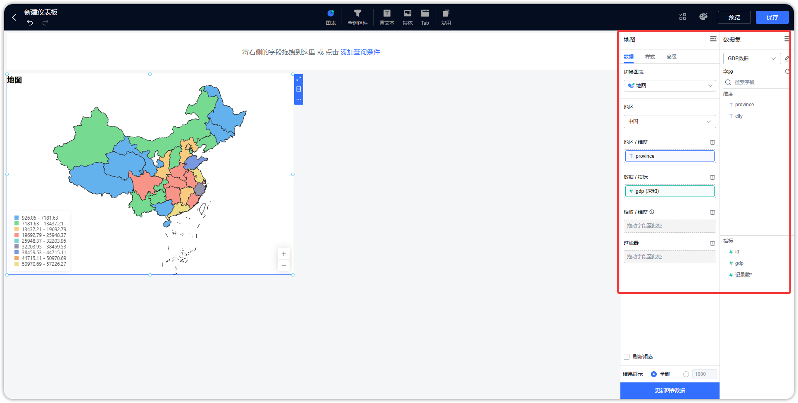{ width="900px" }

## 2 复制

!!! Abstract ""
	点击下图中所示的位置，复制组件。

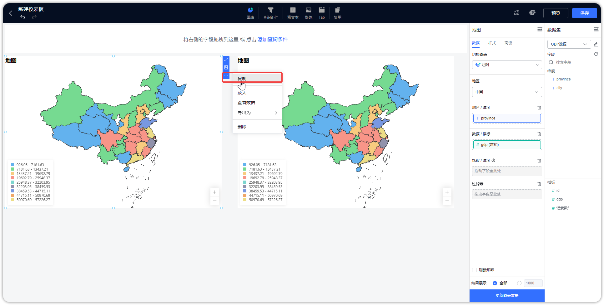{ width="900px" }

## 3 删除

!!! Abstract ""
	点击下图所示的位置，删除组件。

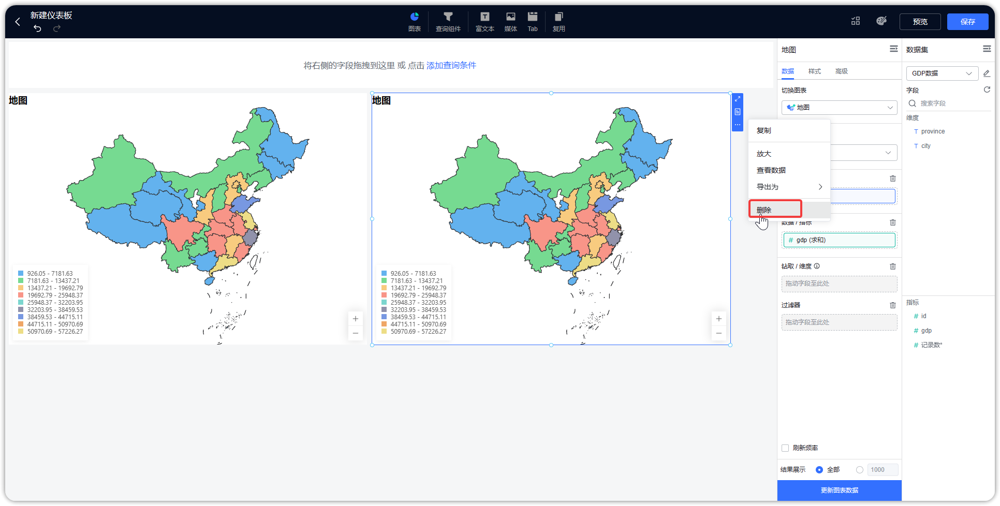{ width="900px" }

## 4 组件位置及大小调整

!!! Abstract ""
	仪表板为矩阵模式，组件支持通过拖拽进行位置移动和大小设置。

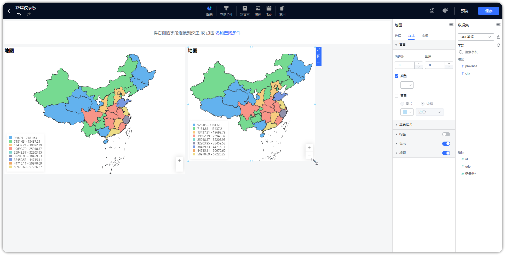{ width="900px" }

## 5 联动设置

!!! Abstract ""
	如下图，切换到 Tab 【高级】，打开【联动设置】开关。  
	**提示：** 仪表盘、水波图、富文本视图不支持联动设置。

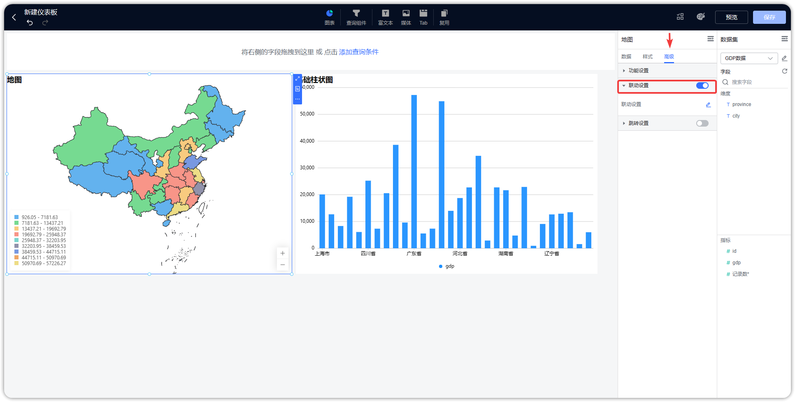{ width="900px" }

!!! Abstract ""
	如下图，当设置两个视图联动时，设置相对应的图表的联动字段，设置完成后，点击【确定】，联动设置完成。

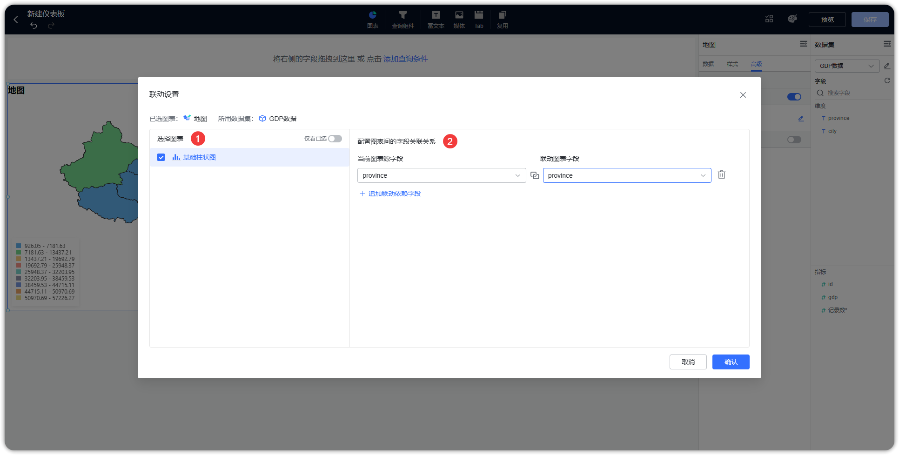{ width="900px" }

!!! Abstract ""
	第一步，点击【黑龙江省】，并选择【联动】。
!!! Abstract ""
	如果视图同时设置了联动和钻取，那么当点击时由用户选择执行联动或者钻取，当只设置了联动时，默认执行联动；当只设置了钻取时，默认执行钻取。

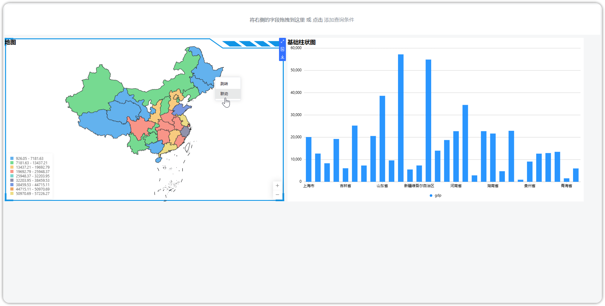{ width="900px" }

!!! Abstract ""
	第二步，联动结果展示，如下图，设置了联动的视图，只展示浙江省的数据，视图联动时，支持联动部分高亮显示。

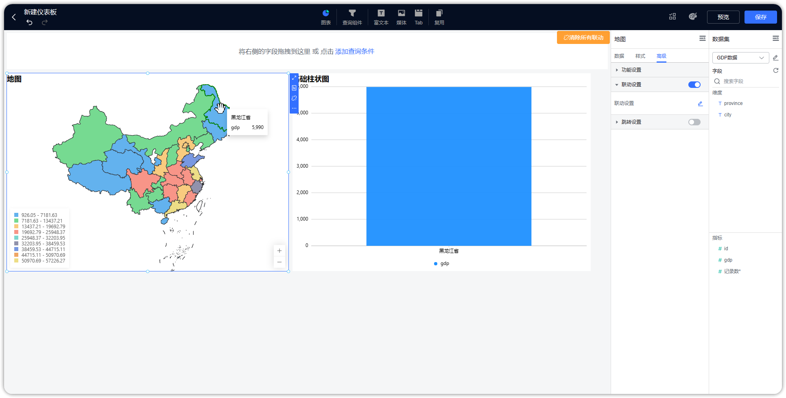{ width="900px" }

!!! Abstract ""
	第三步，可点击下图所示位置，清除局部联动和所有联动。

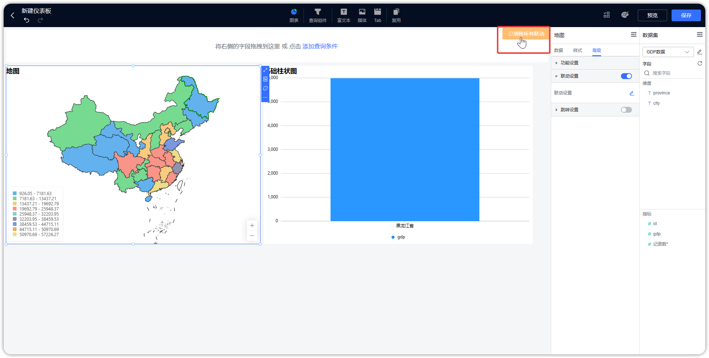{ width="900px" }

## 6 跳转设置

!!! Abstract ""
	如下图，切换到 Tab 【高级】，打开【跳转设置】开关。
	**提示：** 仪表盘、水波图、词云图、富文本视图不支持跳转。

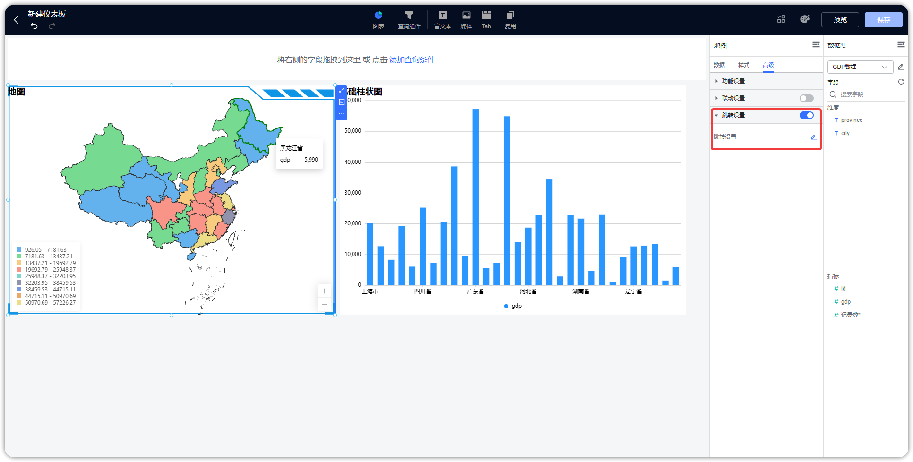{ width="900px" }

!!! Abstract ""
	**第一种，仪表板间跳转，如下图所示，设置原视图与目标仪表板的跳转：**  
	第一步：设置启用字段；  
	第二步：选择仪表板链接类型；  
	第三步：选定跳转的仪表板（系统默认会追加一个字段选择）；  
	第四步：选择关联视图和联动字段；  
	第五步：点击【确定】，完成跳转设置。  
	**注意：** 当前用户至少拥有目标仪表板的查看权限，跳转时，若启用字段是指标字段，则提示”未获取跳转信息“。

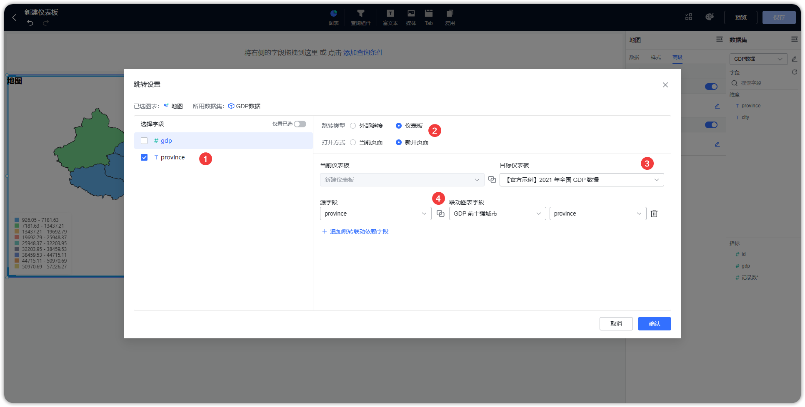{ width="900px" }

!!! Abstract ""
	**第二种，外部链接跳转，支持将视图的点击值作为参数传递给第三方公共链接，作为第三方链接的参数：**  
	第一步：设置启用字段；  
	第二步：选择外部链接链接类型；  
	第三步：填写外部链接地址，同时支持点击字段用来拼接 URL 或者参数（AntV 图库，若为折线图、柱状图等图形，不能出现叠加维度的情况）；  
	第四步：点击【确定】，完成跳转设置。  
	**注意：** 跳转时，若启用字段是指标字段，则提示”未获取跳转信息“。 

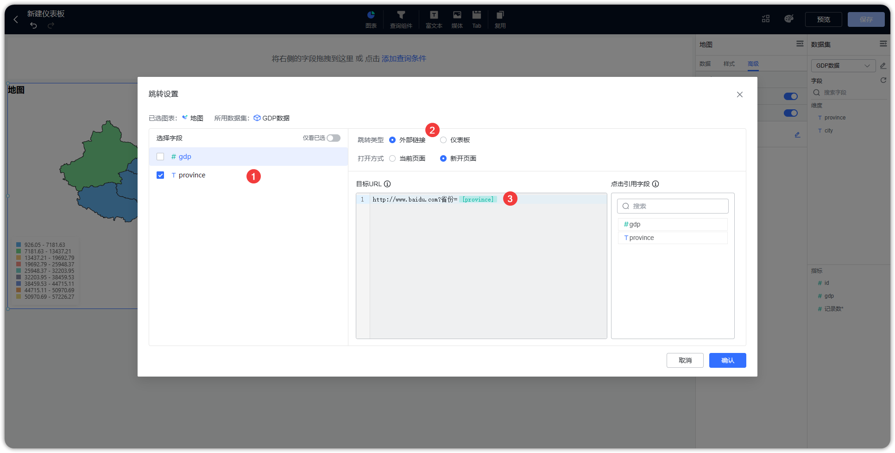{ width="900px" }

!!! Abstract ""
	点击视图中的维度字段，即可触发跳转。

{ width="900px" }

!!! Abstract ""
	如果选择的是仪表板跳转，那么跳转至目标仪表板，并联动目标仪表板的视图，如果不需要，可点击右上角清除联动。

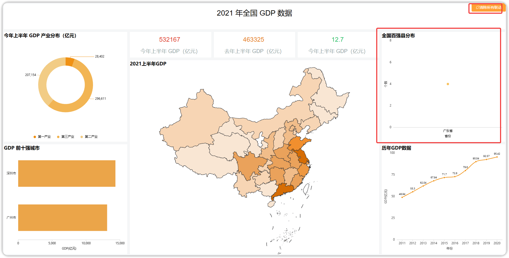{ width="900px" }

!!! Abstract ""
	如果选择的是外部链接跳转，那么跳转至第三方平台，同时点击值传递给第三方链接。

{ width="900px" }

## 7 组件样式

!!! Abstract ""
	如下图，切换到 Tab 【样式】，在【背景】和【基础样式】进行组件样式设置。

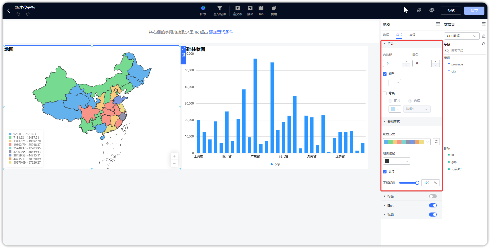{ width="900px" }

!!! Abstract ""
	支持设置组件的内边距，边框半径与组件背景，背景支持颜色类背景、图片类背景与边框类背景；  
	以下图为示例，勾选【背景】，上传背景图片，或者勾选【边框】，选择边框样式，点击【确定】，完成背景设置。

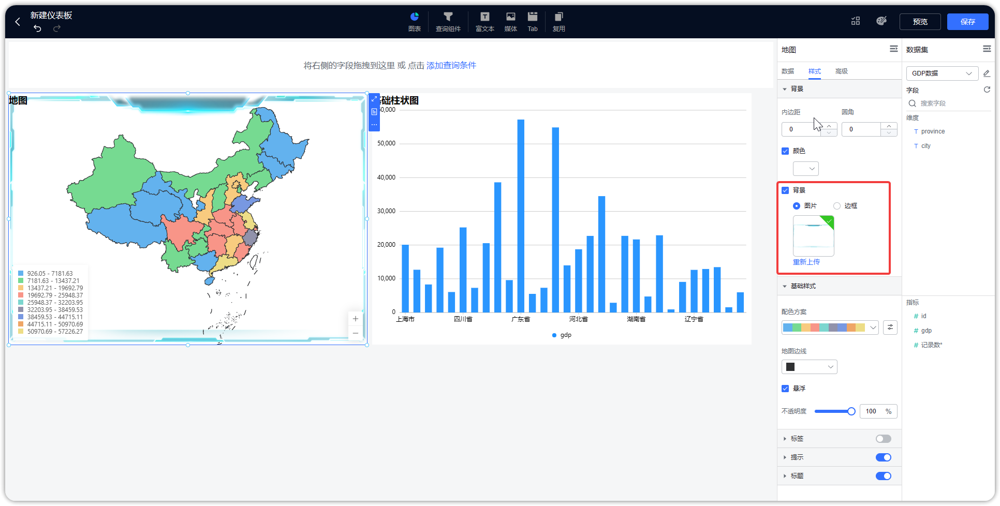{ width="900px" }

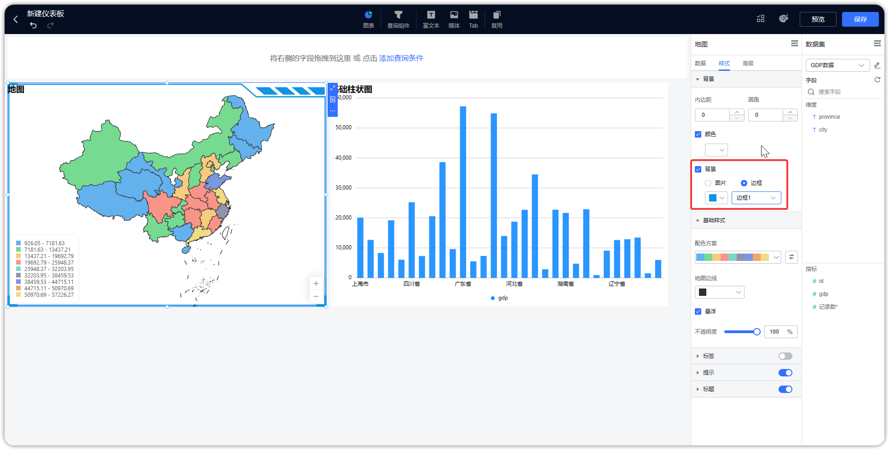{ width="900" }

!!! Abstract ""
	查询组件支持标题颜色、表情颜色、边框颜色、提示文字颜色、自定义背景颜色设置，如下图所示。

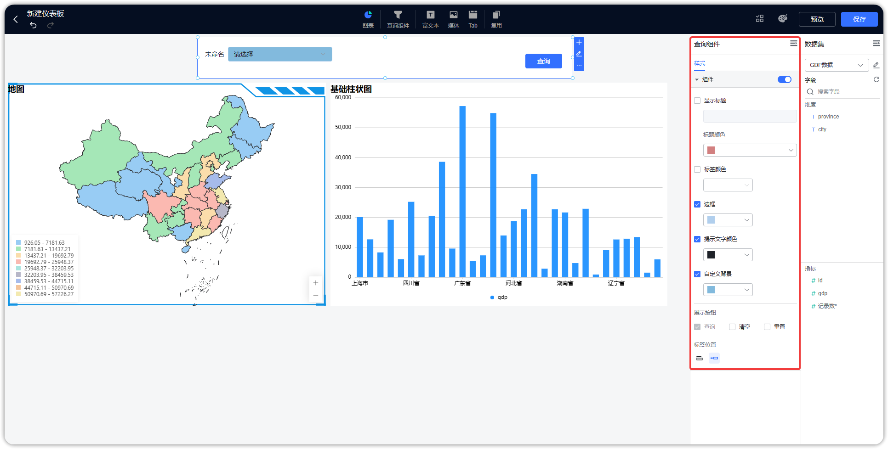{ width="900" }

