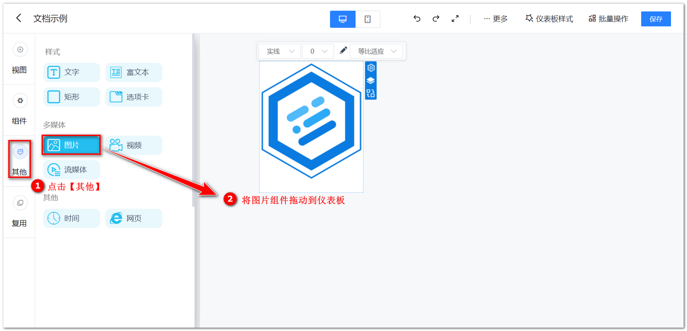
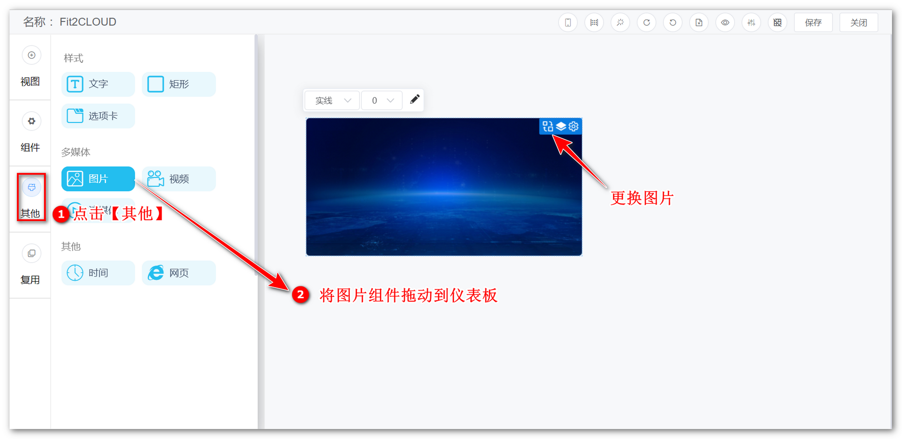
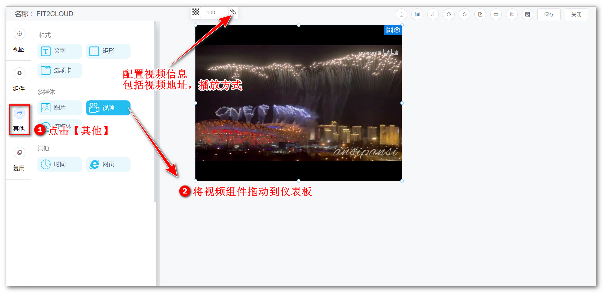
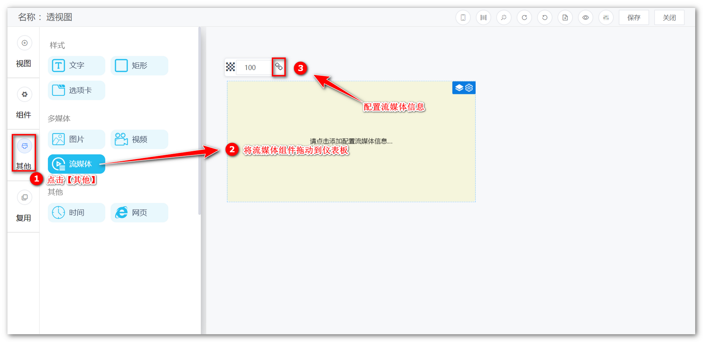

## 1 图片

!!! Abstract ""
	仪表板中可上传图片，并设置图片的透明度、边框、链接等属性

{ width="900px" }

!!! Abstract ""
	v1.12.0 版本开始，图片组件新增图片尺寸适应选项，如下图所示。

	- 原始尺寸：仪表板展示图片原大小，不会根据组件范围大小或仪表板缩放大小而自适应；
	- 适应组件：始终铺满组件框给的大小；
	- 等比适应：宽度自适应，但是图片高度始终跟随图片自身的宽高比，不跟随组件大小的高度，如果组件框给的高度不够就会被遮挡。

{ width="900px" }

## 2 视频

!!! Abstract ""
	可配置视频信息，如视频链接、播放频率等，在仪表板中播放在线视频。  
	**提示：** 当前支持 mp4，webm 格式的视频。

{ width="900px" }

## 3 流媒体

!!! Abstract ""
	可配置流媒体链接，目前仅支持 flv 格式，可设置是否直播，非直播模式下可设置是否自动播放、播放频率，支持调整视频播放速度。

{ width="900px" }