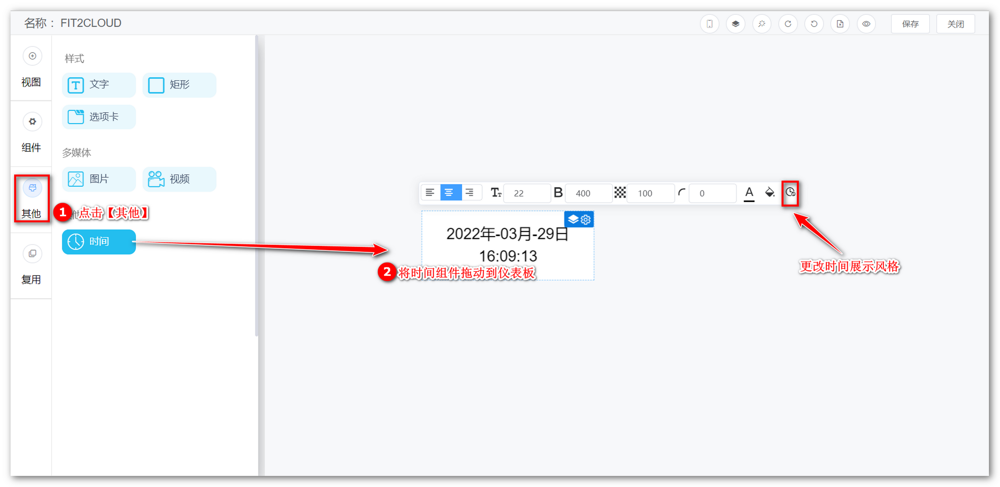
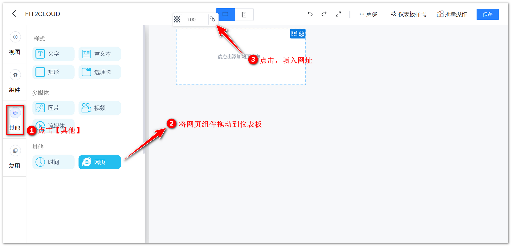
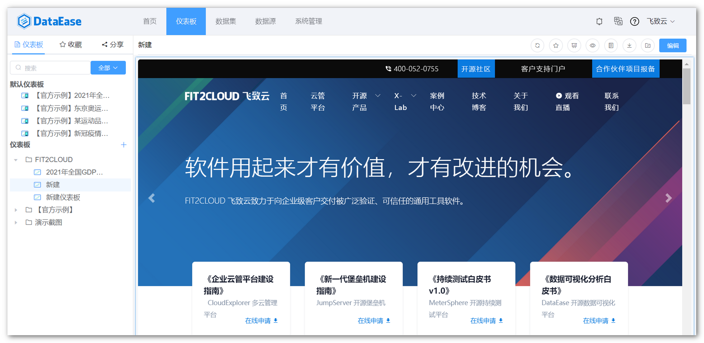

## 1 时间

!!! Abstract ""
	选择时间组件，可显示当前时间。可根据需要设置展示风格、日期格式等。

{ width="900px" }

## 2 网页

!!! Abstract ""
	选择网页组件，填写网页的 URL ，打开网页，并可操作网页内容。可填写图片地址，自动获取图片并展示在仪表板。  
	**提示：** 在仪表板的编辑状态中，无法点击或者上下滑动网页；  
	**注意：** 部分网站可能存在跨域问题无法显示，部分网站可能设置不允许嵌入而无法显示。 

{ width="900px" }  
{ width="900px" }