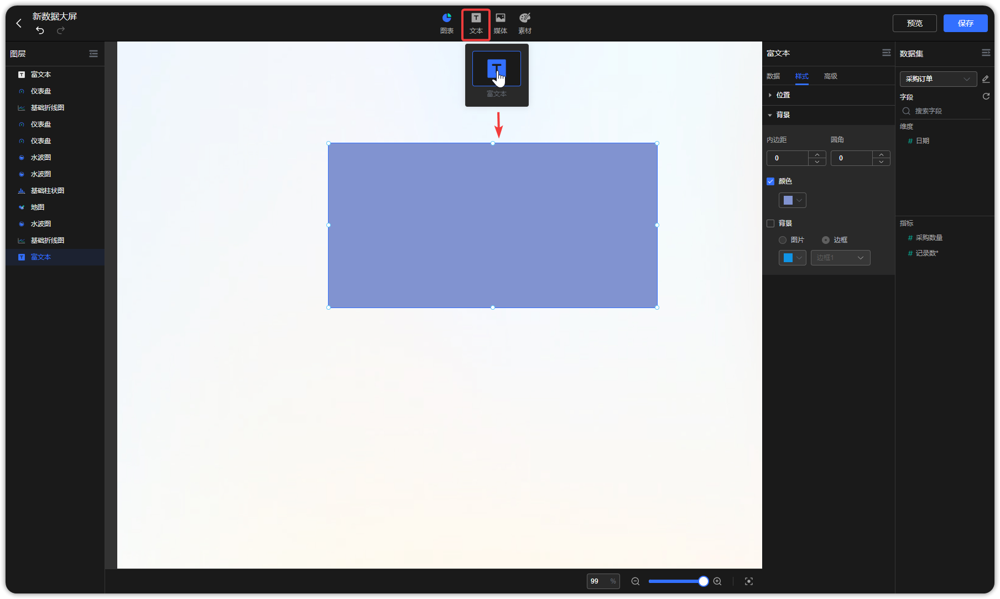
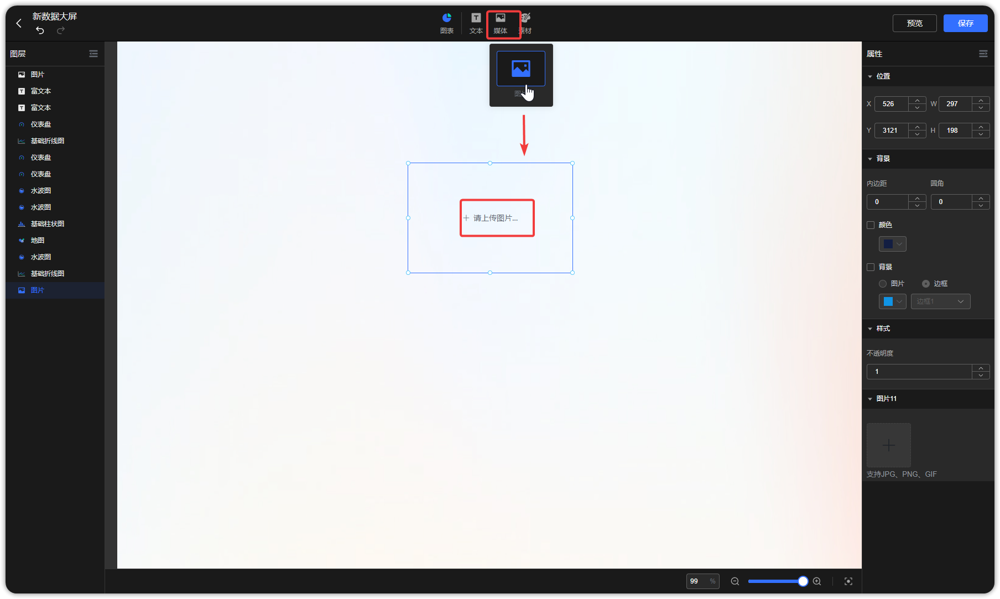

## 1 富文本

!!! Abstract ""
	双击富文本组件，可定义样式，并支持在编辑区引用维度与指标中字段。
	注意： 引用维度与指标字段时，富文本只选取第一条结果值。

	{ width="900px" }

	{ width="900px" }

!!! Abstract ""
	双击输入文字，可单独调整某文字样式。

{ width="900px" }

!!! Abstract ""
	点击插入超链接按钮，可配置超链接，下示例图以插入”百度网页“链接为例。

{ width="900px" }

!!! Abstract ""
	添加表格，输入文字，并可对表格单元格、行、列等做调整，如下图所示。

{ width="900px" }

{ width="900px" }

!!! Abstract ""
	还支持插入图片、媒体。

{ width="900px" }

{ width="900px" }

## 2 媒体

!!! Abstract ""
	辅助类图片组件，如可作为组件的背景等。

{ width="900px" }

{ width="900px" }

## 3 素材

!!! Abstract ""
	数据大屏自带丰富的边框和图形、图标，用户可以通过点击【素材】，根据实际场景进行选用。

{ width="900px" }

{ width="900px" }

{ width="900px" }

