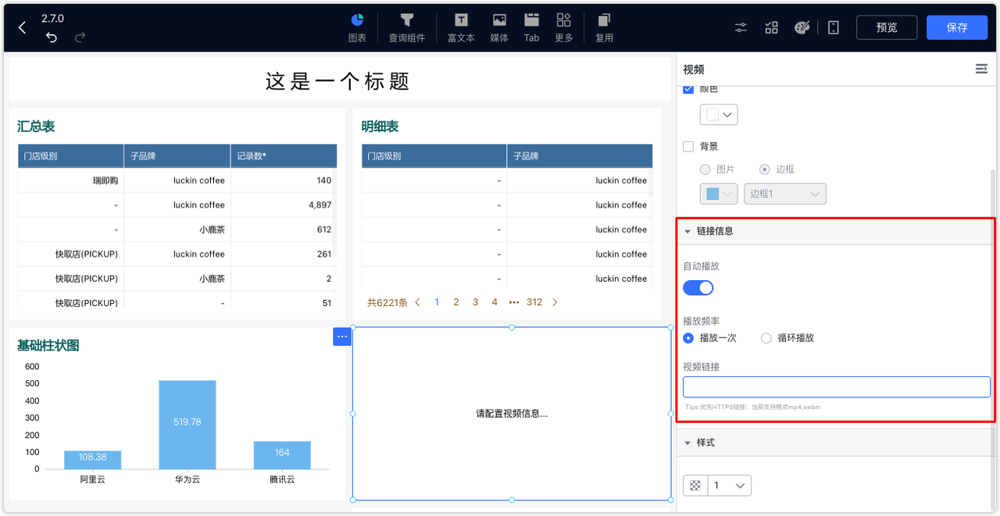
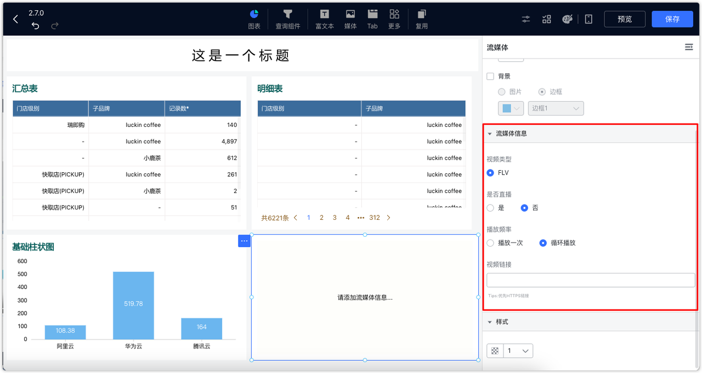

## 1 文本
### 1.1 富文本

!!! Abstract ""
	双击富文本组件，可定义样式，并支持在编辑区引用维度与指标中字段。
	注意： 引用维度与指标字段时，富文本只选取第一条结果值。

	{ width="900px" }

	{ width="900px" }

!!! Abstract ""
	双击输入文字，可单独调整某文字样式。

{ width="900px" }

!!! Abstract ""
	点击插入超链接按钮，可配置超链接，下示例图以插入”百度网页“链接为例。

{ width="900px" }

!!! Abstract ""
	添加表格，输入文字，并可对表格单元格、行、列等做调整，如下图所示。

{ width="900px" }

{ width="900px" }

!!! Abstract ""
	还支持插入图片、媒体。

{ width="900px" }

{ width="900px" }

### 1.2 跑马灯

!!! Abstract ""
	马灯组件可实现文字的循环滚动。支持设置文字颜色、字间距、字体大小、透明度、播放速度等选项。

{ width="900px" }

{ width="900px" }

## 2 媒体
### 2.1 图片
!!! Abstract ""
	辅助类图片组件，如可作为组件的背景等。

{ width="900px" }

{ width="900px" }

### 2.2 视频
!!! Abstract ""
	不能上传本地视频，需要填写视频链接信息。如果需要搭建视频服务器可参考知识库：https://kb.fit2cloud.com/?p=0e763f1d-a175-49e0-ac69-af8d39fb789b、https://kb.fit2cloud.com/?p=15 。
{ width="900px" }
{ width="900px" }

### 2.3 流媒体
!!! Abstract ""
	流媒体只支持 flv 格式，如果需要使用 rtsp 格式，可参考知识库文章：https://kb.fit2cloud.com/?p=182 。
{ width="900px" }
{ width="900px" }

## 3 素材

!!! Abstract ""
	数据大屏自带丰富的边框和图形、图标，用户可以通过点击【素材】，根据实际场景进行选用。

{ width="900px" }

{ width="900px" }

{ width="900px" }

## 4 日期时间

!!! Abstract ""
	数据大屏支持时钟组件
{ width="900px" }
{ width="900px" }

## 5 网页

!!! Abstract ""
	数据大屏支持时钟组件
{ width="900px" }
{ width="900px" }

