## 1 文字

!!! Abstract ""
	文本型组件，可设置文字的大小、颜色、粗细、背景色、超链接等。

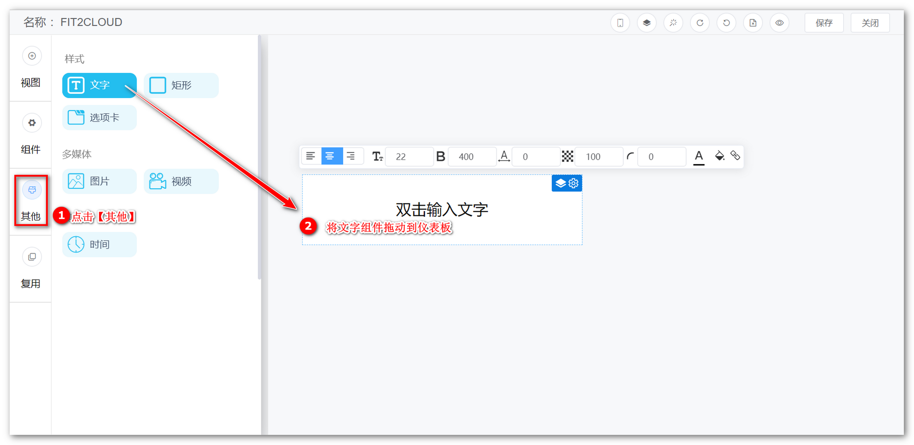{ width="900px" }  
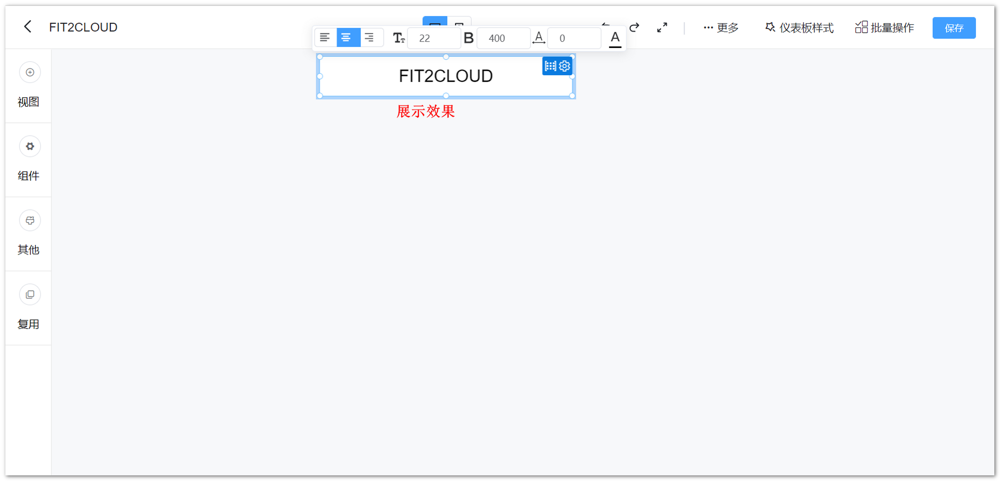{ width="900px" }
## 2 矩形

!!! Abstract ""
	辅助类组件，如可作为组件的背景、边框等。

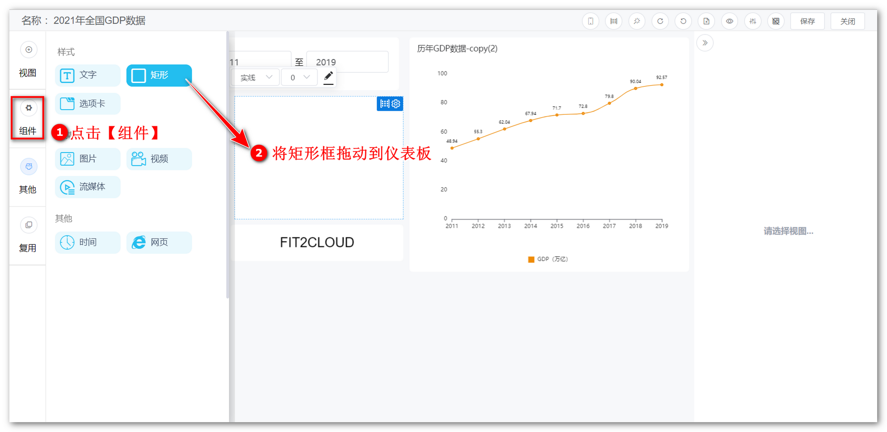{ width="900px" }

## 3 选项卡

!!! Abstract ""
	用户在制作仪表板时，可通过选项卡展示多个视图，并通过切换查看。

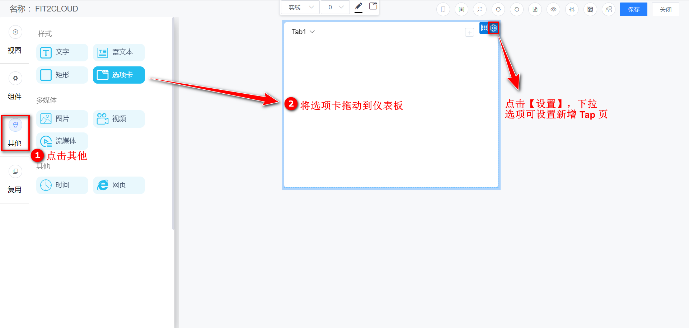{ width="900px" }

!!! Abstract ""
	点击下图所示位置，通过 Tab 页展示一个视图。  
	**提示：** Tab 组件目前不支持同一 Tab 展示多个视图。

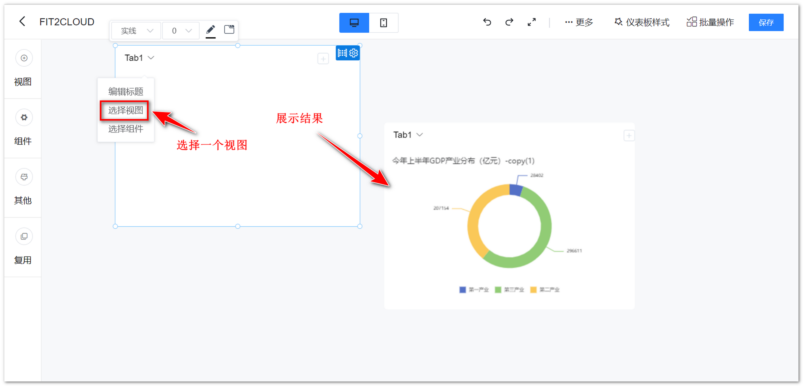{ width="900px" }

!!! Abstract ""
	如下图所示，可设置 Tab 组件内部样式。

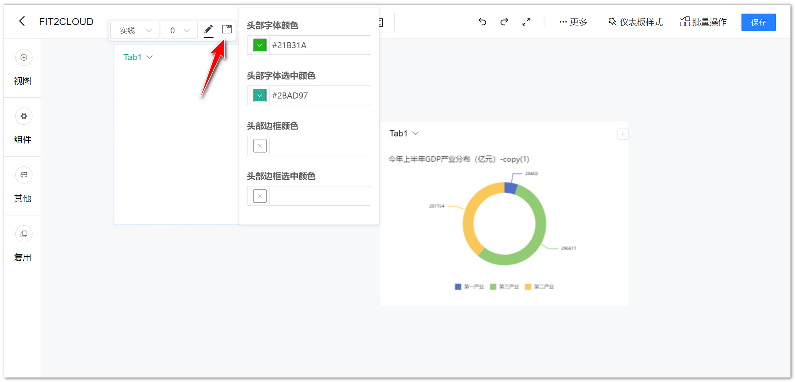{ width="900px" }

!!! Abstract ""
	如下图所示，Tab 组件支持放置视频、流媒体、网页组件，配置方式与单独使用该组件一致。

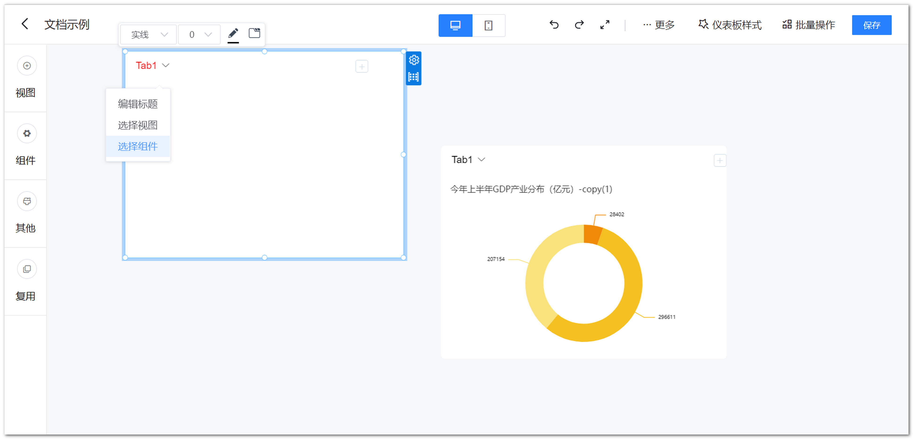{ width="900px" }

## 4 富文本

!!! Abstract ""
	如下列示例，富文本组件支持调整文字样式，配置超链接，添加表格，插入图片、媒体等。

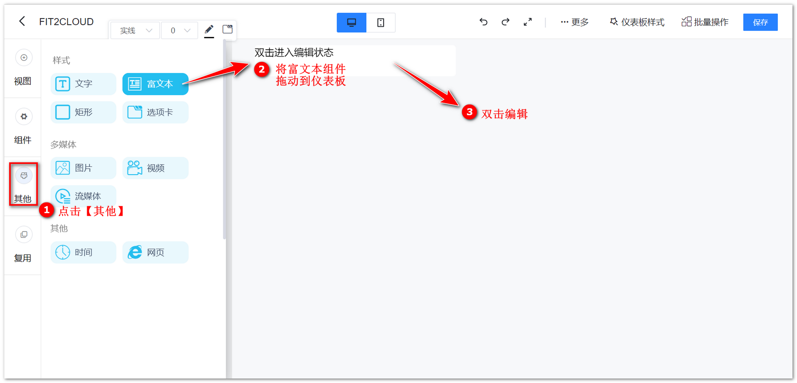{ width="900px" }

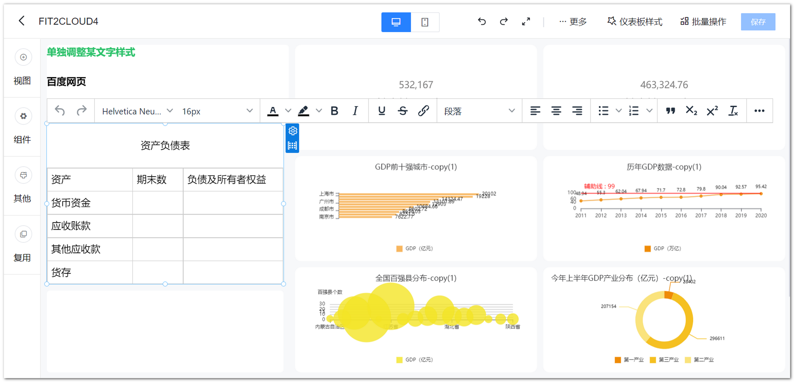{ width="900px" }

!!! Abstract ""
	双击输入文字，可单独调整某文字样式。

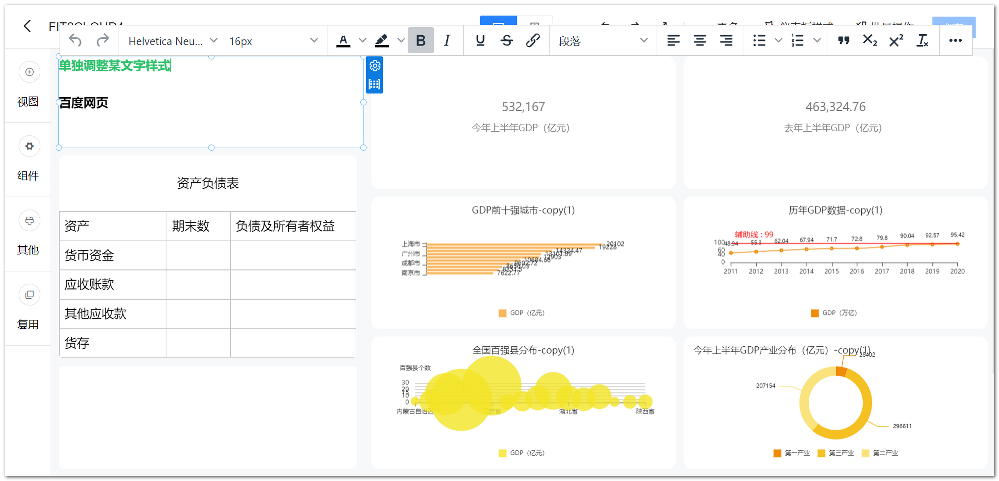{ width="900px" }

!!! Abstract ""
	点击插入超链接按钮，可配置超链接，下示例图以插入”百度网页“链接为例。

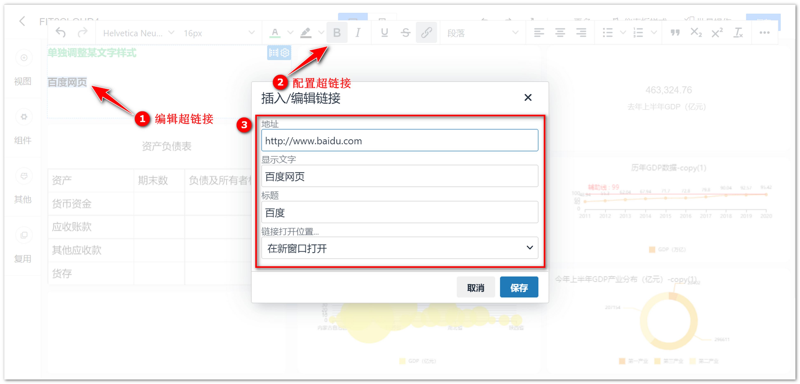{ width="900px" }

!!! Abstract ""
	添加表格，输入文字，并可对表格单元格、行、列等做调整，如下图所示。

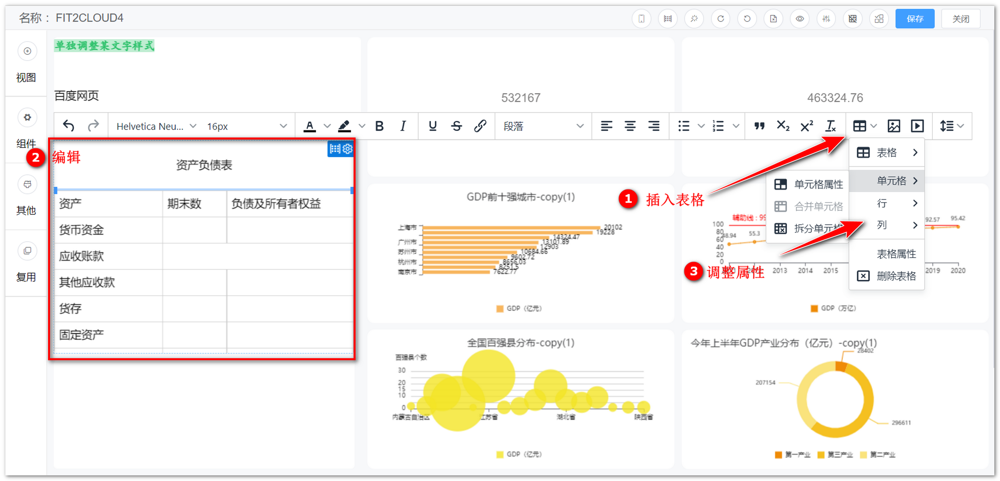{ width="900px" }

!!! Abstract ""
	还支持插入图片、媒体。

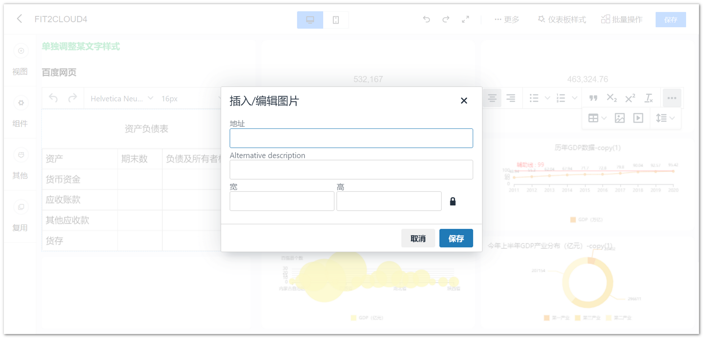{ width="900px" }

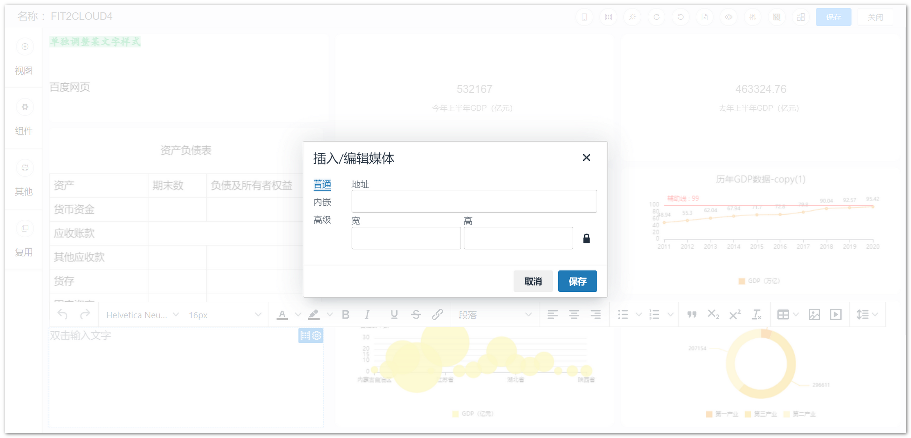{ width="900px" }