## 1 富文本

!!! Abstract ""
	双击富文本组件，可定义样式，并支持在编辑区引用维度与指标中字段。
	注意： 引用维度与指标字段时，富文本只选取第一条结果值。

	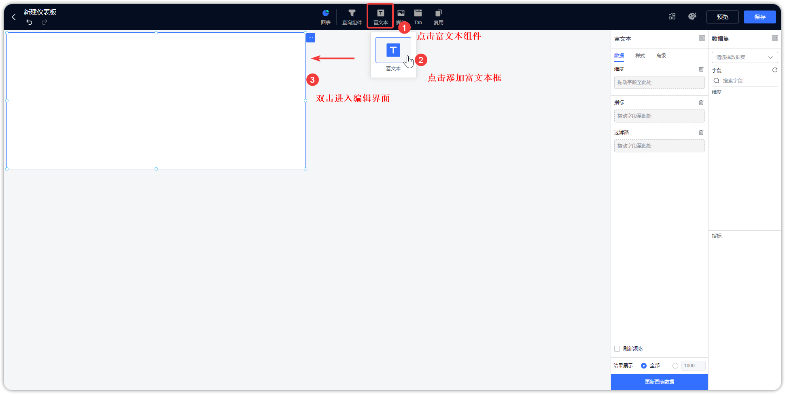{ width="900px" }

	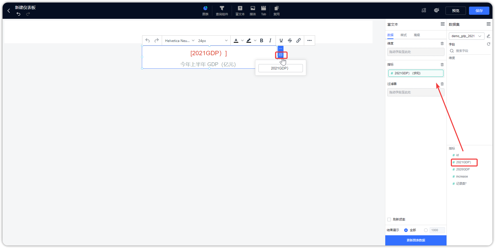{ width="900px" }

!!! Abstract ""
	双击输入文字，可单独调整某文字样式。

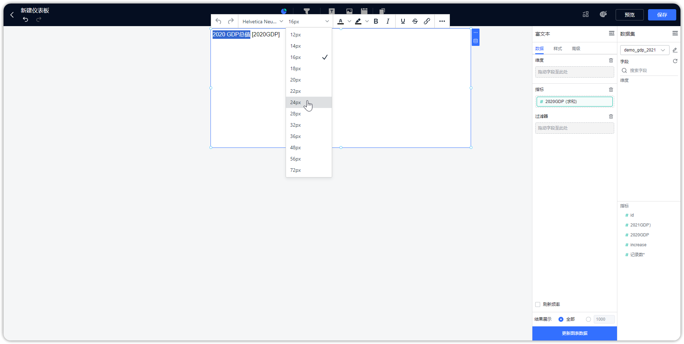{ width="900px" }

!!! Abstract ""
	点击插入超链接按钮，可配置超链接，下示例图以插入”百度网页“链接为例。

	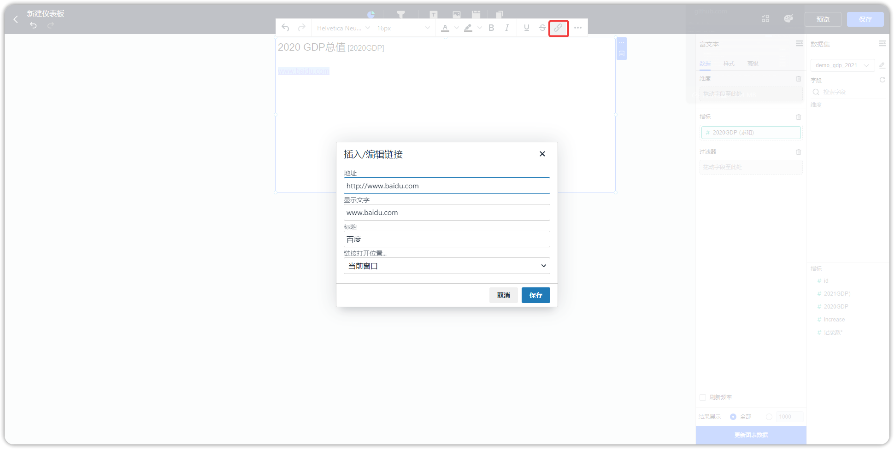{ width="900px" }

!!! Abstract ""
	添加表格，输入文字，并可对表格单元格、行、列等做调整，如下图所示。

{ width="900px" }

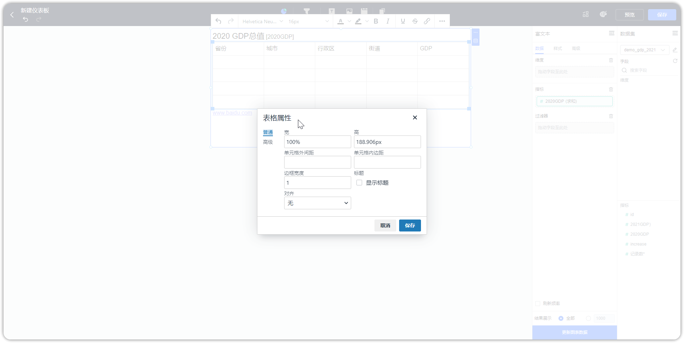{ width="900px" }

!!! Abstract ""
	还支持插入图片、媒体。

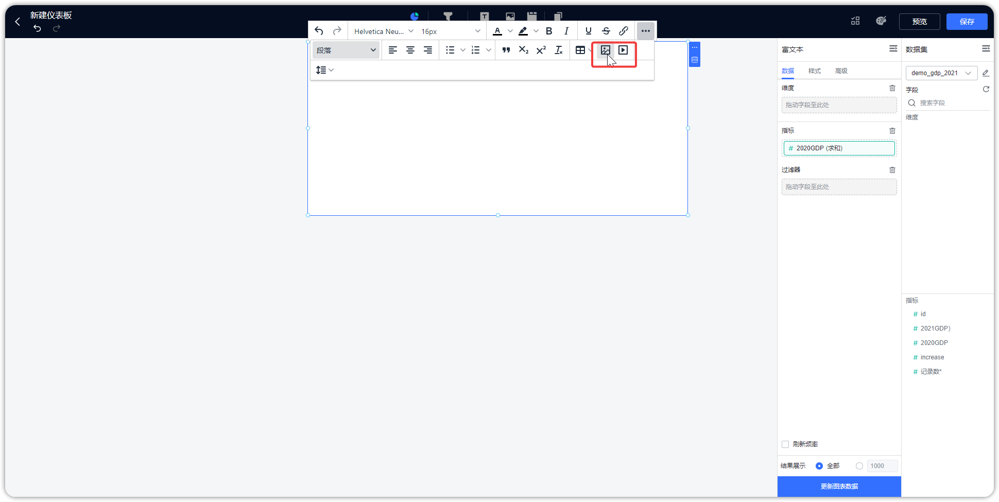{ width="900px" }

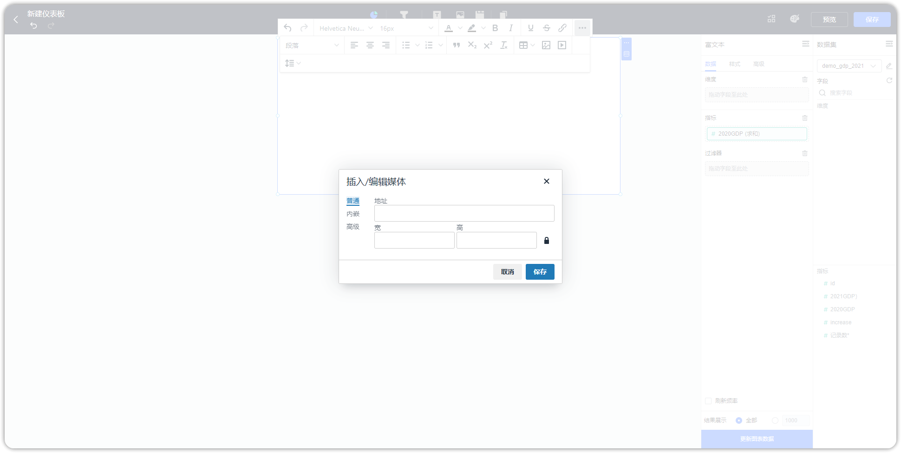{ width="900px" }

## 2 媒体

!!! Abstract ""
	辅助类图片组件，如可作为组件的背景等。

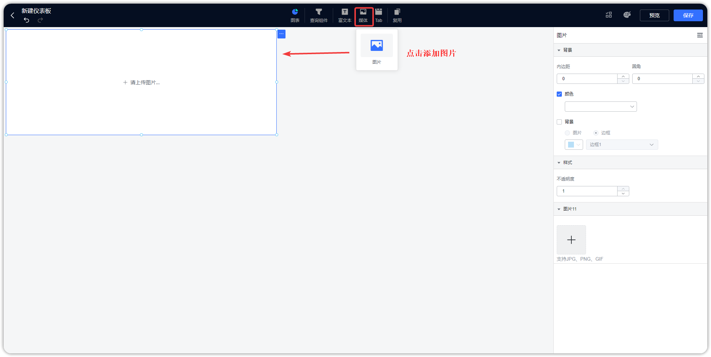{ width="900px" }

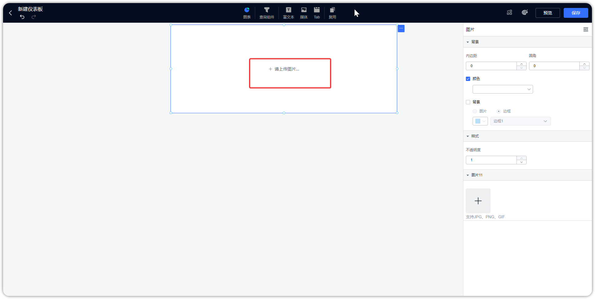{ width="900px" }

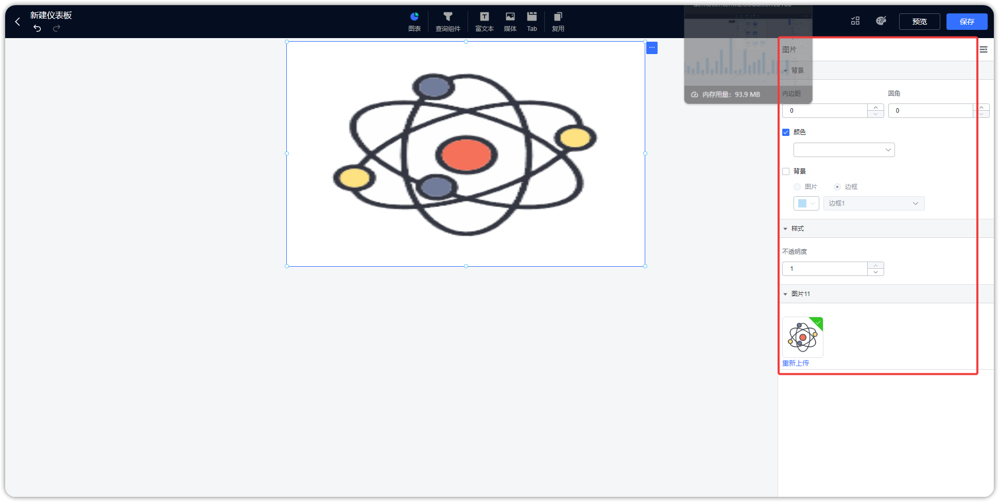{ width="900px" }

## 3 Tab 组件

!!! Abstract ""
	用户在制作仪表板时，可通过选项卡展示多个视图，并通过点击切换查看；  
	Tab 组件支持放置视图、媒体等组件，配置方式与单独使用该组件一致，即 Tab 组件支持多组件移入移出自由布局。

	- Tab 组件内支持放置多个组件；
	- 支持在仪表板中以拖拽的形式，将其他组件拖拉至 Tab 组件内；
	- 支持 Tab 项内组件的联动、下钻、跳转等；
	- Tab 组件中不可以再嵌套 Tab。

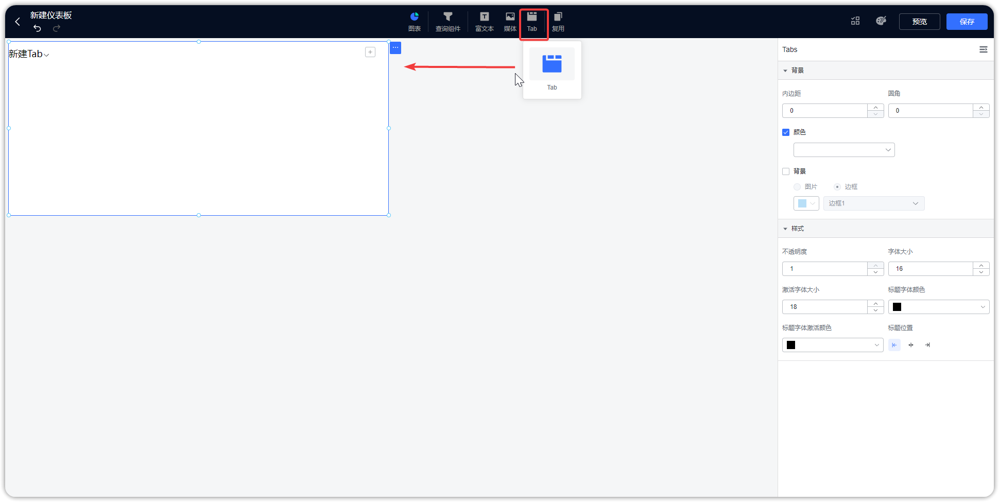{ width="900px" }

!!! Abstract ""
	如下图所示，可通过 Tab 页展示多个图表和组件。

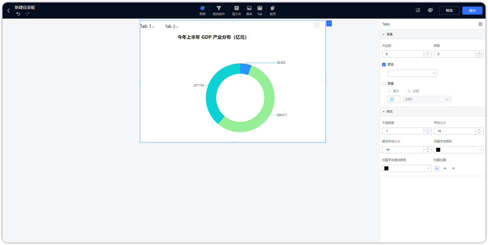{ width="900px" }

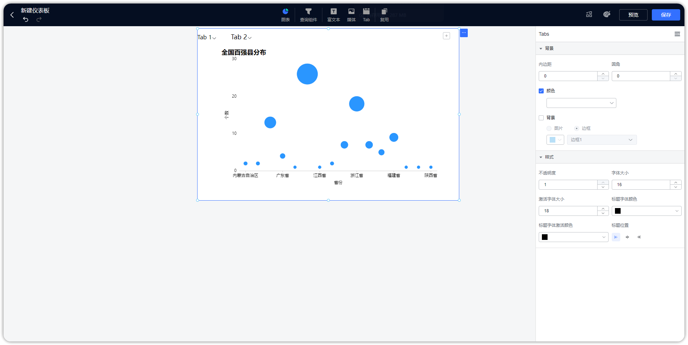{ width="900px" }

