## 1 编辑数据大屏

!!! Abstract ""
	点击下图所示的位置或者新建数据大屏，进入数据大屏编辑界面。

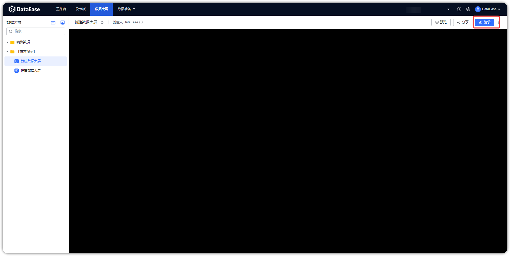{ width="900px" }

!!! Abstract ""
	功能区划分如下：

	- 【序号 1】撤销、恢复操作；
	- 【序号 2】组件区，包括图表、文本、媒体、素材等；；
	- 【序号 3】外部传参设置、预览、保存；
	- 【序号 4】图层管理，查看画布中的所有组件，并进行图层的管理；
	- 【序号 5】画布区域，可将组件添加至该区域、并调整组件的位置；
	- 【序号 6】属性配置，调整尺寸、背景等配置；
	- 【序号 7】比例的调整，来控制和调整画布的缩放比例；

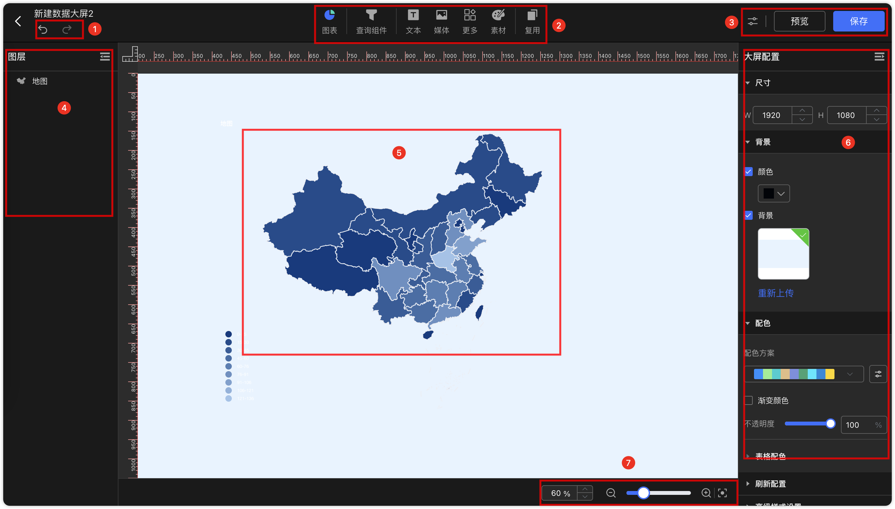{ width="900px" }


!!! Abstract ""
	按住空格键并同时使用鼠标或者触摸板，可自由移动数据大屏的画布位置。

{ width="900px" }

## 2 撤销

!!! Abstract ""
	点击下图按钮，撤销上一步操作。

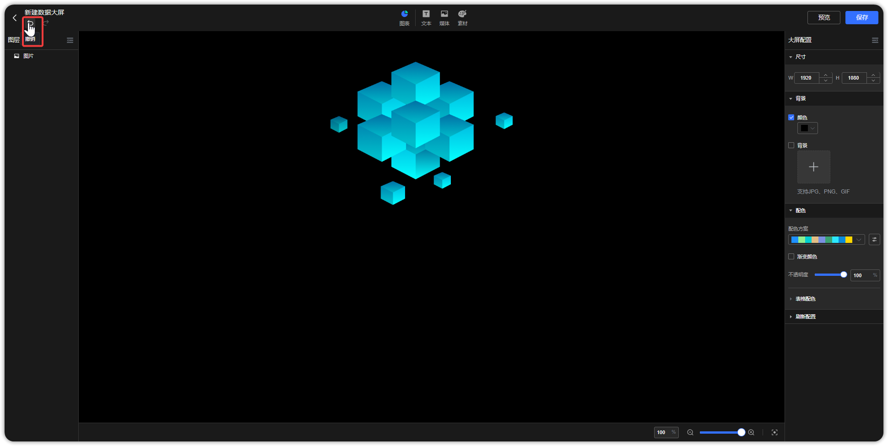{ width="900px" }

## 3 恢复

!!! Abstract ""
	点击下图按钮，可以对组件操作恢复。

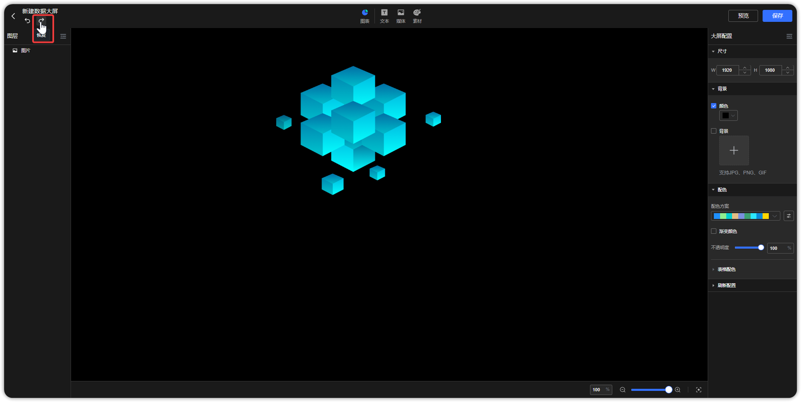{ width="900px" }

## 4 图层管理

!!! Abstract ""
	根据组件添加至画布区域的顺序，图层自下而上，即最先加入画布区域的组件，位于最底层。  
	图层管理分为弹窗区域、大屏区域。用户在图层管理或者点击图层右键，来调整组件的图层。

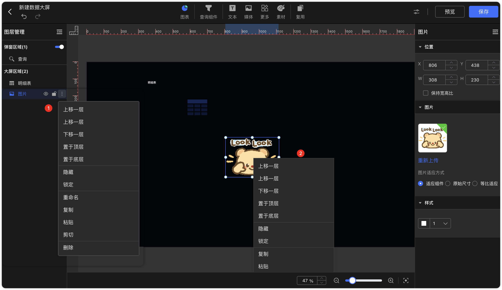{ width="900px" }

### 4.1 弹窗设置

!!! Abstract ""
	打开弹窗区域，可在弹窗区域中添加查询组件。

{ width="900px" }

!!! Abstract ""
	在全屏或预览的界面下，当设置了弹窗区时，数据大屏右下侧会出现查询按钮，点击可唤出弹窗区。弹窗区的查询组件功能同普通查询组件，同时也支持外部传参。

{ width="900px" }


!!! Abstract ""
	弹窗区查询按钮支持显示控制打开预览时弹窗区域的控制按钮，则支持用户预览数据大屏时动态调整弹窗区域的显隐。
{ width="900px" }

{ width="900px" }

!!! Abstract ""
	关闭预览时弹窗区域的控制按钮，则弹窗区域被完全隐藏，且用户无法在预览界面手动调出弹窗区域。

{ width="900px" }

{ width="900px" }

### 4.2 图层隐藏

!!! Abstract ""
	图层隐藏功能，可以迅速隐藏不需要显示的图层，以便更清晰地查看和编辑目标图层。
	
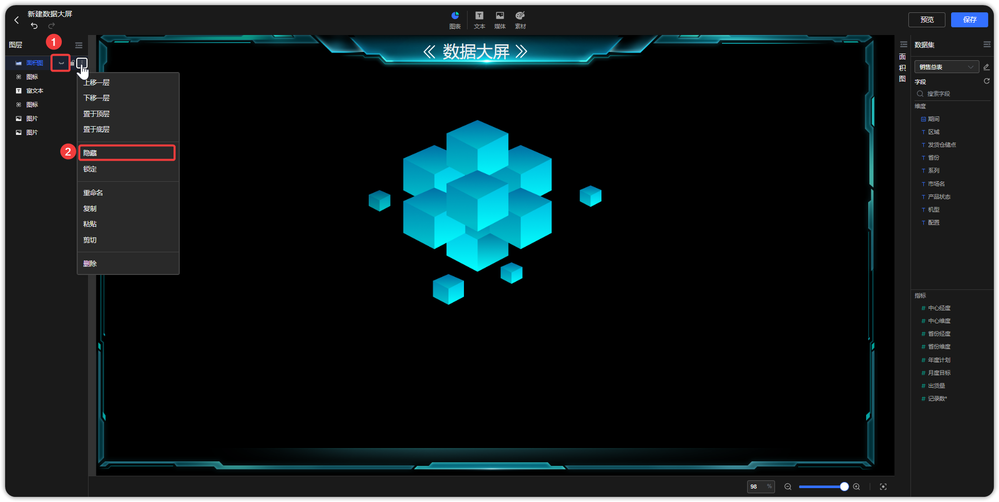{ width="900px" }

### 4.3 图层锁定

!!! Abstract ""
	通过图层锁定功能，可以确保在设计过程中不会误操作或修改已经设置好的图层。

{ width="900px" }

### 4.4 图层组合
!!! Abstract ""
	在处理复杂项目时，将相关联的图层组合在一起，有助于保持结构的清晰性，同时方便整体编辑。

	图层组合操作：
	
	- 在图层管理中，选中图层后进行组合；
	- 在画布区域选择图层后，右键选择组合。

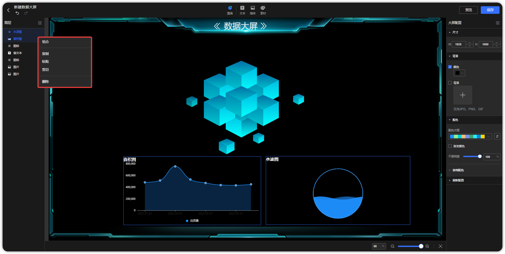{ width="900px" }
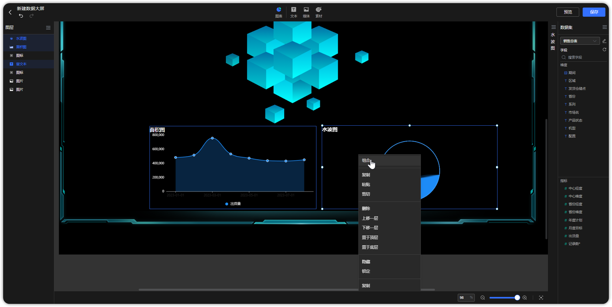{ width="900px" }
!!! Abstract ""
	组件组合后，在图层管理中可以按照分组查看组件列表。 

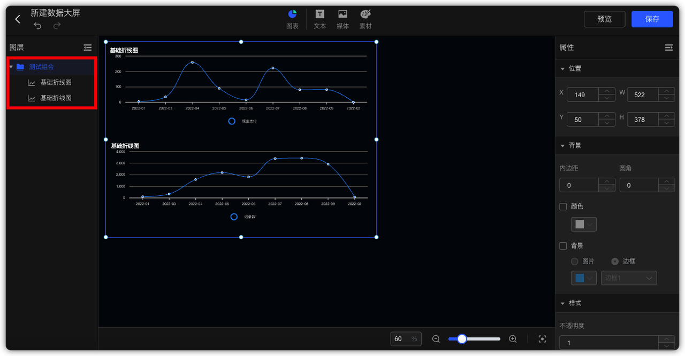{ width="900px" }

!!! Abstract ""
	多个组件创建分组后，可以作为分组整体移动，如果需要单独调整分组内组件的位置，可以通过双击该组件，然后移动该组件的所在位置。 

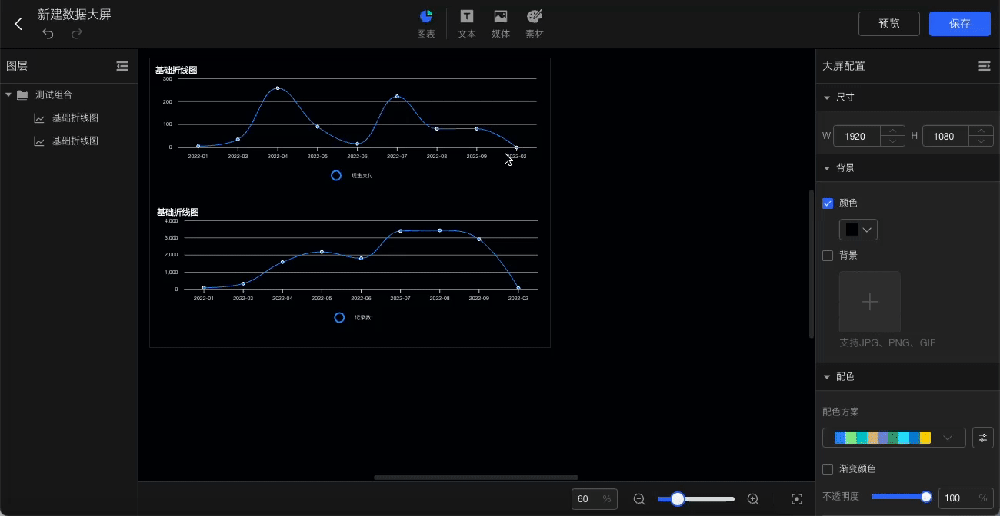{ width="900px" }

!!! Abstract ""
	放大缩小组合时其内部组件同比放大缩小。

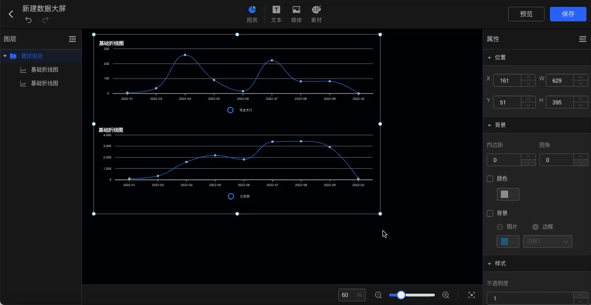{ width="900px" }

!!! Abstract ""
	画布放大缩小其图表支持同比放大缩小。
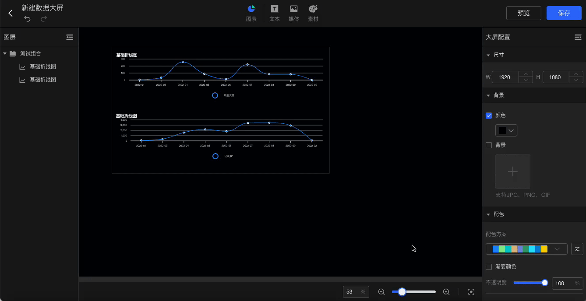{ width="900px" }

### 4.5 图层顺序

!!! Abstract ""
	图层顺序：可以直接在图层管理中直接拖拽图层顺序。或者在图层操作通过点击【上移一层】、【下移一层】、【置于顶层】、【置于底层】这些操作，来调整组件。

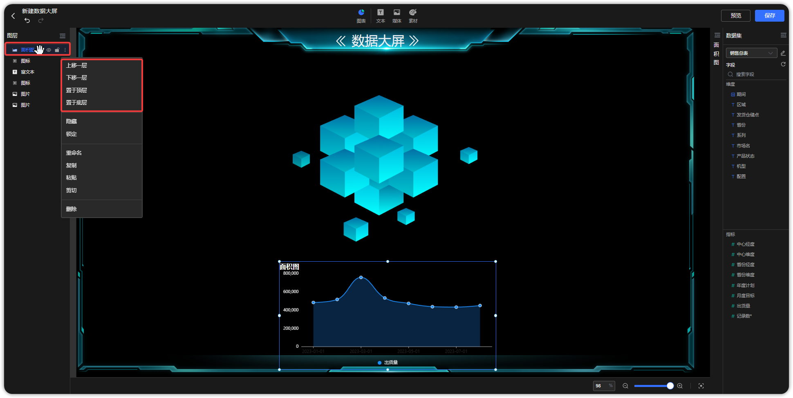{ width="900px" }


### 4.6 快速对齐

!!! Abstract ""
	选择多个组件后，可以快速对齐，支持左对齐、右对齐、上对齐、下对齐、水平居中、垂直居中。

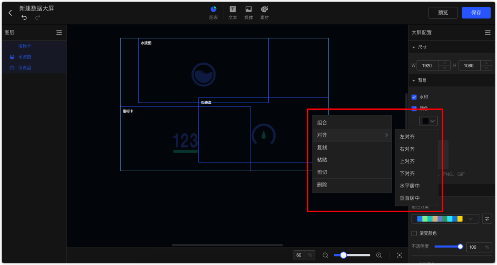{ width="900px" }

### 4.7 其他操作

!!! Abstract ""
	涵盖了图层重命名、复制、删除、剪贴等各种图层操作。

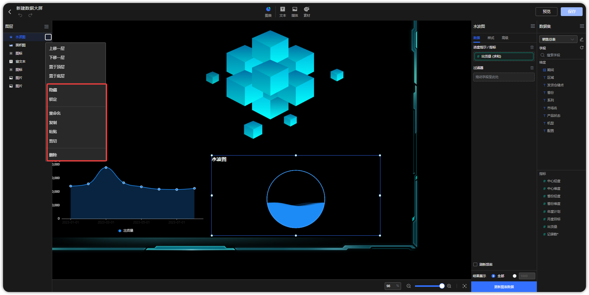{ width="900px" }


## 5 批量操作

!!! Abstract ""
	可通过鼠标框选或按住 Ctrl 点选的方式完成多选，可批量支持选择多个组件后批量移动。

{ width="900px" }

!!! Abstract ""
	选中后可整体调整组件大小。
{ width="900px" }

!!! Abstract ""
	数据大屏支持批量设置样式。

{ width="900px" }


## 6 大屏配置

!!! Abstract ""
	配置大屏尺寸、背景、配色、表格配色和刷新配置。

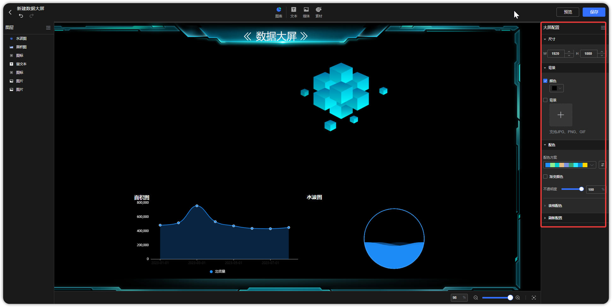{ width="900px" }

!!! Abstract ""
	数据大屏设计面板支持开启辅助网格线。

{ width="900px" }

!!! Abstract ""
	数据大屏支持字体更换。

{ width="900px" }


### 6.1 尺寸

!!! Abstract ""
	根据展示情况设置数据大屏的尺寸大小，设置对应的长度和宽度，便于适用于不同的展示常见。

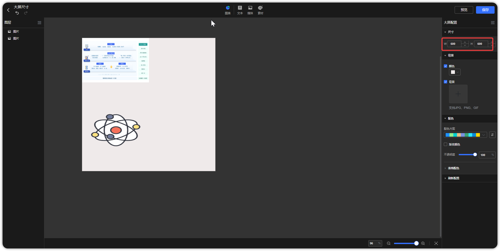{ width="900px" }


!!! Abstract ""
	根据画布进行展示，超出画布的组件、图表范围将不展示。如下图展示效果。

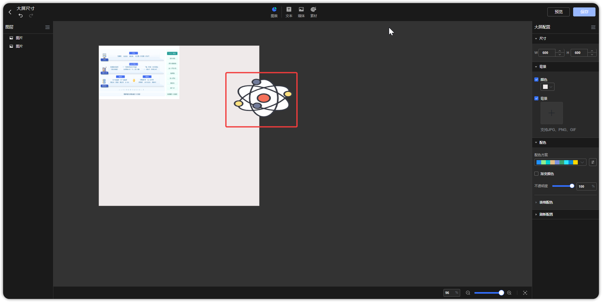{ width="900px" }

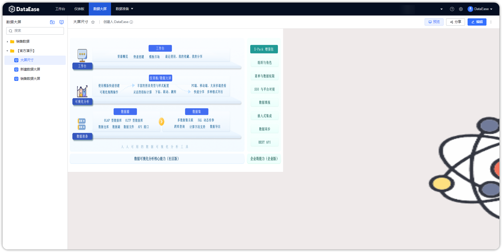{ width="900px" }


!!! Abstract ""
	数据大屏支持缩放方式设置缩放方式：宽度优先、高度优先、铺满全屏、不缩放。

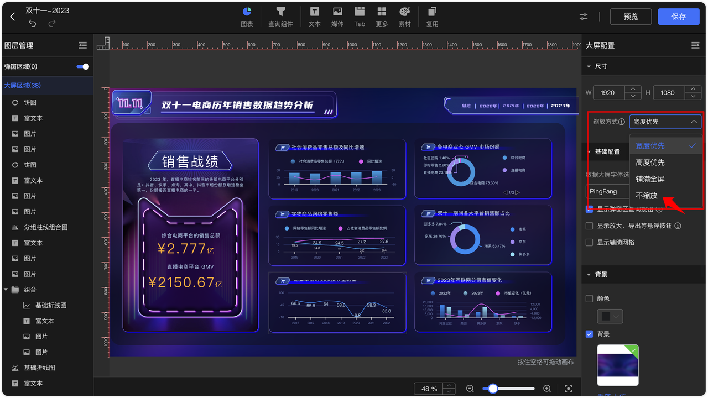{ width="900px" }

!!! Abstract ""
	宽度优先：以画布宽度完整显示为前提，等比缩放高度显示。

{ width="900px" }

!!! Abstract ""
	高度优先：以画布高度完整显示为前提，等比缩放宽度显示。

{ width="900px" }

!!! Abstract ""
	铺满全屏：按屏幕尺寸缩放画布，会出现组件比例变形的情况。

{ width="900px" }

!!! Abstract ""
	不缩放:当显示设备尺寸大于或者小于数据大屏的设计尺寸时，内容将按设计尺寸显示，不进行拉伸或缩放。

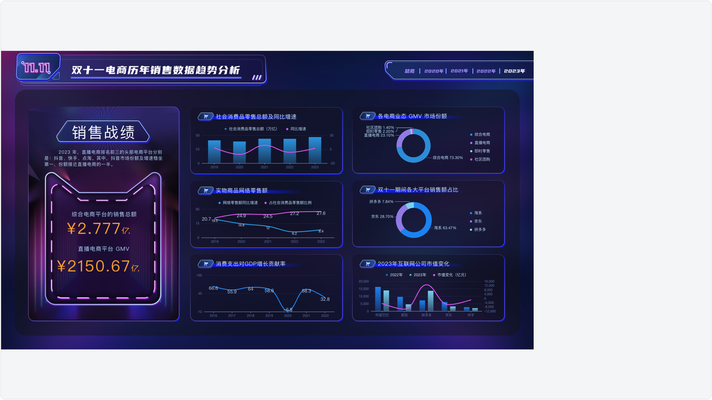{ width="900px" }

### 6.2 背景

!!! Abstract ""
	设置大屏的背景时，可以选择设置颜色背景或图片背景

!!! Abstract ""
	颜色背景：根据主题和展示需求选择适当的颜色。

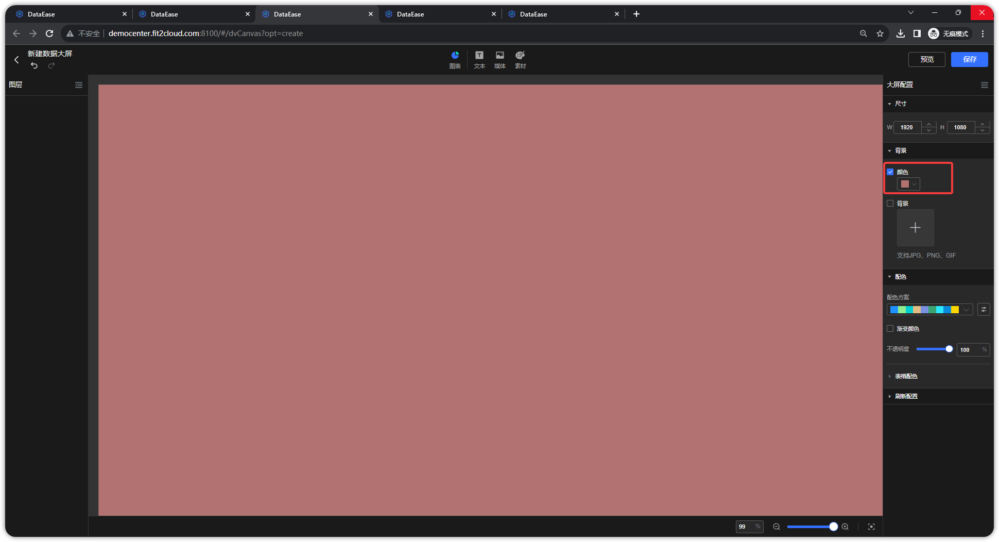{ width="900px" }

!!! Abstract ""
	图片背景：选择使用图片背景，确保选择高质量、高分辨率的图片。
	**注意：同时进行颜色背景和图片背景。图片背景会覆盖颜色背景。**

{ width="900px" }

### 6.3 配色

!!! Abstract ""

	- 对图表（除表格）的配色方案进行统一调整，同时支持渐变和透明的图表（根据具体图表颜色设置）。
	- 对表格进行背景、字体、边框、滚动条的颜色进行统一设置。

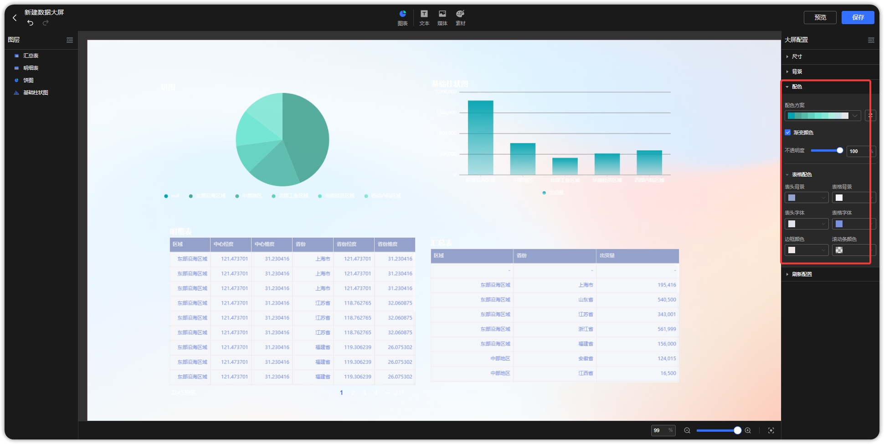{ width="900px" }


### 6.4 刷新配置

!!! Abstract ""
	对数据大屏所有图表的刷新频率、以及图表的展示结果进行统一设置。

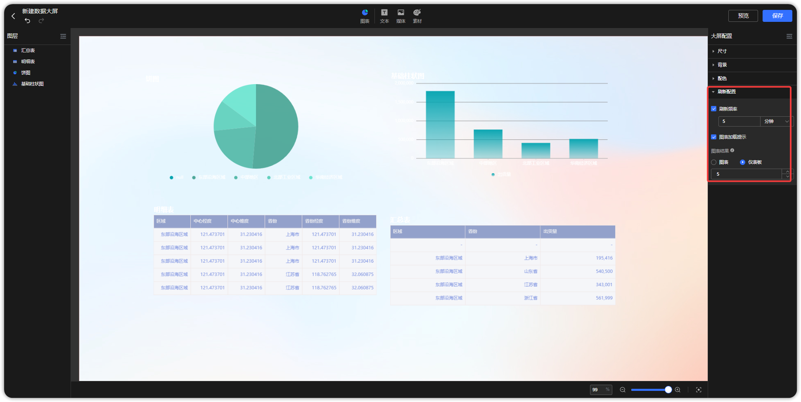{ width="900px" }

## 7 外部参数设置

!!! Abstract ""
	点击下图按钮，弹出外部参数设置页面，外部参数设置步骤：  
	增加一个参数并命名，启用参数，可设置多个参数；配置联动视图与联动视图的字段；      
	对关联组件做了分类，分为查询组件和图表两类。查询组件的关联需要选择关联条件。图表关联则可以通过数据集批量关联，减少重复操作。且图表的关联支持直接选择与数据集参数进行关联。  
	**注意：外部传参同时关联查询组件与图表时，以查询组件的优先级优先。**  


{ width="900px" }

!!! Abstract ""
	**推荐直接在公共链接的 [Ticket 机制](https://dataease.io/docs/v2/user_manual/panel_using/#1)中进行设置。相较于外部参数进行 base64 编码处理后拼接，公共链接外部参数可以直接在 Ticket 参数中简易设置。  
	注意：使用 Ticket 设置和 base64 加密组装均需要开启外部参数，进行参数设置。**   

!!! Abstract ""	
	公共链接参数组装对传参进行 base64 处理，以下为示例：配置参数名为"省份"，关联了仪表板中【省份】文本下拉过滤组件（也可关联对应的图表字段），组装参数为 {"省份":"北京市"}，使用 base64 加密处理，该示例通过电脑终端进行，其它方式均可。
	```
	echo '{"省份":"北京市"}'|base64
	```
	加密结果为：eyLnnIHku70iOiLljJfkuqzluIIifQo= ，组装规则如下:    
	< 仪表板公共链接 > + < ?attachParams= > + < 加密后的结果 >    
	构建完整的 URL 为：<仪表板公共链接>?attachParams=eyLnnIHku70iOiLljJfkuqzluIIifQo=
	以公共链接的形式访问仪表板，关联的内容被过滤。

{ width="900px" }

!!! Abstract ""
	公共链接外部参数支持一参多传、多参数传参，可通过数组形式传入多值，对组件进行多选，如下示例，对参数进行处理。   
	提示： 传参处理时，若拼接后的 URL 带特殊符号，需做转换处理，示例如：+ 用 %2B 替代。  
	```
	echo '{"省份":["山东省","四川省","广东省","河南省"]}'|base64
	```
	```
	echo '{"省份":"广东省","年份":"2023"}'|base64
	```
	注意： 在做完 base64 编码后，再做一次 encodeURIComponent 的 URL 编码，以防有些内容编码后存在特殊字符，浏览器无法解析的情况。    
	存在这类字符时，会提示”外部参数解析错误未生效，请按规定编码方式传参“。


## 8 复用

!!! Abstract ""
	支持复用所有的组件，复用图表支持适配当前数据大屏板样式。

{ width="900px" }


## 9 保存

!!! Abstract ""
	点击下图所示的保存按钮，保存数据大屏。

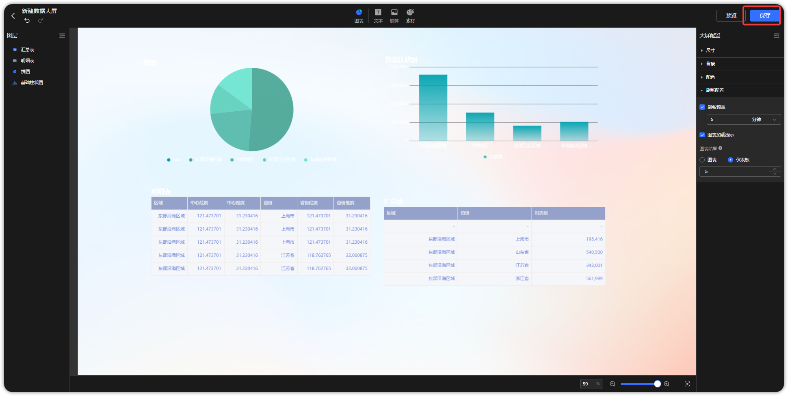{ width="900px" }

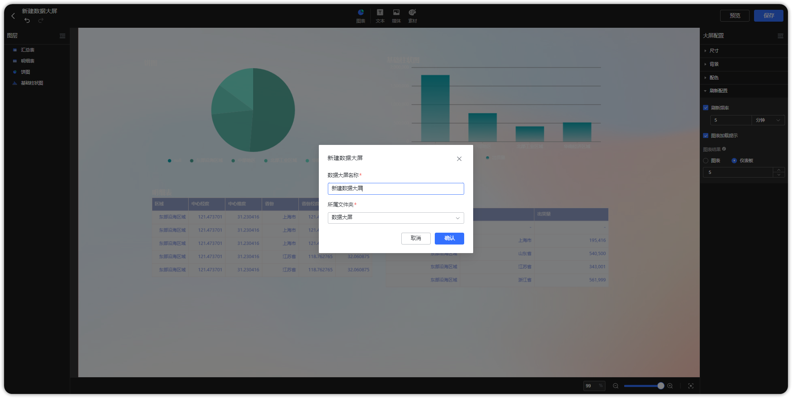{ width="900px" }

## 10 返回

!!! Abstract ""
	点击下图所示的返回按钮，关闭数据大屏。

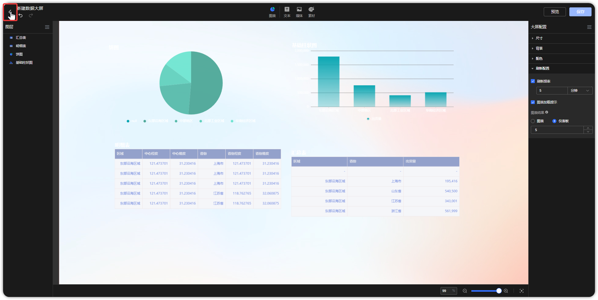{ width="900px" }

## 11 快捷键使用

!!! Abstract ""
	数据大屏支持快捷键复制、粘贴、剪切、撤销等。  


