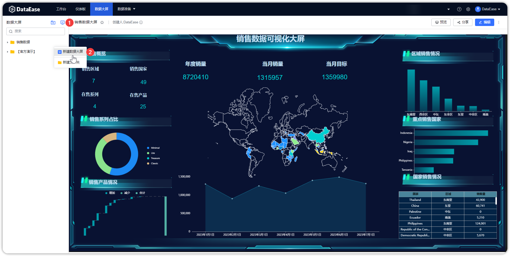
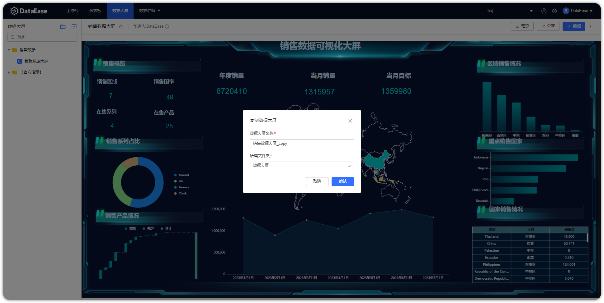
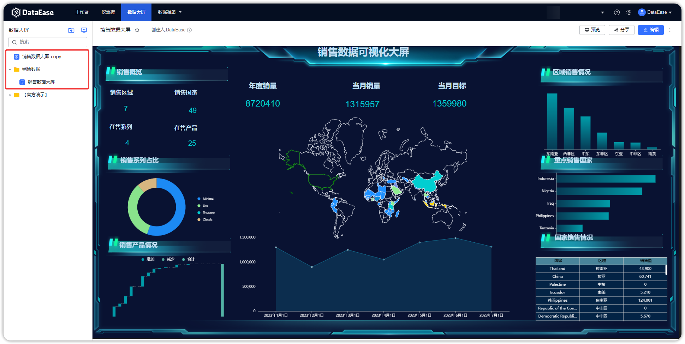

## 1 自定义数据大屏

!!! Abstract ""
	点击【序号 1】 或【序号 2】位置新建数据大屏，根据下图所示操作，在目录下新建数据大屏；

{ width="900px" }  

## 2 复制数据大屏

!!! Abstract ""
	按下图所示，选择对应的数据大屏进行复制，保存复制的数据大屏。

{ width="900px" }  
{ width="900px" }
{ width="900px" }

