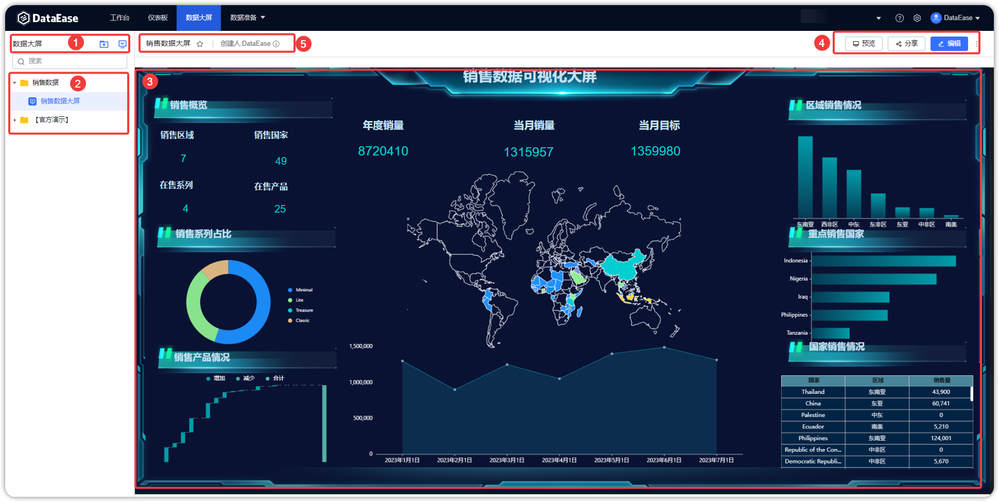

## 1 数据大屏概述

!!! Abstract ""
	选择【数据大屏】菜单，进入数据大屏功能模块。此模块支持数据大屏的添加、编辑、重命名、预览、查看等，数据大屏制作完成后，还可支持数据大屏的收藏、分享、下载等等。

## 2 界面功能区

!!! Abstract ""
	如下图所示：

	- 【序号 1】创建数据大屏和文件夹；
	- 【序号 2】已创建好的数据大屏放到此区域目录下，可对数据大屏进行编辑、复制、分享、移动、重命名、删除；
	- 【序号 3】数据大屏预览区，从数据大屏目录区选择数据大屏，在此区域预览；
	- 【序号 4】数据大屏操作区，可对数据大屏分享、预览、数据刷新、导出为 PDF和图片；
	- 【序号 5】查看数据大屏信息，在数据大屏预览界面点击此感叹号，数据大屏信息则弹出提示。

{ width="900px" }
