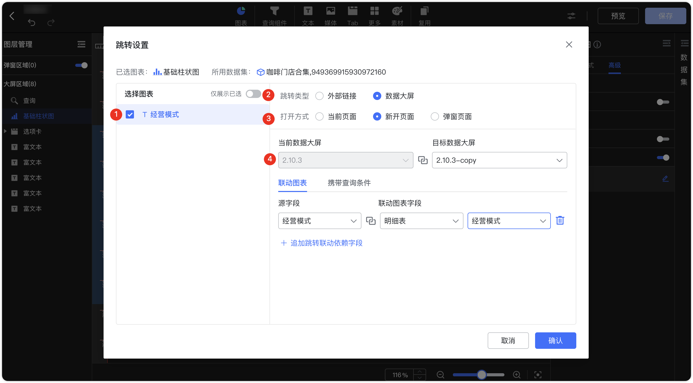

## 1 编辑

!!! Abstract ""
	创建一个新的图表组件后，数据大屏右侧会默认展开该图表的配置界面，点击【收回】也可将右侧图表编辑区、数据集编辑区隐藏靠边。

{ width="900px" }

## 2 复制与删除

!!! Abstract ""
	使用系统快捷键可快速复制组件 ，点击【back】键进行组件删除。

{ width="900px" }

!!! Abstract ""
	表格支持右键复制单元格内容鼠标悬浮到某一单元格上，点击右键，即可复制当前单元格内容。（注意，这里不会另外弹出复制按钮，右键之后就已经完成了复制）
{ width="900px" }

## 4 组件位置及大小调整

!!! Abstract ""
	点击组件出现下图图标，可进行组件的位置移动和大小调整。

{ width="900px" }

{ width="900px" }
!!! Abstract ""
	通过组件的位置属性，通过设置 X、Y、W、H 的值，可对组件的位置和大小精准调整。

{ width="900px" }

!!! Abstract ""
	数据大屏中所有组件均支持 3D 设置，且支持组件组合后进行 3D 设置。

{ width="900px" }

## 5 事件设置
!!! Abstract ""
	图片、富文本、指标卡、图形、图标组件支持事件设置。数据大屏中支持的事件：

    - 跳转：跳转到指定 URL
    - 刷新：刷新整个数据大屏
    - 弹窗区域：控制弹窗区显示
    - 下载：将当前数据大屏导出为图片
    - 全屏：点击后数据大屏全屏展示

    **注意：事件绑定需退出编辑模式后生效，富文本开启绑定事件则内部点击事件失效。**

{ width="900px" }

## 6 联动设置

!!! Abstract ""
	如下图，切换到 Tab 【高级】，打开【联动设置】开关。  
	**提示：** 仪表盘、水波图、富文本不支持联动设置。

{ width="900px" }

!!! Abstract ""
	如下图，当设置两个图表联动时，设置相对应的图表的联动字段，设置完成后，点击【确定】，联动设置完成。

{ width="900px" }

!!! Abstract ""
	第一步，点击【黑龙江省】，并选择【联动】。
!!! Abstract ""
	如果图表同时设置了联动和钻取，那么当点击时由用户选择执行联动或者钻取，当只设置了联动时，默认执行联动；当只设置了钻取时，默认执行钻取。

{ width="900px" }

!!! Abstract ""
	第二步，联动结果展示，如下图，设置了联动的图表，只展示浙江省的数据，图表联动时，支持联动部分高亮显示。

{ width="900px" }

!!! Abstract ""
	第三步，可点击下图所示位置，清除局部联动和所有联动。

{ width="900px" }

!!! Abstract ""

	当一个图表同时配置了【下钻】与【联动】时，可以选择单独触发，如下图所示，根据提示选择当前执行下钻还是联动。  
	也可以选择在配置联动设置时，选择“同时触发联动和下钻”，这样当点击该图表时将同时执行下钻与联动动作。

{ width="900px" }

{ width="900px" }

## 7 跳转设置

!!! Abstract ""
	如下图，切换到 Tab 【高级】，打开【跳转设置】开关。
	**提示：** 仪表盘、水波图、词云图、富文本不支持跳转。

{ width="900px" }

!!! Abstract ""
	**第一种，数据大屏间跳转，如下图所示，设置原图表与数据大屏的跳转：**  
	第一步：设置启用字段；  
	第二步：选择数据大屏链接类型；  
	第三步：选定跳转的数据大屏（系统默认会追加一个字段选择）；  
	第四步：选择关联图表和联动字段；  
	第五步：点击【确定】，完成跳转设置。  
	**注意：** 当前用户至少拥有目标数据大屏的查看权限，跳转时，若启用字段是指标字段，则提示”未获取跳转信息“。

{ width="900px" }

!!! Abstract ""
	跳转支持携带查询组件的过滤值并传递给外部参数。
	在目标数据大屏上创建外部参数，添加所需的外部参数，并选择与其关联的查询组件或图表。

{ width="900px" }

!!! Abstract ""
	在跳转数据大屏上配置跳转设置，选择需要支持跳转功能的图表进入跳转配置界面。

    如果目标数据大屏中有多个图表需要联动，可在【联动图表】中进行字段关联设置。  

{ width="900px" }

!!! Abstract ""
	切换【携带查询条件】，将源数据大屏的查询组件值绑定到目标数据大屏的外部参数。

{ width="900px" }

!!! Abstract ""
	可将源数据大屏上的查询条件动态传递至目标数据大屏，实现跨数据大屏的图表联动。

{ width="900px" }

!!! Abstract ""
	**第二种，外部链接跳转，支持将图表的点击值作为参数传递给第三方公共链接，作为第三方链接的参数：**  
	第一步：设置启用字段；  
	第二步：选择外部链接链接类型；  
	第三步：填写外部链接地址，同时支持点击字段用来拼接 URL 或者参数；  
	第四步：点击【确定】，完成跳转设置。  
	**注意：** 跳转时，若启用字段是指标字段，则提示”未获取跳转信息“。 

{ width="900px" }

!!! Abstract ""
	点击【福建省】，并选择【跳转】。如果图表同时设置了联动和钻取，那么当点击时由用户选择执行联动或者跳转，当只设置了跳转时，默认执行跳转。

{ width="900px" }

!!! Abstract ""
	如果选择的是数据大屏跳转，那么跳转至数据大屏，并联动目标数据大屏的图表，如果不需要，可点击右上角清除联动。

{ width="900px" }
!!! Abstract ""
	如果选择的是外部链接跳转，那么跳转至第三方平台，同时点击值传递给第三方链接。

{ width="900px" }

## 8 组件样式

!!! Abstract ""
	如下图，图表切换到 Tab 【样式】，在【背景】和【基础样式】进行组件样式设置。

{ width="900px" }

!!! Abstract ""
	支持设置组件背景模糊，该效果能够透过组件展示并模糊下层内容，透明区域也将应用模糊处理。若为图片，需确保其具有透明背景以生效。

{ width="900px" }

!!! Abstract ""
	图片等其他组件同样支持设置组件样式；以下图为示例，图片组件可选择边框样式以及设置背景。

{ width="900px" }

