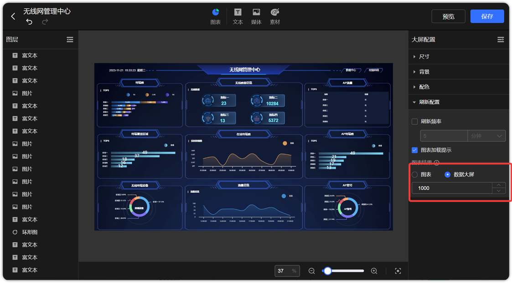

## 1 分享公共链接

!!! Abstract ""
	点击下图中所示位置，创建公共链接进行数据大屏分享。

{ width="900px" }

{ width="900px" }

!!! Abstract ""
	打开下图中所示链接分享的按钮，链接自动生成，点击【复制链接】进行分享。  
	**分享链接可设置有效期及密码保护。**

{ width="900px" }

## 2 数据大屏导出

!!! Abstract ""
	点击下图中所示位置，导出数据大屏的模板、PDF、图片到本地，可在本地的下载目录中查看。

{ width="900px" }

## 3 数据大屏预览

!!! Abstract ""
	点击下图中所示位置，新打开页面预览。

{ width="900px" }

## 4 数据大屏刷新

!!! Abstract ""
	数据大屏新提供手动与自动两种方式，其中自动刷新配置如下，支持开关控制，可开启固定刷新功能，实时刷新数据，若当前数据大屏一般长时间无数据更新，不需要固定刷新功能则可关闭此功能，完成配置后需保存数据大屏进入预览界面查看效果。

{ width="900px" }

!!! Abstract ""
	同时，数据大屏提供手动刷新按钮，用户需要时可自行点击进行刷新。

{ width="900px" }

