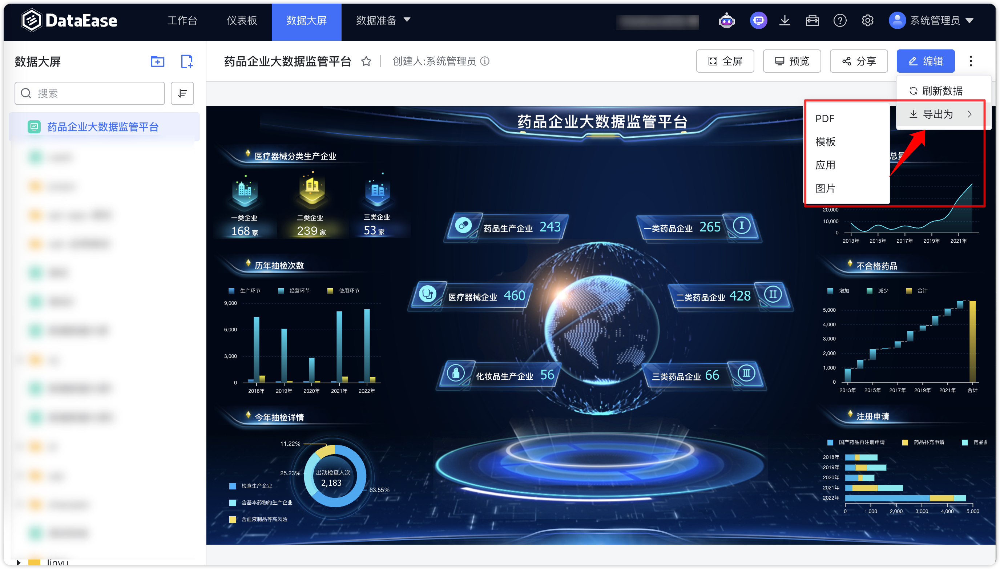

## 1 分享公共链接

!!! Abstract ""
	点击下图中所示位置，创建公共链接进行数据大屏分享。

{ width="900px" }

{ width="900px" }

!!! Abstract ""
	打开下图中所示链接分享的按钮，链接自动生成，点击【复制链接】进行分享。  
	**分享链接可设置有效期及密码保护。**

{ width="900px" }

!!! Abstract ""
	支持自定义公共链接后缀。
{ width="400px" }{ width="400px" }
!!! Abstract ""
	支持自定义公共链接密码。
{ width="500px" }

!!! Abstract ""
	公共链接功能现已集成 Ticket 机制，公共链接外部参数可以直接在 Ticket 参数中简易设置，增强外部传参的安全性和灵活性。  
	**注意：设置 Ticket 的同时，需要开启 [设置仪表板外部参数](https://dataease.io/docs/v2/user_manual/panel_basicfunctions/#7)。**   
	打开 Ticket 设置，并单独配置其有效期与参数，每个 Ticket 均可独立设定有效期，例如配置有效期为 30 天，参数为 {"name":"Tony","age":10}：  

{ width="500px" }

!!! Abstract ""
	复制 Ticket 链接，那么，使用 Ticket 的公共链接格式为 https://example.dataease.com/link/bcg48L2W?ticket=xk59xiHJ。在此情况下，无需传递 Ticket 参数，DataEase 将从数据库自动获取 Ticket 相关参数。

{ width="500px" }

!!! Abstract ""
	当启用 Ticket “必选”选项时，只有在 URL 中附带 ticket 参数的情况下，公共链接才能被成功访问。

{ width="500px" }

## 2 数据大屏导出

!!! Abstract ""
	点击下图中所示位置，导出数据大屏的模板、应用、PDF、图片到本地，可在本地的下载目录中查看。

{ width="900px" }

## 3 数据大屏预览

!!! Abstract ""
	点击下图中所示位置，新打开页面预览。

{ width="900px" }

## 4 数据大屏刷新

!!! Abstract ""
	数据大屏新刷新提供手动与自动两种方式。自动刷新支持开关控制，可开启固定刷新功能，实时刷新数据，若当前仪表板一般长时间无数据更新，不需要固定刷新功能则可关闭此功能，完成配置后需保存仪表板进入预览界面查看效果。
	具体设置如下：

	- 刷新频率：可以通过输入时间（以秒为单位）设置数据大屏的自动刷新间隔。例如，设置为 10 秒表示每 10 秒刷新一次数据，确保显示的数据是最新的。  
	- 整体刷新：勾选此选项后，数据大屏会在每次刷新时重载整个浏览器页面内容。适合那些希望页面全局数据和样式都保持最新的情况。注意整体刷新仅公共链接和新 Tab 预览生效，避免在设计时频繁刷新影响编辑体验。  
	- 图表加载提示：开启后当数据大屏图表在刷新或加载时，会显示一个加载中的提示，告知用户当前正在获取或更新数据。  

{ width="900px" }

!!! Abstract ""
	同时，数据大屏提供手动刷新按钮，用户需要时可自行点击进行刷新。

{ width="900px" }

## 5 数据大屏全屏

!!! Abstract ""
	数据大屏新支持一键全屏预览

{ width="900px" }

