## 首页
> 由测试、报告、测试日历三个部分组成，可快速了解到最近执行的测试内容以及整体的性能测试频次。

- 测试：展示最近 5 次执行的性能测试

- 报告：展示最近 5 次执行的性能测试所生成的报告

- 测试日历：按时间维度展示性能测试执行的频次，颜色越深，代表使用频次越高

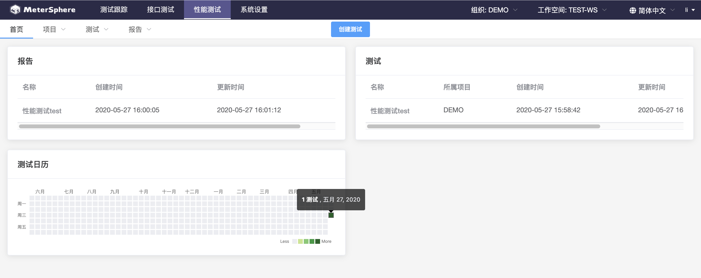

## 项目
> 对项目进行新增、修改、删除、查询操作

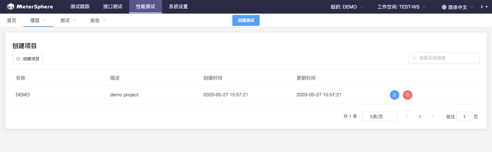

### 新增项目
> 点击“创建项目”，录入项目名称和描述

  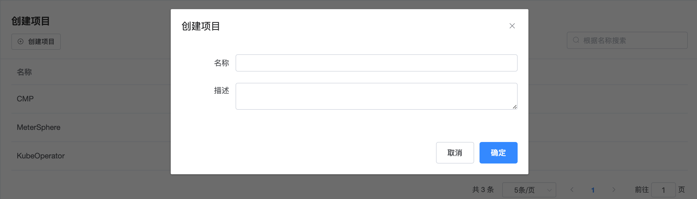

  

### 修改项目
> 选择要修改的项目，点击编辑按钮

  

  

### 删除项目
> 选择要删除的项目，点击删除按钮

  

  

### 查询项目
> 查询全部项目选择“显示全部”，查询单个项目可以根据名称搜索

  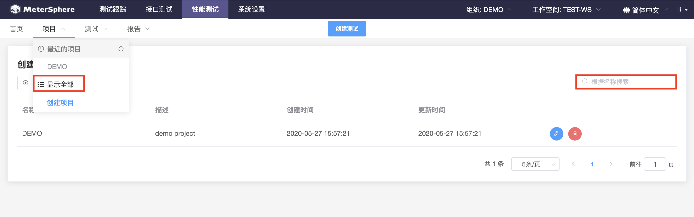
  
## 测试

### 创建测试

#### 场景配置
> 填写基本信息，上传测试JMX脚本，根据需要添加CSV参数文件

  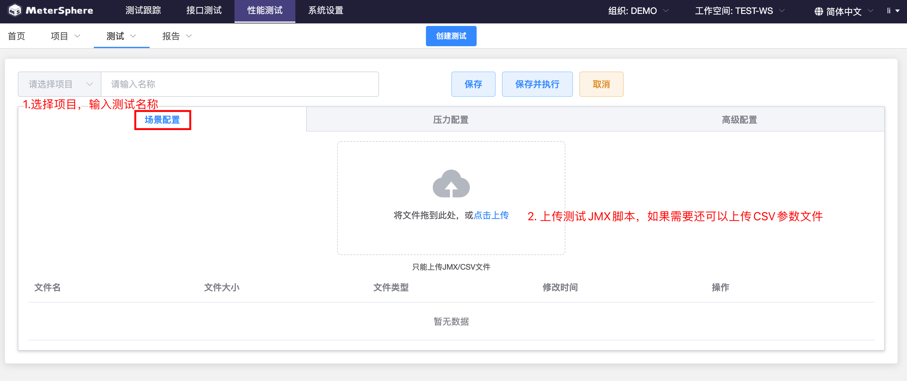
  
#### 压力配置
> 资源池在 系统设置->系统->测试资源池 中进行管理

  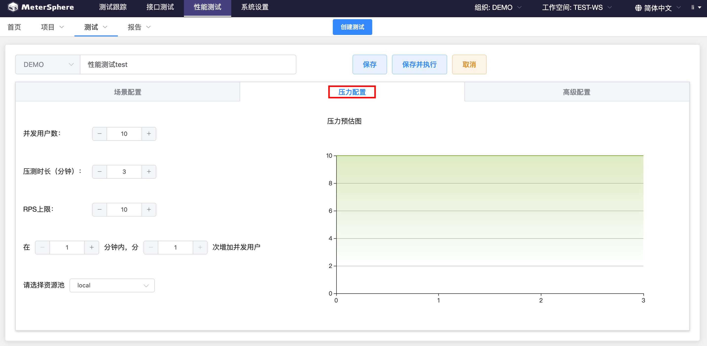
  
#### 高级配置

  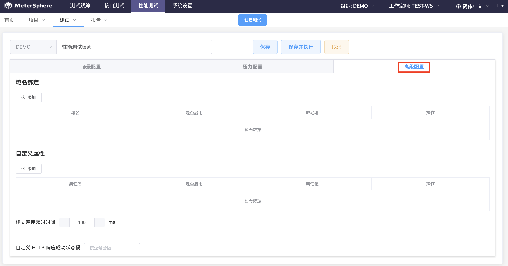

### 修改测试
  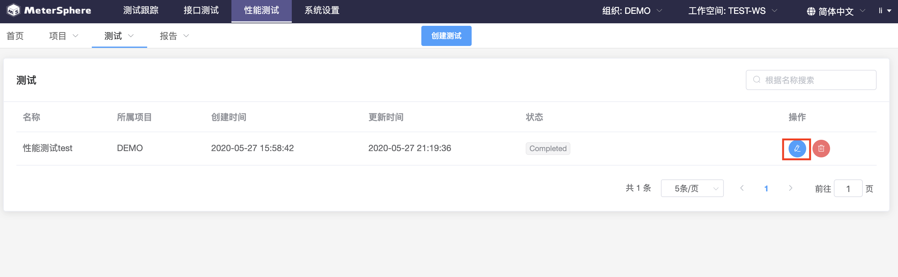
  
> 点击测试-显示全部，选择要修改的测试，点击编辑按钮，跳转到如下图所示进行测试的修改

  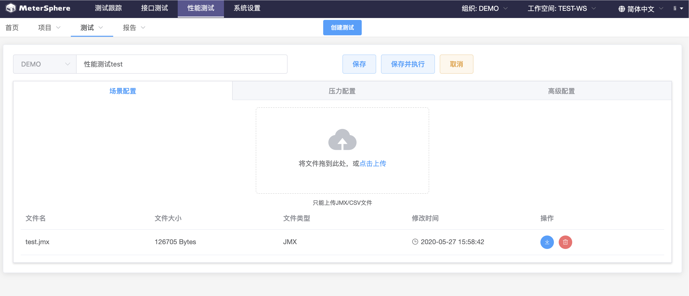

### 删除测试

> 点击测试-显示全部，选择要删除的测试，点击删除按钮
  
  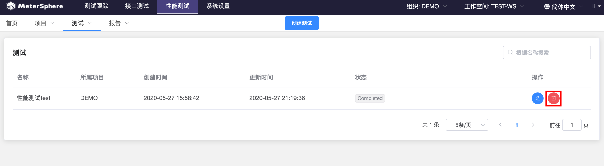
  

### 查询测试
> 查询全部测试，点击显示全部，查询单个测试可以根据名称搜索

  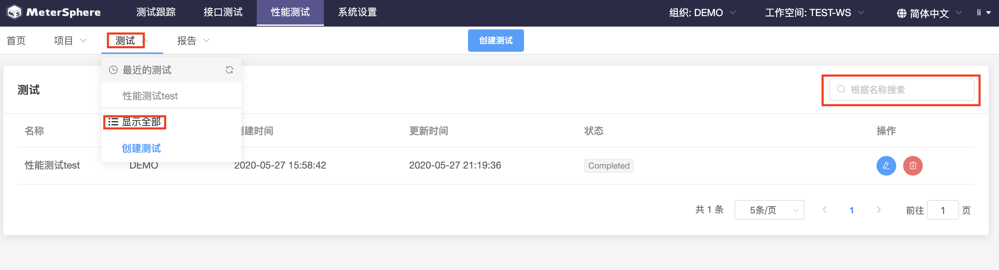

### 执行测试
> 点击“保存并执行”按钮，页面将会跳转到当前测试的测试报告中。

  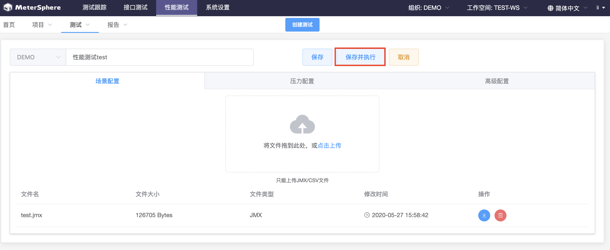

### 更多操作
> 暂未实现

## 报告

> 对性能测试报告的查询和删除操作

### 查询报告

> 查询全部报告，点击显示全部，查询单个报告可以根据名称搜索

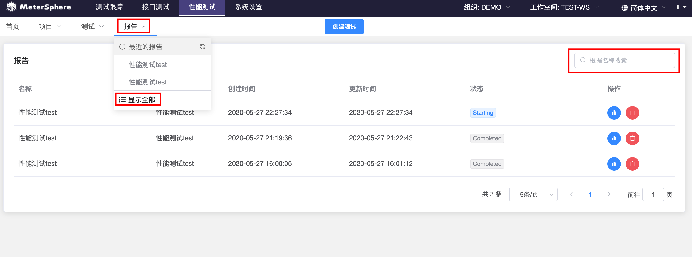

### 报告详情
#### 测试概览
  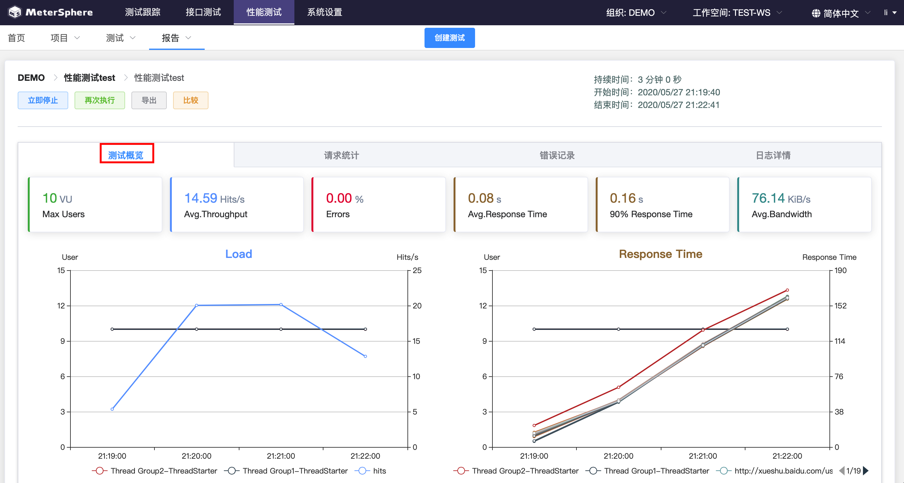
#### 请求统计
  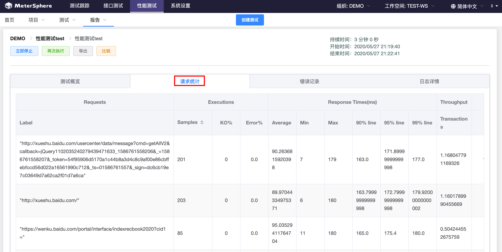
#### 错误记录
  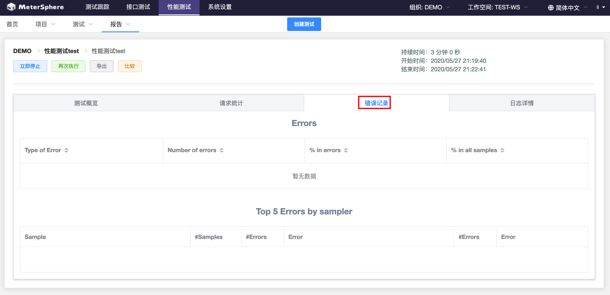
#### 日志详情

### 删除报告

> 点击报告-显示全部，选择要删除的报告，点击删除按钮

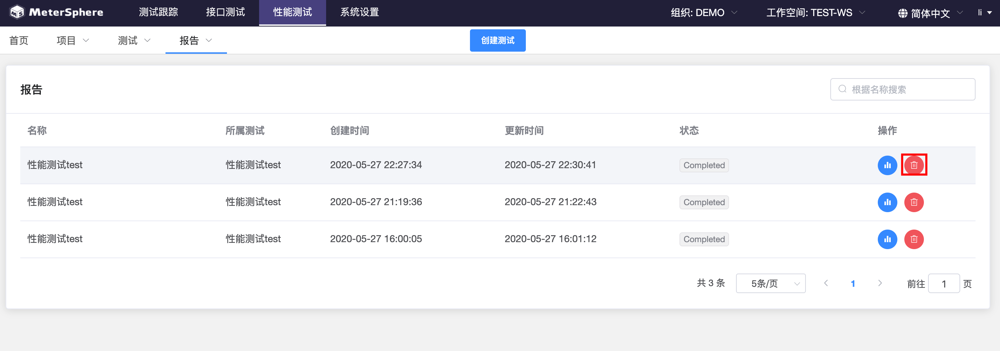

