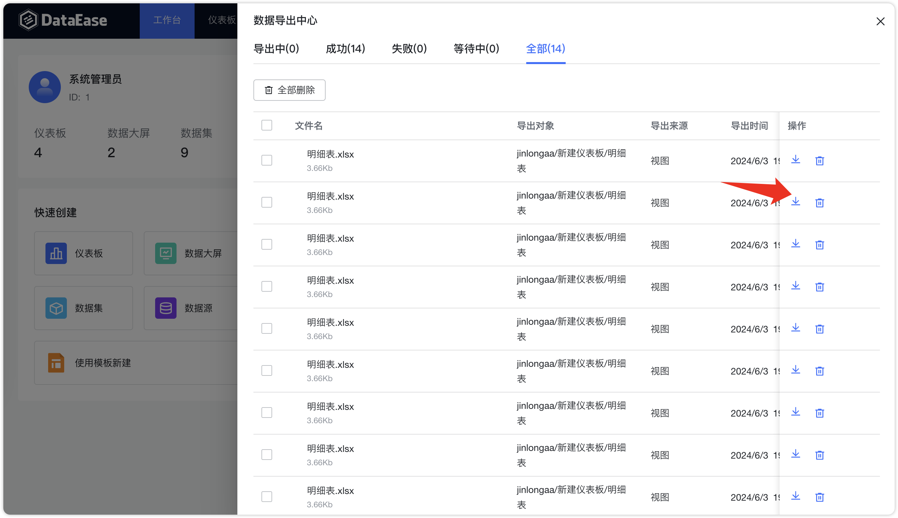

!!! Abstract ""
    图表的 Excel 数据导出功能已进行优化升级。原本版本直接生成 Excel 文件进行导出的机制，现改进为引入一个全新的数据导出中心，以便统一管理所有导出任务。     
    
{ width="900px" }
{ width="900px" }

!!! Abstract ""
    该导出中心默认支持 10 个并发导出任务，并会自动将生成的数据文件导出至 DataEase 服务器。导出任务完成后，用户将会接收到通知，随时可前往导出中心下载文件。

{ width="900px" }