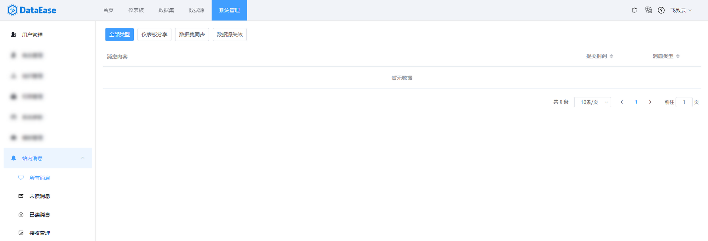
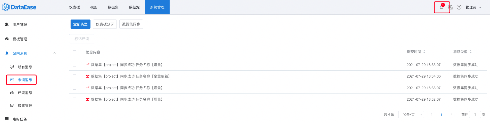
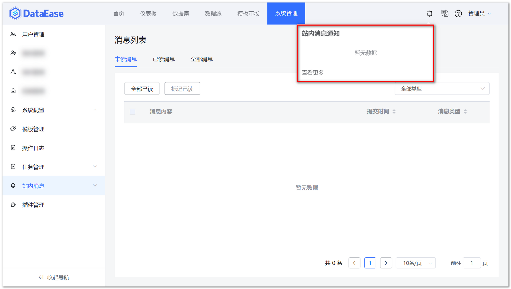
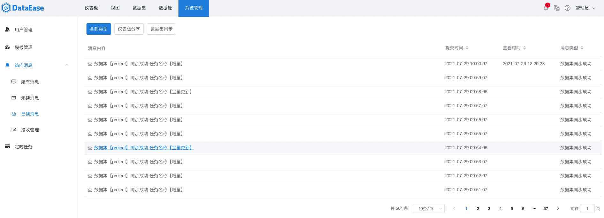
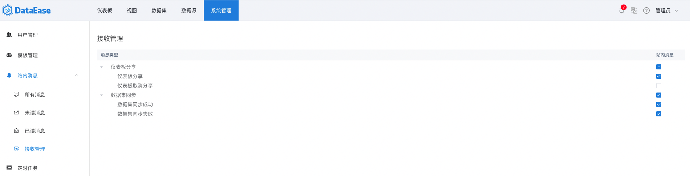

## 1 功能概述

!!! Abstract ""
	通过接收配置，后台自动推送消息给用户，用户登录后可第一时间查阅消息、及时响应。

## 2 所有消息

!!! Abstract ""
	保留后台自动推送的所有消息，可通过类型筛选，查阅对应消息。比如，点击【数据集同步】类型的任务，自动跳转至定时任务，查看该任务的执行情况。
	
{ width="900px" }

## 3 未读消息

!!! Abstract ""
	保留后台自动推送的未读消息，用户查阅对应消息后，消息自动从【未读消息】中移除。点击下图消息内容的标题，即可跳转至执行记录。

{ width="900px" }

!!! Abstract ""
	后台推送的消息，通过 WebSocket 推送到页面右上角小铃铛，用户可点击【铃铛】查看。

{ width="900px" }

## 4 已读消息

!!! Abstract ""
	未读消息经查阅后，消息自动从【未读消息】中移除，并移入【已读消息】。

{ width="900px" }

## 5 接收管理

!!! Abstract ""
	用户可通过配置，选择接收某种类型的消息，亦可选择不接收某种类型的消息。接收方式可以为邮件或站内信。

{ width="900px" }
