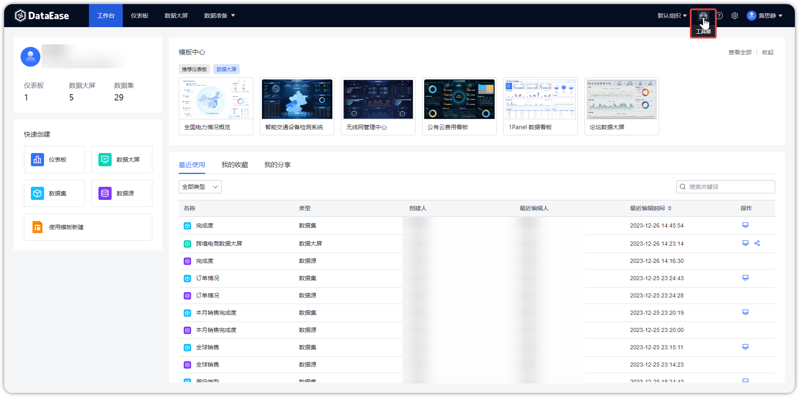
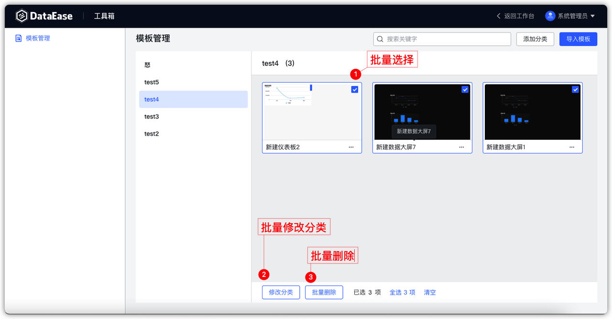
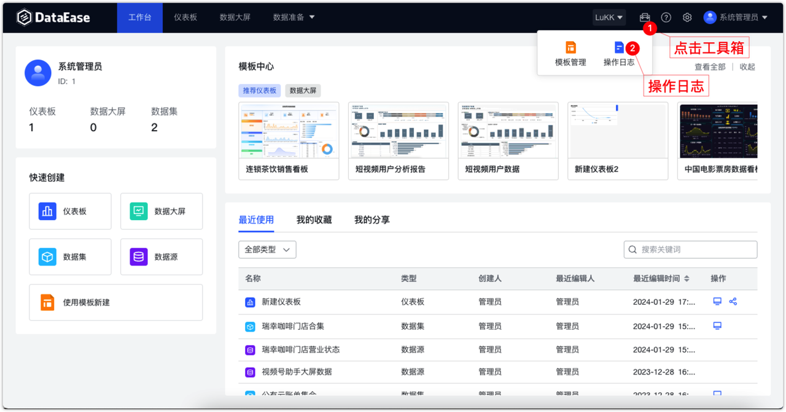
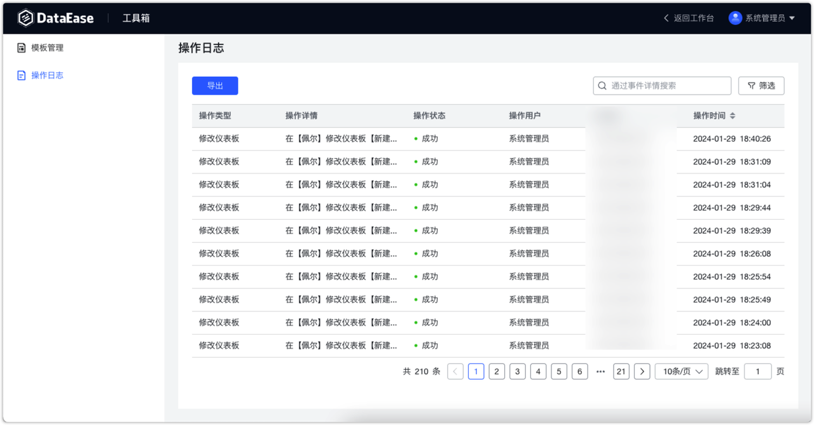
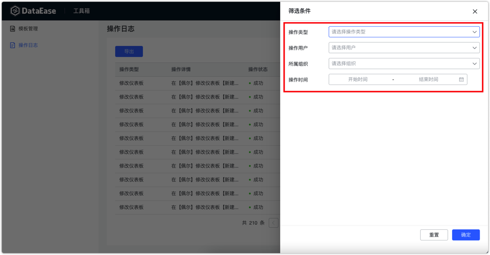

{ width="900px" }

##  1 模板管理

### 1.1 新建模板分类

!!! Abstract ""
    用户可以在创建仪表板的时候，通过选择已有的模板，快速创建所需的仪表板和数据大屏，减少创建可视化图表的工作量。  
    可以通过点击【添加分类】按钮，给模板新建分类，为模板进行分组分类，可以更方便的对模板进行管理和查找。

{ width="900px" }
!!! Abstract ""
    - 支持批量修改模板分类
    - 支持批量删除模板
{ width="900px" }

### 1.2 添加模板

!!! Abstract ""
    模板来源于仪表板、数据大屏的转换，可在仪表板、数据大屏预览界面"保存为模板"。如下图所示，也可点击【导入模板】，上传 .DET 结尾模板文件，添加模板。

{ width="900px" }
{ width="900px" } 
{ width="900px" }

### 1.3 添加应用

!!! Abstract ""
    仪表板和数据大屏支持以应用的形式进行导出。在 DataEase v2 中，应用作为模板的其中一种形式，和模板同时放在【模板管理】中管理。  
    **模板与应用的区别：**

    - 模板：更注重仪表板本身的样式设计布局等内容，。DataEase 生成仪表板并附带示例数据，需要根据自己的数据情况自行手动创建数据源、数据集并将仪表板中的示例数据替换为自己的真实数据；
    - 应用：有一定的针对性，适用于应用系统的对接，例如 JumpServer 应用。DataEase 生成仪表板并同时生成其所对应的数据集与数据源，无需再手动替换数据。

    关于模板文件与应用文件的区别可参考：https://kb.fit2cloud.com/?p=211。  

{ width="900px" }

{ width="900px" }
!!! Abstract ""
    可在【模板管理】中上传应用。
{ width="900px" }
!!! Abstract ""
    使用模板新建仪表板或数据大屏时可选择使用存在的应用文件。

{ width="900px" }

{ width="900px" }
!!! Abstract ""
    使用应用创建的资源，会自动弹出相关配置项，需要用户进一步填写。

{ width="900px" }

## 2 操作日志

!!! Abstract ""
    系统管理员可以查看所有日志，包括组织管理员在内的其他用户只能查看自己的所有日志，包括该用户所在的所有组织下的操作日志。
{ width="900px" }

!!! Abstract ""
    可根据操作类型、操作用户、所属组织、操作时间等查询系统操作日志。
{ width="900px" }

{ width="900px" }
