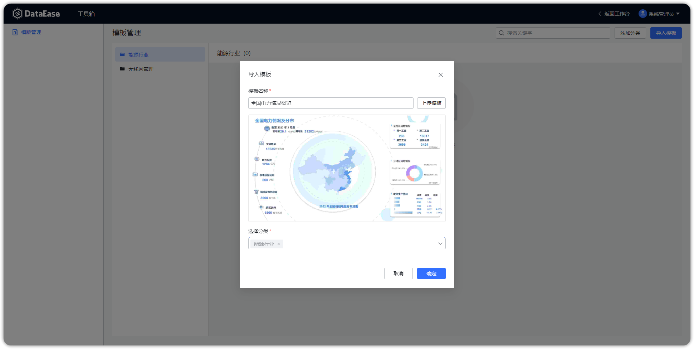

!!! Abstract ""
    目前百宝箱只有模版管理，后续会上线其他工具。

{ width="900px" }

##  模板管理

### 1 新建模板分类

!!! Abstract ""
    用户可以在创建仪表板的时候，通过选择已有的模板，快速创建所需的仪表板和数据大屏，减少创建可视化图表的工作量。  
    可以通过点击【添加分类】按钮，给模板新建分类，为模板进行分组分类，可以更方便的对模板进行管理和查找。

{ width="900px" }

### 2 添加模板

!!! Abstract ""
    模板来源于仪表板、数据大屏的转换，可在仪表板、数据大屏预览界面"保存为模板"。如下图所示，也可点击【导入模板】，上传 .DET 结尾模板文件，添加模板。

{ width="900px" }
{ width="900px" } 
{ width="900px" }