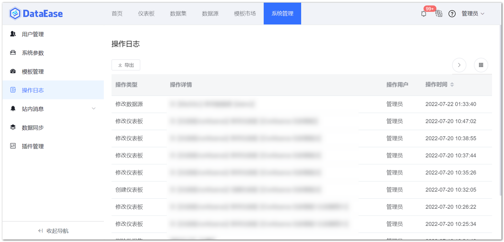
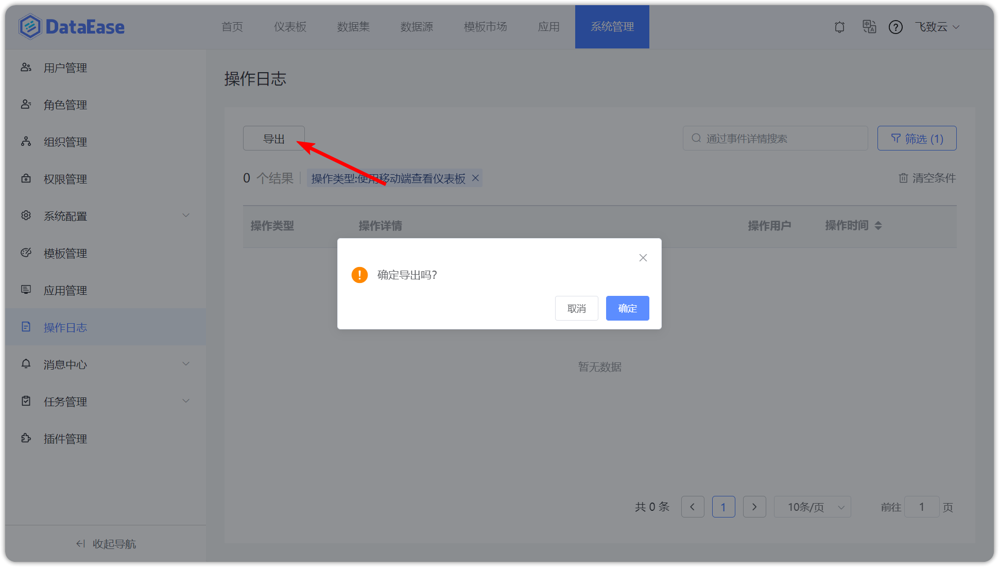

## 1 查看操作日志

!!! Abstract ""
    系统支持操作日志的查看，如下图所示；  
    支持用户登录信息查看（主要包括时间），支持查看仪表板信息记录查看（区分 PC 端与移动端），支持视图数据导出查看（记录视图数据的导出记录)等；  
    可通过高级搜索，输入操作类型、操作用户、操作时间筛选相应的操作日志。  
    记录规则如下：

    - 定时报告发送，不计查看次数；
    - 视图复用，不计查看次数；
    - 仪表板导出，不计查看次数；
    - 移动端查看，需要记录次数，区分 PC 端和移动端；
    - 编辑仪表板，不计查看次数。  

    **提示：** 定时任务和消息通知里已有的相关记录，操作日志里不再重复记录。

{ width="900px"}

## 2 导出操作日志

!!! Abstract ""
    点击下图所示的按钮，将操作日志导出为 Excel 文件。

{ width="900px" }