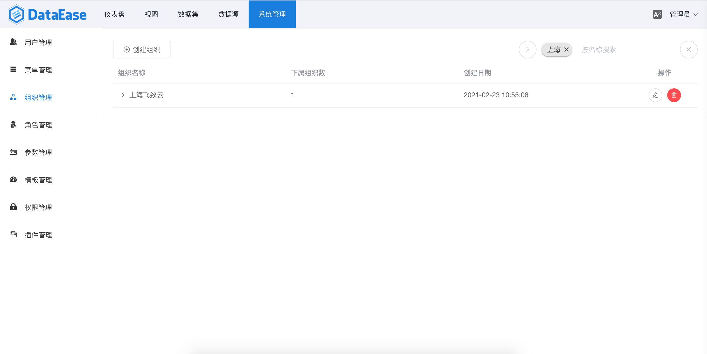
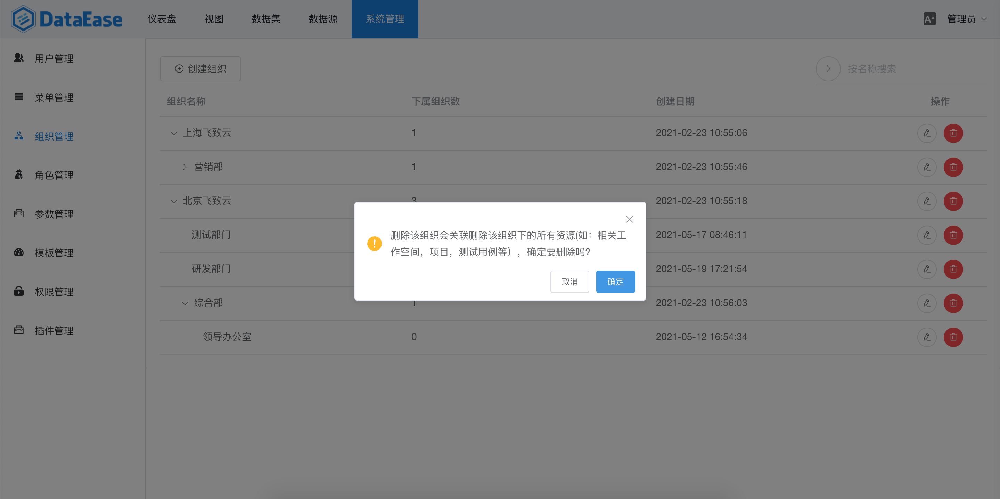

> 【组织管理】中可以对用户组织基本信息进行管理，包括组织名称、组织层级关系、组织的排序等。

## 创建组织
> 在组织列表页的上方，点击【创建组织】按钮，在弹出的对话框中输入要新建组织的基本信息，如名称、排序、是否为顶级组织、上级组织等，点击【确定】按钮。

## 编辑组织
> 组织列表的最后一列是组织的操作区，选择需要编辑的组织，点击该组织操作区的【编辑】按钮。在弹出的信息框中，修改组织相关信息后，点击【确定】按钮即可保存。

## 搜索组织
> 在组织列表页的右上方是组织的搜索区，在搜索区中输入需要查询过滤的组织名，如"上海"，敲下回车键即可进行指定用户的搜索。还可以点击搜索区的【高级搜索】箭头，使用高级搜索功能。

## 删除组织
> 点击组织列表操作区的【删除】按钮，在弹出的确认框中点击【确定】按钮即可。

