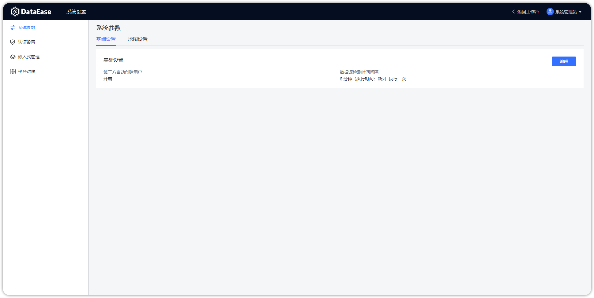
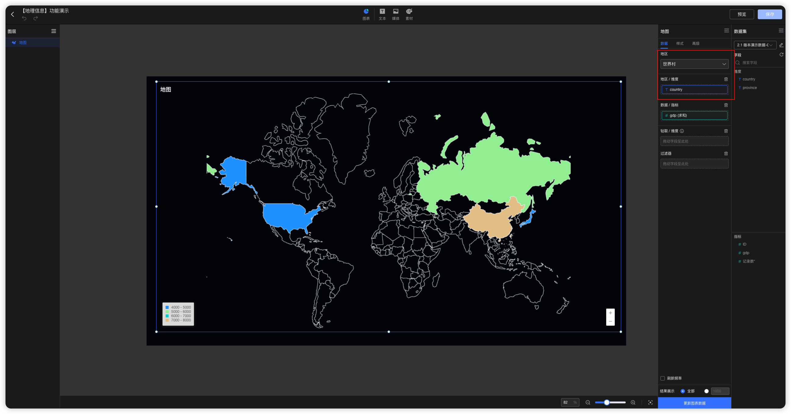

## 1 基础设置

{ width="900" }

!!! Abstract ""
    如下图所示，可设置是否开启第三方自动创建用户、数据源检测时间间隔。

{ width="900" }

!!! Abstract ""
    支持设置数据源有效性检测的间隔时间。

{ width="900" }

## 2 地图设置

!!! Abstract ""
    支持设置自定义地图文件。

{ width="900" }

{ width="900" }

!!! Abstract ""
    **世界各国的地图文件可以自行在网上下载。**  
    **提示：** 因为各个国家的行政架构不一致，无法统一处理，目前世界地图不支持钻取。  
    1.下载指定国家的 geo 地图文件，文件缀名需修改为 .json，如下载俄罗斯的 russia.geojson 改为 russia.json；
    https://github.com/codeforgermany/click_that_hood/blob/main/public/data/russia.geojson；  
    2.确认 geo 文件是否正确，并在 properties 中包含 name 字段；

{ width="900" }

!!! Abstract ""
    3.查找[国家地区代码](https://zh.wikipedia.org/wiki/%E5%9C%8B%E5%AE%B6%E5%9C%B0%E5%8D%80%E4%BB%A3%E7%A2%BC)来唯一标识该国家，如俄罗斯地区的代码为 643，区域代码可以写成 643100000；  
    4.在 DataEase 中创建俄罗斯地图；

{ width="900" }

!!! Abstract ""
    5.创建测试数据文件；

{ width="900" }

!!! Abstract ""
    country 需要和地球村文件里的 name 字段名称保持一致；

{ width="900" }

!!! Abstract ""
    province 需要和国家 geo 文件中 properties 下的 name 字段保持一致；

{ width="900" }

!!! Abstract ""
    6.制作俄罗斯地图视图，在地图中选择俄罗斯即可；

{ width="900" }

{ width="900" }
<!-- 
## 4 引擎设置

### 4.1 精简模式

!!! Abstract ""
    精简模式下需配置数据引擎用以存储 Excel 及 API 数据集数据，目前该引擎只支持 MySQL 类型，支持使用外部 MySQL；  
    系统会自动检查是否设置了引擎参数，若无设置，则读取 dataease.properties 配置文件中 MySQL 连接信息，并填入其中。

{ width="900" }

### 4.2 集群模式

!!! Abstract ""
    集群模式下需要手动配置 Doris 组件的参数，用以存储 Excel 数据集，API 数据集数据和定时同步模式下数据集的数据。

{ width="900" }

## 5 Kettle 设置

!!! Abstract ""
    集群模式下需配置 Kettle 组件用以做数据抽取，可手动配置 Kettle 的基本信息，并可添加多个 Kettle 组件，多个 Kettle 存在时，任务将随机分配。

{ width="900" }  
{ width="900" }
-->
    