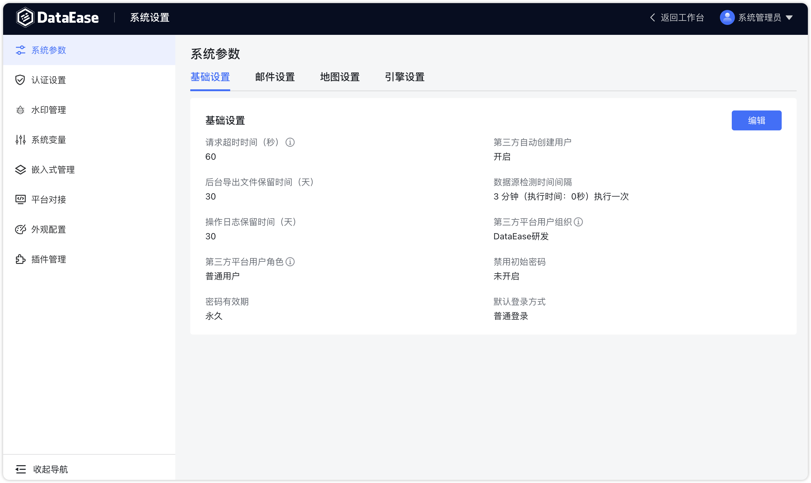
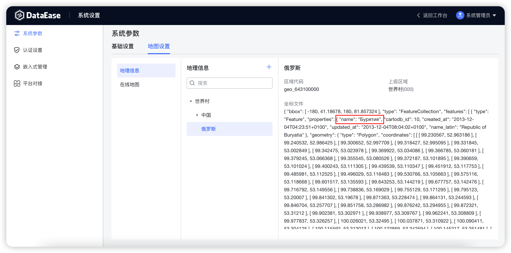

## 1 基础设置

!!! Abstract ""
    如下图所示，可设置请求超时时间，消息保留时间，以及是否显示首页。

{ width="900" }

!!! Abstract ""
    默认请求超时时间为 10 秒，可通过此项参数调整超时时间，当前最大值支持 300 秒，如下图所示。

{ width="900" }

## 2 邮件设置

!!! Abstract ""
    用户可通过配置邮件的基本信息，来接收仪表板分享、数据集同步或数据源失效的信息。

{ width="900" }

## 3 地图设置

!!! Abstract ""
    支持设置自定义地图文件。

{ width="900" }

{ width="900" }

!!! Abstract ""
    **世界各国的地图文件可以自行在网上下载，下面举例说明如何使用。**  
    **提示：** 因为各个国家的行政架构不一致，无法统一处理，目前世界地图不支持钻取。  
    1.下载指定国家的 geo 地图文件，文件要求后缀名为 json，如俄罗斯的 geojson:  
    https://github.com/codeforgermany/click_that_hood/blob/main/public/data/russia.geojson  
    2.确认 geo 文件是否正确，并在 properties 中包含 name 字段；

{ width="900" }

!!! Abstract ""
    3.查找国家地区代码来唯一标识该国家，如俄罗斯地区的代码为 643，区域代码可以写成 643100000；  
    4.在 DataEase 中创建俄罗斯地图；

{ width="900" }

!!! Abstract ""
    5.创建测试数据文件；

{ width="900" }

!!! Abstract ""
    country 需要和地球村文件里的 name 字段名称保持一致；

{ width="900" }

!!! Abstract ""
    province 需要和国家 geo 文件中 properties 下的 name 字段保持一致；

{ width="900" }

!!! Abstract ""
    6.制作俄罗斯地图视图，在地图中选择俄罗斯即可；

{ width="900" }

## 4 引擎设置

### 4.1 精简模式

!!! Abstract ""
    精简模式下需配置数据引擎用以存储 Excel 及 API 数据集数据，目前该引擎只支持 MySQL 类型；  
    DataEase v1.10.0 之前版本中引擎的参数都为空，用户不知道需要配置的情况下上传 Excel 会报错，提示用户“未配置数据引擎”；  
    DataEase v1.10.0 系统会检查是否设置了引擎参数，若无设置，则读取 dataease.properties 配置文件中 MySQL 连接信息，自动填入其中；  
    参考以下示例图，也可使用外部 MySQL 。

{ width="900" }

### 4.2 集群模式

!!! Abstract ""
    集群模式下需要手动配置 Doris 组件的参数，用以存储 Excel 数据集，API 数据集数据和定时同步模式下数据集的数据。

{ width="900" }

## 5 Kettle 设置

!!! Abstract ""
    集群模式下需配置 Kettle 组件用以做数据抽取，可手动配置 Kettle 的基本信息，并可添加多个 Kettle 组件，多个 Kettle 存在时，任务将随机分配。

{ width="900" }  
{ width="900" }

    