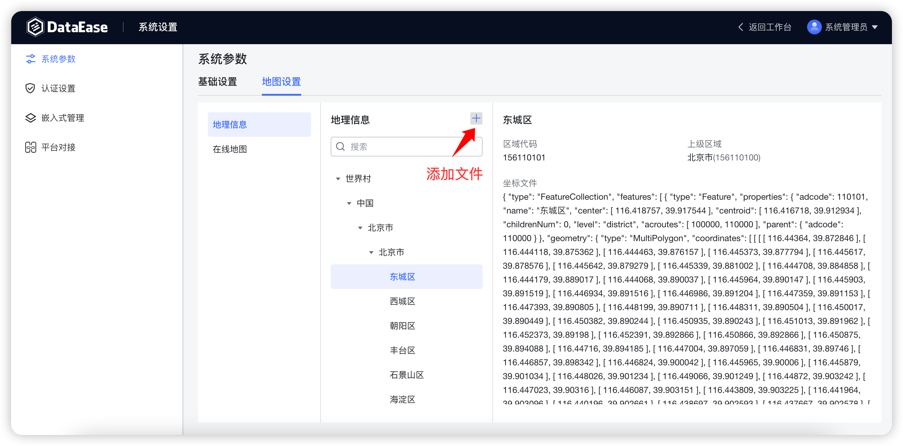
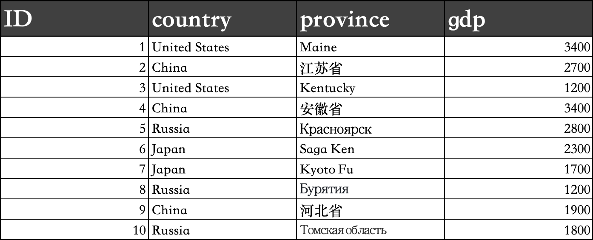

## 1 基础设置

{ width="900" }

!!! Abstract ""
    如下图所示，可设置请求超时时间、数据源检测时间间隔，日志保留时间。  
    通过 X-Pack 进行认证设置或平台对接后，可以设置是否开启第三方自动创建用户、用户组织和角色。

{ width="900" }

!!! Abstract ""
    支持设置数据源有效性检测的间隔时间。

{ width="900" }

!!! Abstract ""
    在已配置其他登录方式（LDAP、CAS、OIDC）的情况下，并将其配置为默认登录方式，则在访问 DataEase 时，登录页面会自动跳转到相应登录页面。在配置了其他默认登录方式的情况下，如果需要使用 DataEase 原有登录方式，可以访问 URL：http(s)://de_server_ip:de_port/#/admin-login，可支持所有用户的普通登录。

{ width="900px" }

{ width="900px" }

## 2 邮件设置
!!! Abstract ""
    用户可通过配置邮件的基本信息，来接收仪表板分享、数据集同步或数据源失效的信息。
{ width="900" }

## 3 地图设置

### 3.1 地理信息

!!! Abstract ""
    支持设置自定义地图文件。

{ width="900" }

{ width="900" }

!!! Abstract ""
    **世界各国的地图文件可以自行在网上下载。**  
    **提示：** 因为各个国家的行政架构不一致，无法统一处理，目前世界地图不支持钻取。  
    1.下载指定国家的 geo 地图文件，文件缀名需修改为 .json，如下载俄罗斯的 russia.geojson 改为 russia.json；
    https://github.com/codeforgermany/click_that_hood/blob/main/public/data/russia.geojson；  
    2.确认 geo 文件是否正确，并在 properties 中包含 name 字段；

{ width="900" }

!!! Abstract ""
    3.查找[国家地区代码](https://zh.wikipedia.org/wiki/%E5%9C%8B%E5%AE%B6%E5%9C%B0%E5%8D%80%E4%BB%A3%E7%A2%BC)来唯一标识该国家，如俄罗斯地区的代码为 643，区域代码可以写成 643100000；  
    4.在 DataEase 中创建俄罗斯地图；

{ width="900" }

!!! Abstract ""
    5.创建测试数据文件；

{ width="900" }

!!! Abstract ""
    country 需要和地球村文件里的 name 字段名称保持一致；

{ width="900" }

!!! Abstract ""
    province 需要和国家 geo 文件中 properties 下的 name 字段保持一致；

{ width="900" }

!!! Abstract ""
    6.制作俄罗斯地图视图，在地图中选择俄罗斯即可；

{ width="900" }

{ width="900" }

### 3.2 在线地图

!!! Abstract ""
    在线地图：支持配置高德地图 Key（符号地图、流向地图）。

!!! Abstract ""
    进入高德开放平台官网：https://lbs.amap.com/

{ width="900" }

!!! Abstract ""
    选择【文档与支持】->【API】->【web 服务 API】。

{ width="900" }

!!! Abstract ""
    点开【开发指南】->【获取 Key】。

{ width="900" }

!!! Abstract ""
    登录【高德开放平台控制台】，注册开发者，后续按照文档进行即可。

{ width="900" }

!!! Abstract ""
    如下即为验证成功，以及创建应用获取 Key。

{ width="900" }

{ width="900" }

{ width="900" }

!!! Abstract ""
    在 DataEase 在线地图 Key 配置中，填入获取的地图服务 Key，点击保持即可。

{ width="900" }

## 4 引擎设置

!!! Abstract ""
    默认数据引擎是 DataEase 自带的 MySQL，用以存储 Excel 及 API 数据集数据。目前该引擎只支持 MySQL 类型，支持使用外部 MySQL；  
    系统会自动检查是否设置了引擎参数，若无设置，则读取 dataease.properties 配置文件中 MySQL 连接信息，并填入其中。

{ width="900" }
