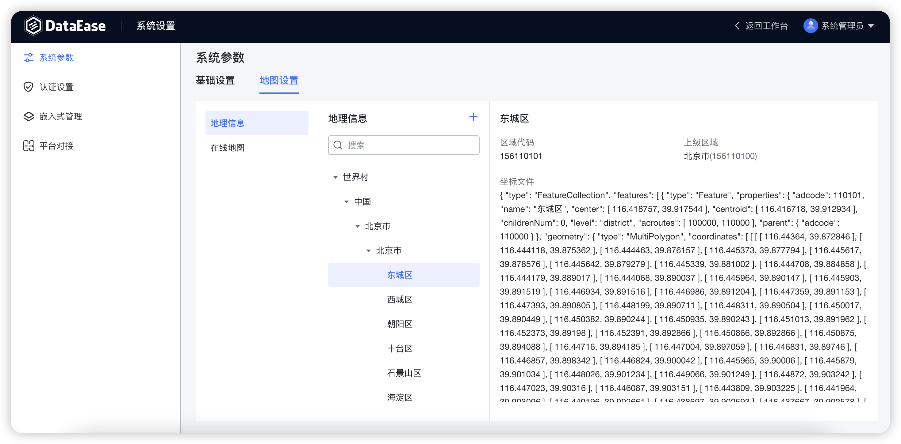
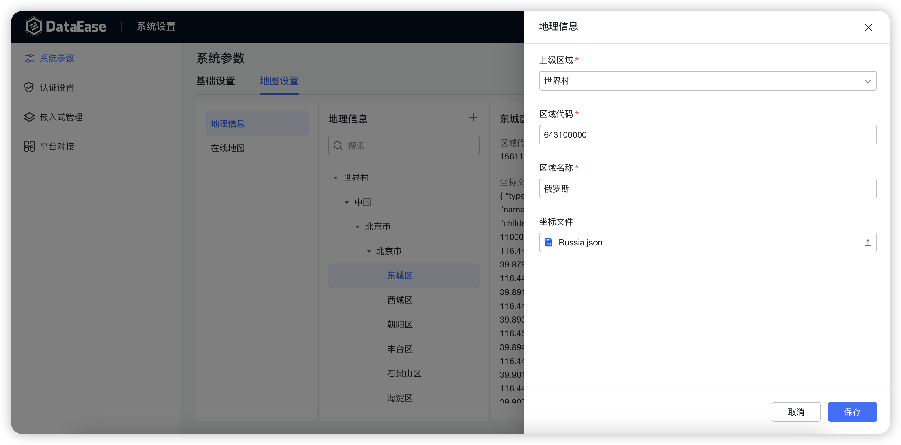
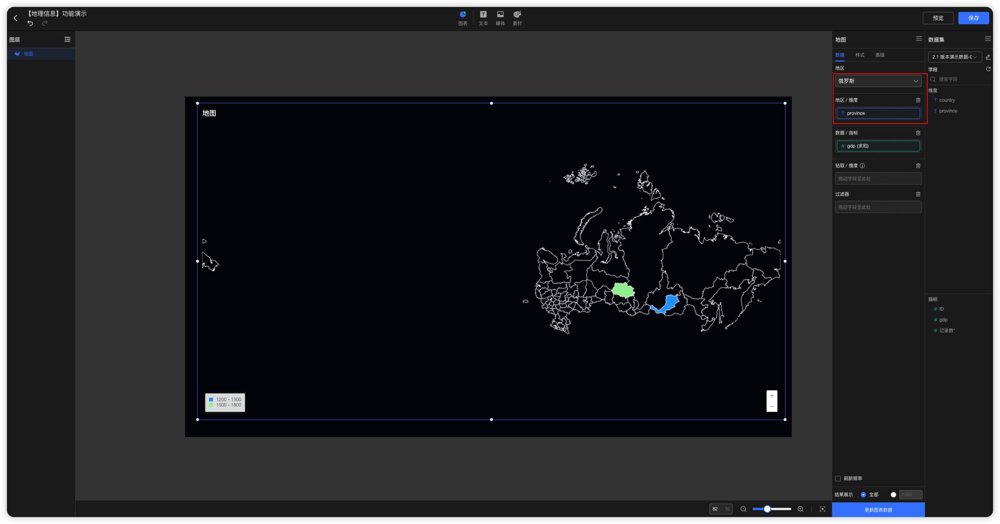
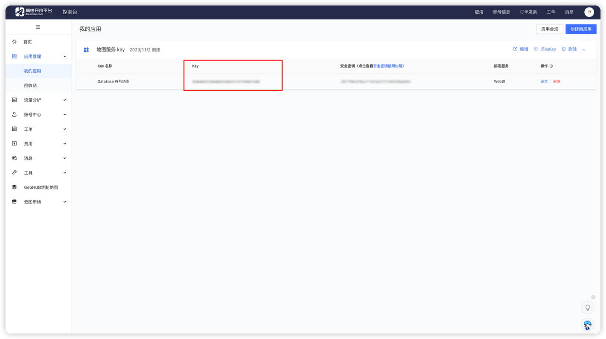
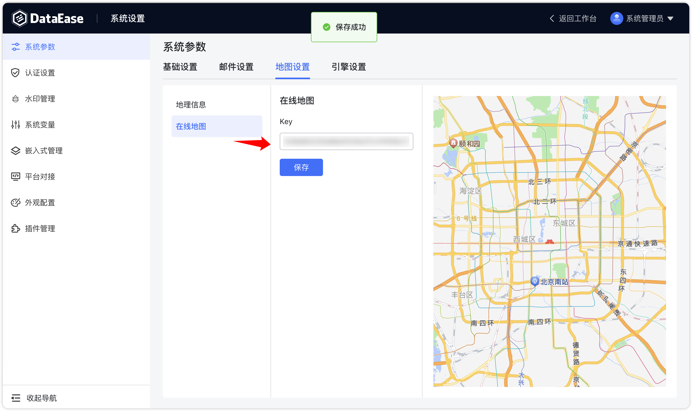
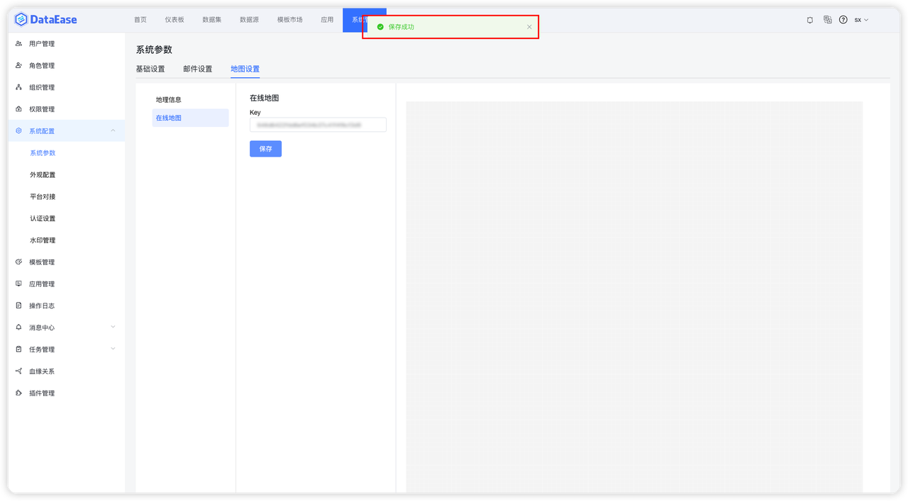

## 1 基础设置

!!! Abstract ""
    如下图所示，可设置请求超时时间，消息保留时间，日志保留时间，是否显示首页，是否显示模板市场等。

{ width="900" }

!!! Abstract ""
    默认请求超时时间为 100 秒，可通过此项参数调整超时时间，当前最大值支持 300 秒，如下图所示。

{ width="900" }

!!! Abstract ""
    支持设置数据源有效性检测的间隔时间。

{ width="900" }

!!! Abstract ""
    支持防暴力登录设置以及解锁用户；  
    “限制登录失败次数”：触发禁止登录的次数上限；  
    “限制登录失败时间”：从禁止登录到可再次登录之间需要等待的时间。

{ width="900" }

## 2 邮件设置

!!! Abstract ""
    用户可通过配置邮件的基本信息，来接收仪表板分享、数据集同步或数据源失效的信息。

{ width="900" }

## 3 地图设置

### 3.1 地理信息

!!! Abstract ""
    地理信息：支持设置自定义地图文件。

{ width="900" }

{ width="900" }

!!! Abstract ""
    **世界各国的地图文件可以自行在网上下载，下面举例说明如何使用。**  
    **提示：** 因为各个国家的行政架构不一致，无法统一处理，目前世界地图不支持钻取。  
    1.下载指定国家的 geo 地图文件，文件缀名需修改为 .json，如下载俄罗斯的 russia.geojson 改为 russia.json；
    https://github.com/codeforgermany/click_that_hood/blob/main/public/data/russia.geojson；  
    2.确认 geo 文件是否正确，并在 properties 中包含 name 字段；

{ width="900" }

!!! Abstract ""
    3.查找[国家地区代码](https://zh.wikipedia.org/wiki/%E5%9C%8B%E5%AE%B6%E5%9C%B0%E5%8D%80%E4%BB%A3%E7%A2%BC)来唯一标识该国家，如俄罗斯地区的代码为 643，区域代码可以写成 643100000；  
    4.在 DataEase 中创建俄罗斯地图；

{ width="900" }

!!! Abstract ""
    5.创建测试数据文件；

{ width="900" }

!!! Abstract ""
    country 需要和地球村文件里的 name 字段名称保持一致；

{ width="900" }

!!! Abstract ""
    province 需要和国家 geo 文件中 properties 下的 name 字段保持一致；

{ width="900" }

!!! Abstract ""
    6.制作俄罗斯地图视图，在地图中选择俄罗斯即可；

{ width="900" }

{ width="900" }

### 3.2 在线地图

!!! Abstract ""
    在线地图：支持配置高德地图 Key（符号地图、流向地图）。

!!! Abstract ""
    进入高德开放平台官网：https://lbs.amap.com/

{ width="900" }

!!! Abstract ""
    选择【文档与支持】->【API】->【web 服务 API】。

{ width="900" }

!!! Abstract ""
    点开【开发指南】->【获取 Key】。

{ width="900" }

!!! Abstract ""
    登录【高德开放平台控制台】，注册开发者，后续按照文档进行即可。

{ width="900" }

!!! Abstract ""
    如下即为验证成功，以及创建应用获取 Key。

{ width="900" }

{ width="900" }

{ width="900" }

{ width="900" }

!!! Abstract ""
    在 DataEase 在线地图 Key 配置中，填入获取的地图服务 Key，点击保持即可。 

{ width="900" }

{ width="900" }

## 4 引擎设置

### 4.1 精简模式

!!! Abstract ""
    精简模式下需配置数据引擎用以存储 Excel 及 API 数据集数据，目前该引擎只支持 MySQL 类型，支持使用外部 MySQL；  
    系统会自动检查是否设置了引擎参数，若无设置，则读取 dataease.properties 配置文件中 MySQL 连接信息，并填入其中。

{ width="900" }

### 4.2 集群模式

!!! Abstract ""
    集群模式下需要手动配置 Doris 组件的参数，用以存储 Excel 数据集，API 数据集数据和定时同步模式下数据集的数据。

{ width="900" }

## 5 Kettle 设置

!!! Abstract ""
    集群模式下需配置 Kettle 组件用以做数据抽取，可手动配置 Kettle 的基本信息，并可添加多个 Kettle 组件，多个 Kettle 存在时，任务将随机分配。

{ width="900" }  
{ width="900" }

    