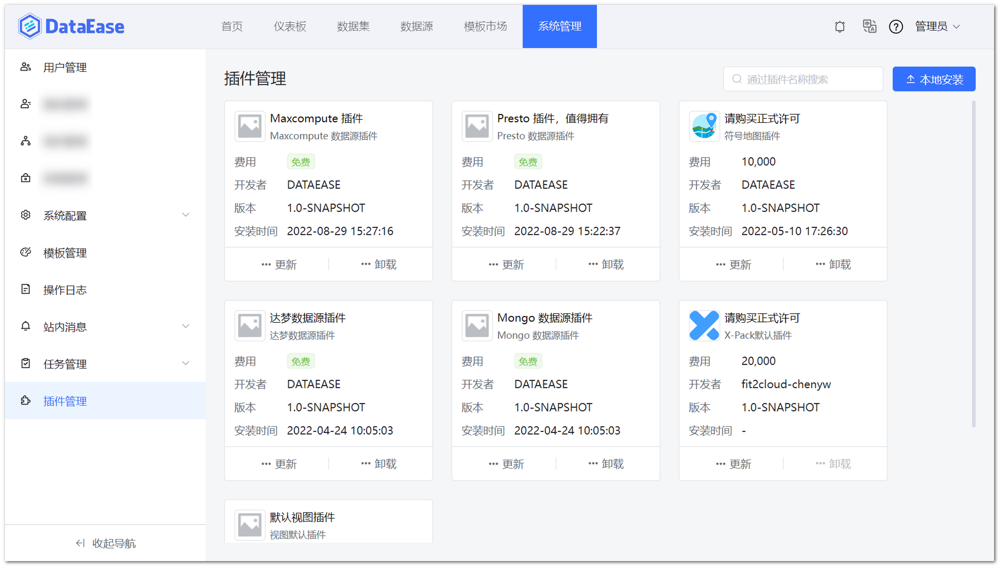

## 1 插件管理

!!! Abstract ""
    系统支持本地安装、更新、卸载插件。  
    目前支持视图插件和数据源插件：

    - 视图插件：导入后可以在对应的图库使用改视图。【[视图插件开发参考](../../dev_manual/dev_view_plugin.md)】
    - 数据源插件：导入后可以在数据源接入该数据源。【[数据源插件开发参考](../../dev_manual/dev_datasource_plugin.md)】

{ width="900px" }