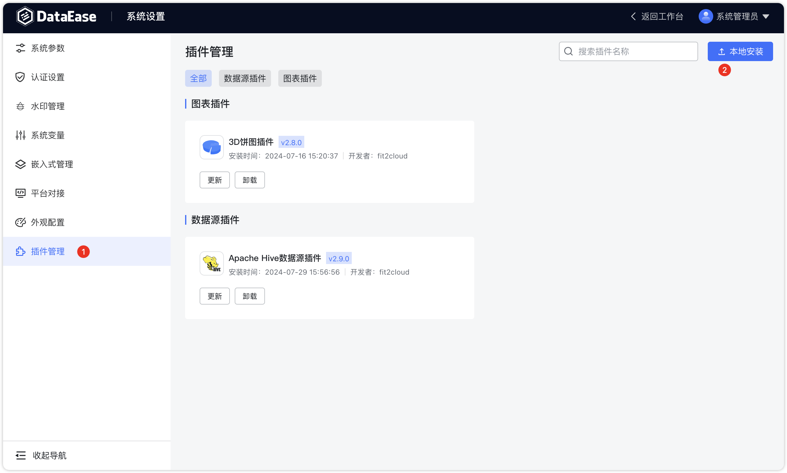
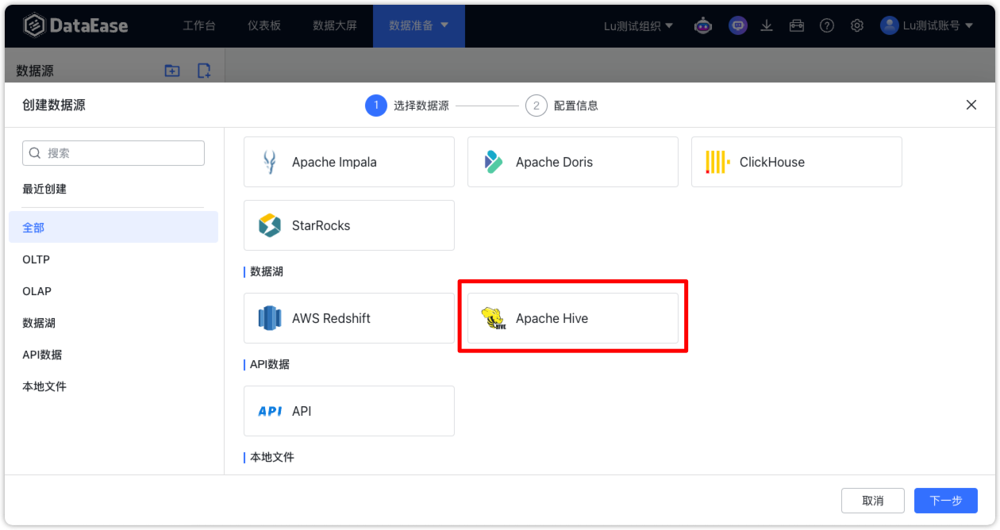

## 1 插件管理

!!! Abstract ""

    - 新增插件管理模块，支持数据源插件和图表插件；
    - 安装插件时即时生效，但更新与卸载插件需要重启服务后生效。
{ width="900px" }

!!! Abstract ""
    Hive 数据源插件目前不支持该数据源做跨源数据集，且不支持 kerberos 认证方式。开发环境对接的 Hive 版本为 2.3.2。

{ width="900px" }