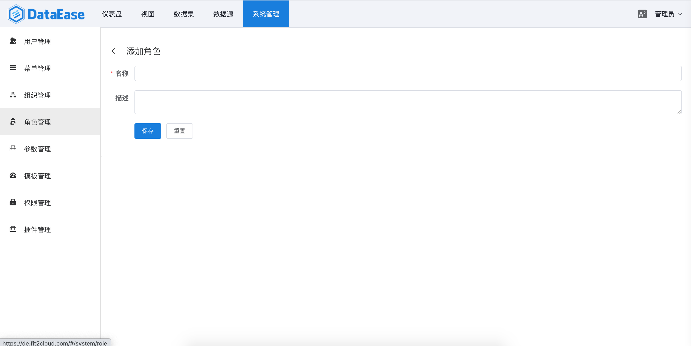

> 【角色管理】中可以对角色进行相关管理，包括对角色的操作权限控制等。

## 创建角色
> 在角色列表页的上方，点击【添加角色】按钮，在弹出的对话框中输入要新建角色的名称、描述，输入完成后，点击【确定】按钮。

## 编辑角色
> 角色列表的最后一列是角色的操作区，选择需要编辑的角色，点击该角色操作区的【编辑】按钮。在弹出的信息框中，修改角色的相关信息，点击【确定】按钮即可保存。

## 搜索角色
> 在角色列表页的右上方是角色的搜索区，在搜索区中输入需要查询过滤的角色名，如"员工"，敲下回车键即可进行指定用户的搜索。还可以点击搜索区的【高级搜索】箭头，使用高级搜索功能。

## 角色授权
> 先在角色列表中选择需要授权的角色，然后在右侧的【菜单授权】列表中勾选上该角色所需授权的菜单名称即可。

## 删除角色
> 点击角色列表操作区的【删除】按钮，在弹出的确认框中点击【确定】按钮即可。

