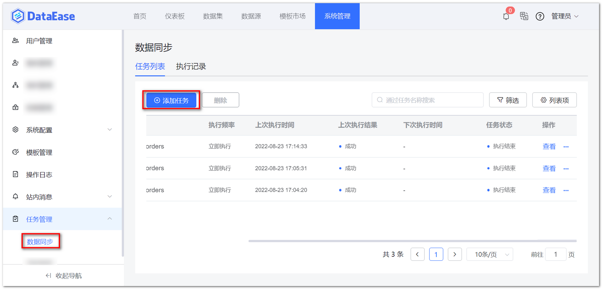
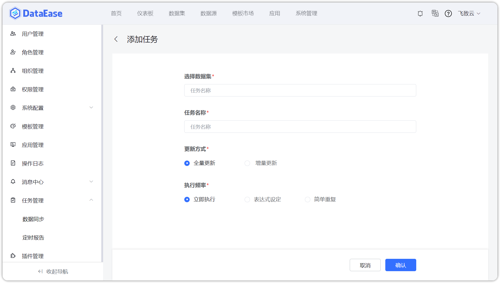
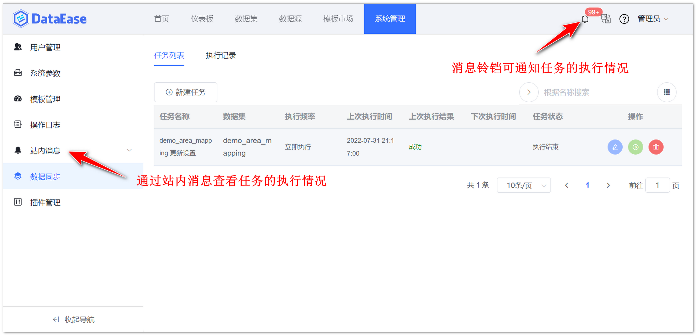
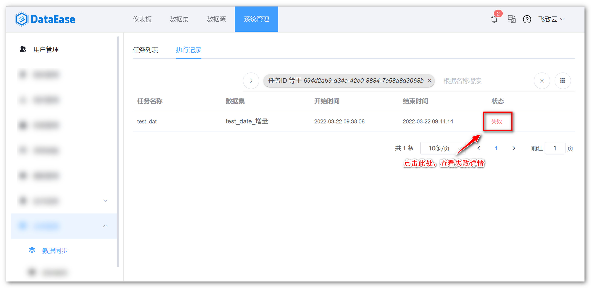
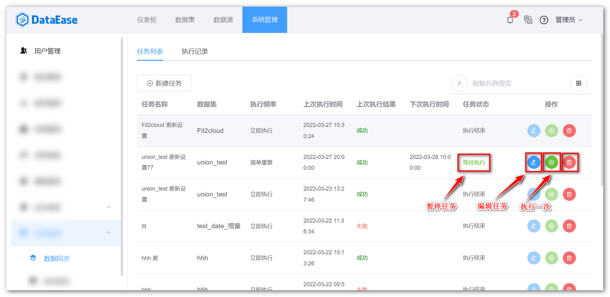

## 1 任务列表

!!! Abstract ""
	任务主界面，点击【添加任务】，新建一个定时任务，操作步骤与数据集的添加定时同步任务一致。

{ width="900px" }  
{ width="900px" }

!!! Abstract ""
	如下图所示，任务执行情况可通过【站内消息】或消息铃铛查看。

{ width="900px" }

## 2 执行记录

!!! Abstract ""
	切换菜单至【执行记录】，查看任务的执行记录。

{ width="900px" }

!!! Abstract ""
	如图所示，点击下图所示的位置，可查看或删除任务。

{ width="900px" }