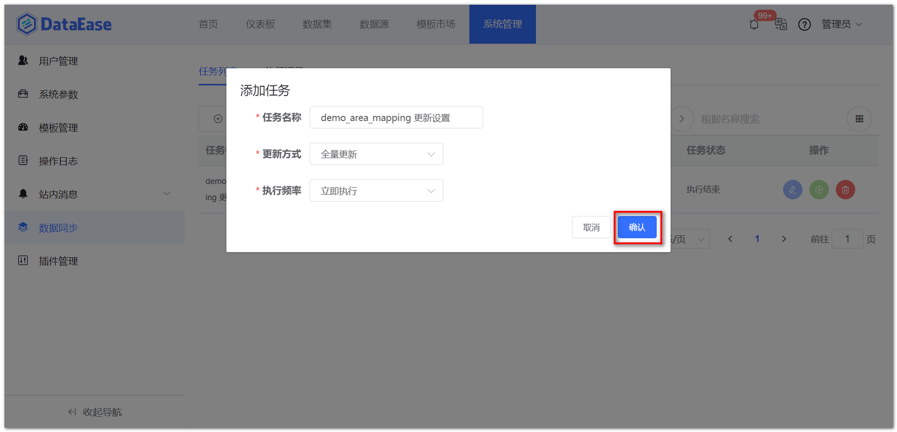

## 1 任务列表

!!! Abstract ""
	任务主界面，点击【新建任务】，新建一个定时任务。

{ width="900px" }  
{ width="900px" }   
{ width="900px" }

## 2 执行记录

!!! Abstract ""
	切换菜单至【执行记录】，查看任务的执行记录。

{ width="900px" }

!!! Abstract ""
	如图所示，点击下图中的位置，可暂停，执行，编辑或删除等待执行的任务。

{ width="900px" }