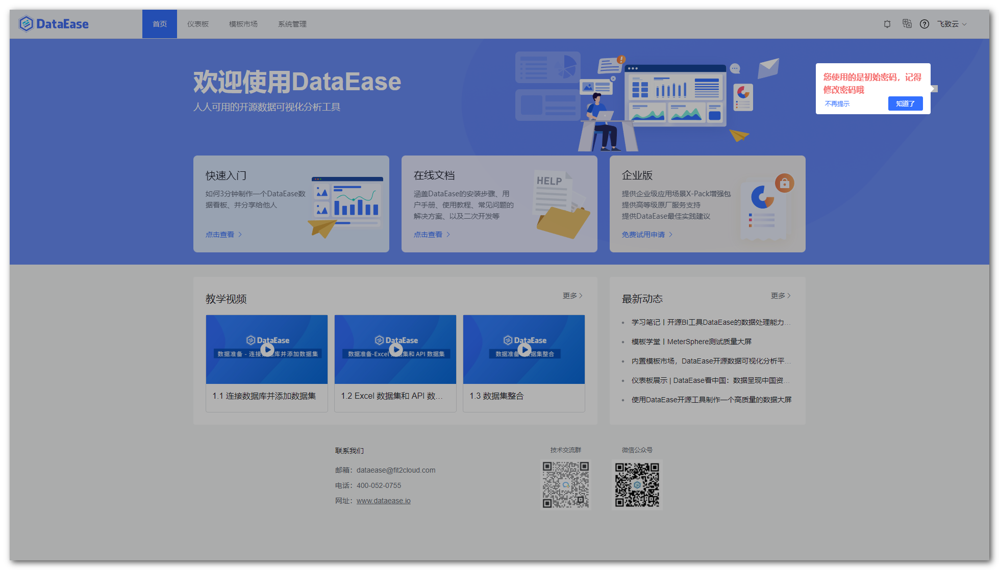
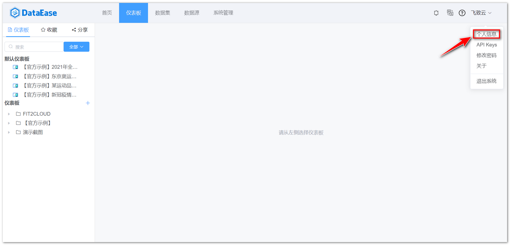

## 1 创建用户

!!! Abstract ""
	【用户管理】中可以对用户的基本信息进行管理，包括用户的组织关系、角色、启停用状态等。

{ width="900px" }

!!! Abstract ""
	在用户列表页的上方，点击【添加用户】按钮，在弹出的对话框中输入要新建用户的基本信息，如姓名、ID、手机号码、邮箱、性别、状态、组织、角色等，输入完成后，点击【确定】按钮。

{ width="900px" }

!!! Abstract ""
	**提示:** 一个用户只能属于一个组织，但一个用户可以拥有多种角色。  
	**新建用户初始密码是 DataEase123456（可在 DataEase 配置文件 dataease.properties 中修改）。**

{ width="900px" }

!!! Abstract ""
	用户登录后，系统判断该用户若使用的默认密码则弹出提示框建议用户修改密码。

{ width="900px" }

## 2 编辑用户

!!! Abstract ""
	用户列表的最后一列是用户的操作区，选择需要编辑的用户，点击该用户操作区的【编辑】按钮。在弹出的信息框中，修改用户变更后的信息，点击【确定】按钮即可保存。

{ width="900px" }

## 3 搜索用户

!!! Abstract ""
	在用户列表页的右上方是用户的搜索区，在搜索区中输入需要查询过滤的用户名，如"demo"，敲下回车键即可进行指定用户的搜索。还可以点击搜索区的【高级搜索】箭头，使用高级搜索功能。

{ width="900px" }

## 4 重置密码

!!! Abstract ""
	重置用户密码为初始密码。

{ width="900px" }

## 5 删除用户

!!! Abstract ""
	点击用户列表操作区的【删除】按钮，在弹出的确认框中点击【确定】按钮即可。

{ width="900px" }

## 6 个人信息

!!! Abstract ""
	个人信息支持编辑，可修改电话、姓名和邮箱，如下图所示。

{ width="900px" }

{ width="900px" }

## 7 修改密码

!!! Abstract ""
	不使用初始密码，建议修改个人密码，如下图所示。

{ width="900px" }