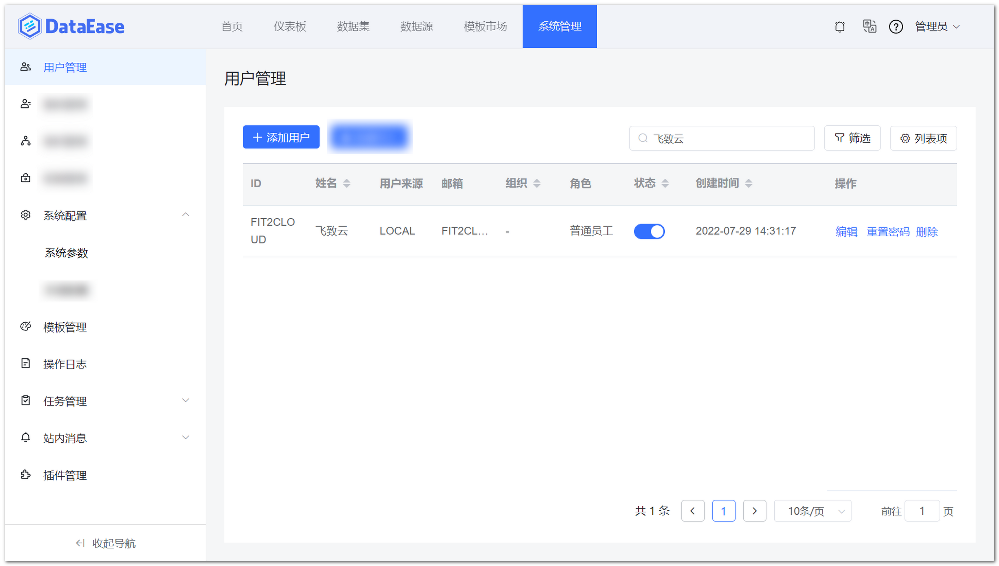
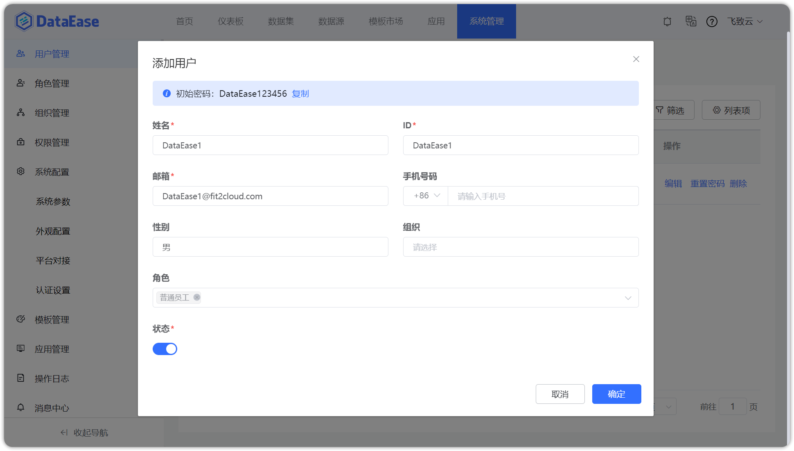
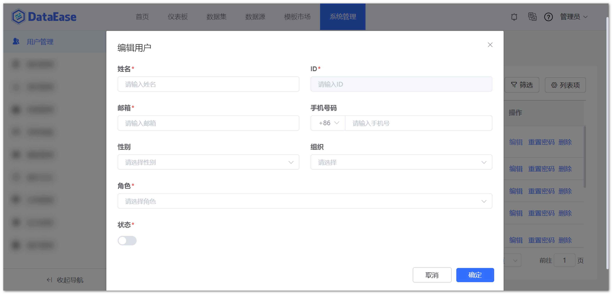
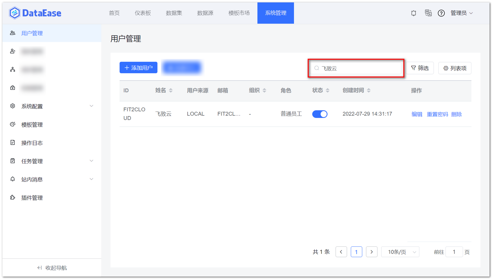
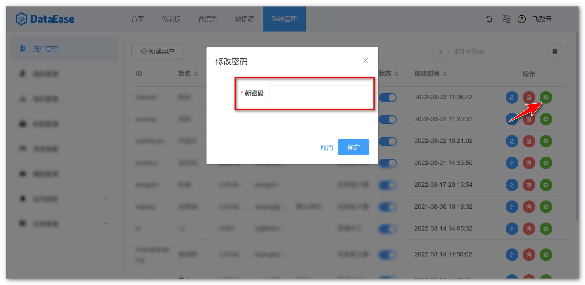
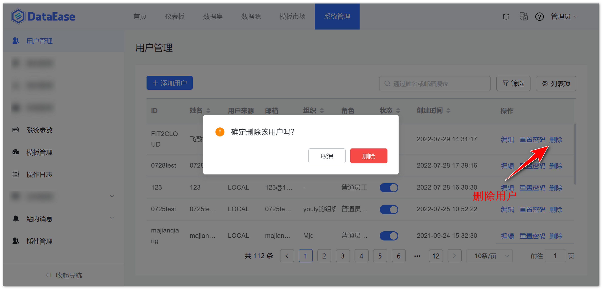

!!! Abstract ""
	【用户管理】中可以对用户的基本信息进行管理，包括用户的组织关系、角色、启停用状态等。

## 创建用户

!!! Abstract ""
	在用户列表页的上方，点击【创建用户】按钮，在弹出的对话框中输入要新建用户的基本信息，如名称、电话、邮箱、状态、组织、角色等。输入完成后，点击【确定】按钮。

!!! tip "提示"
	一个用户只能属于一个组织，但一个用户可以拥有多种角色。
	新建用户默认密码是 DataEase123456，可以参考【[设置用户密码](./user.md#_4)】

## 编辑用户

!!! Abstract ""
	用户列表的最后一列是用户的操作区，选择需要编辑的用户，点击该用户操作区的【编辑】按钮。在弹出的信息框中，修改用户变更后的信息，点击【确定】按钮即可保存。

## 搜索用户

!!! Abstract ""
	在用户列表页的右上方是用户的搜索区，在搜索区中输入需要查询过滤的用户名，如"demo"，敲下回车键即可进行指定用户的搜索。还可以点击搜索区的【高级搜索】箭头，使用高级搜索功能。

## 设置用户密码

!!! Abstract ""
	管理员在新建用户，以及给已有用户重置密码的时候，需要通过【修改密码】功能进行密码的设置。  

	点击用户列表操作区的【修改密码】按钮，在弹出的输入框中输入该用户的新密码，点击【确定】按钮即可。

## 删除用户

!!! Abstract ""
	点击用户列表操作区的【删除】按钮，在弹出的确认框中点击【确定】按钮即可。

