## 1 模板市场概述

!!! Abstract ""
    2022 年 6 月 21 日，DataEase 开源数据可视化分析平台正式发布模板市场，作为广大社区用户期待已久的功能之一，模板市场旨在为 DataEase 用户提供专业、美观、拿来即用的仪表板模板，方便用户根据自身的业务需求和使用场景选择对应的仪表板模板，并在优质模板的基础上轻松制作自己的仪表板。

## 2 内置模板市场

### 2.1 预览模板

!!! Abstract ""
    支持通过 DataEase 内置的模板市场模块，预览仪表板模板。

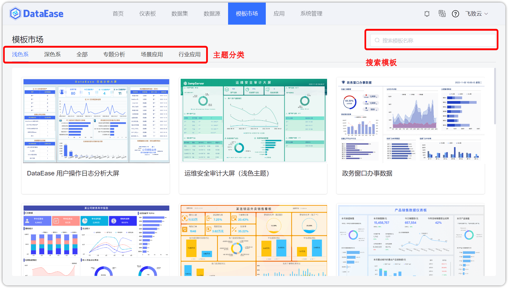{ width="900px" }

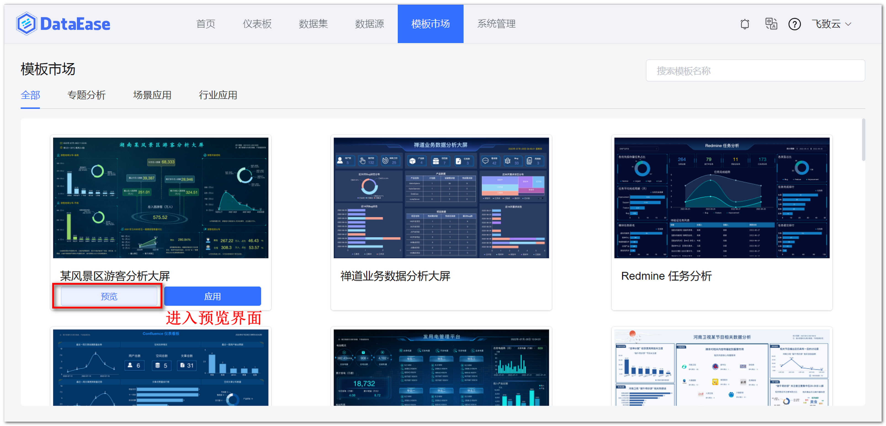{ width="900px" }

!!! Abstract ""
    支持查找功能，快捷搜索仪表板模板。

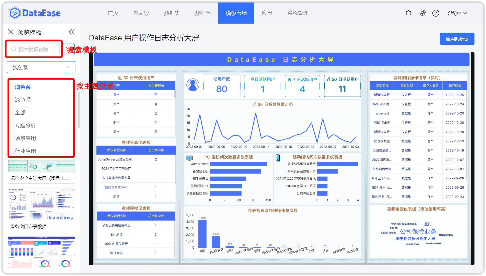{ width="900px" }

### 2.2 应用模板

!!! Abstract ""
    点击【应用模板】，弹出应用模板框，模板名为默认命名，可自行修改，选择一个仪表板分组后点击确定，成功后会自动跳转到该仪表板的编辑界面下。

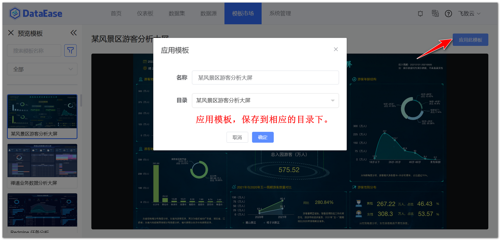{ width="900px" }

### 2.3 关闭模板市场

!!! Abstract ""
    查看内置的模板市场需要与模板市场（https://dataease.io/templates/）网络连通，若不需要使用模板市场模块，可在【系统管理】的【系统参数】关闭模板市场显示。

## 3 线上模板市场

### 3.1 下载模板

!!! Abstract ""
    点击[模板市场](https://dataease.io/templates/)，如下图所示，打开模板市场主页。

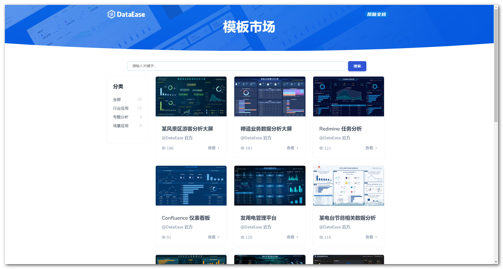{ width="900px" }

!!! Abstract ""
    如下图所示，可通过快速检索功能，进行关键字搜索或分类切换，目前上架的仪表板模板不仅涉及零售、证券、制造、电商、教育、医疗、物流、能源、旅游、金融等多种行业和场景应用，还涵括 JumpServer、MeterSphere 等专题分析，后续更多优质模板将持续增加。

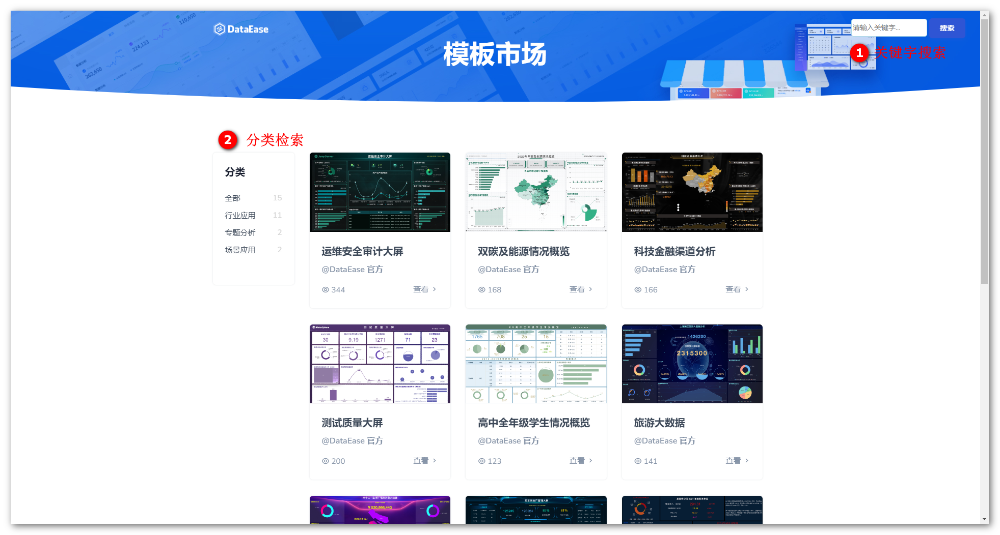{ width="900px"}

!!! Abstract ""
    分类查看视角如下图所示。

{ width="900px" }

!!! Abstract ""
    如需预览或下载模板，可点击对应仪表板进入详情界面，点击”下载“按钮后可将对应模板下载至本地。

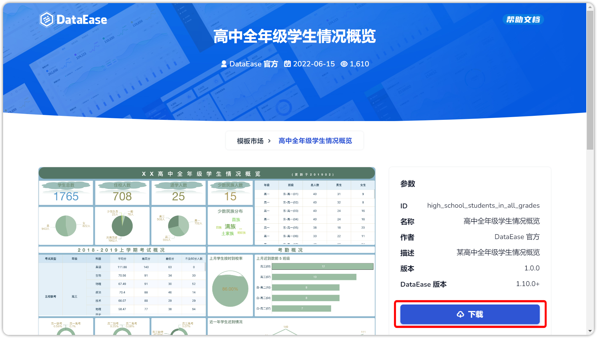{ width="900px" }

!!! Abstract ""
    模板文件不包含仪表板所用到的数据集与数据源信息，需手动替换数据；  
    如下图所示，支持下载应用文件，应用文件包含仪表板模板文件及其用到的数据集、数据源关联关系文件，应用可以快速创建第三方系统仪表板，如何下载应用可参考[目录](../user_manual/app_template_market.md)。

{ width="900px" }

### 3.2 导入模板

!!! Abstract ""
    方式一：进入自己的 DataEase 系统的”仪表板“模块中，通过下图所示以”导入模板的“方式新建仪表板。

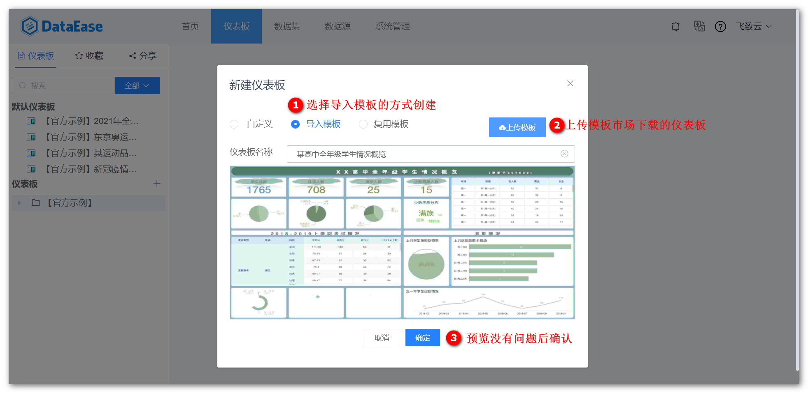{ width="900px"}

!!! Abstract ""
    方式二：在【系统管理】将模板上传至"模板管理"功能模块中，导入的模板可方便的二次复用。

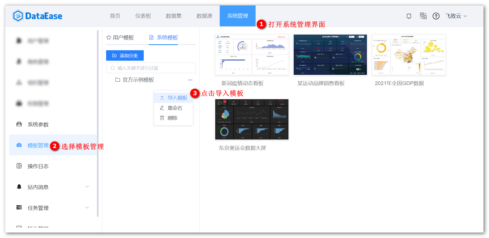{ width="900px" }

!!! Abstract ""
    导入模板界面如下图所示。

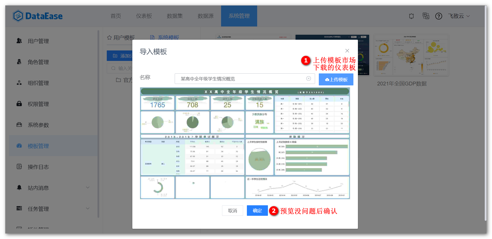{ width="900px" }

!!! Abstract ""
    通过下图所示以“复用模板的”方式新建仪表板。

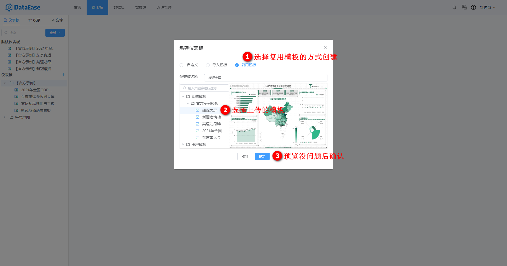{ width="900px" }

## 4 替换数据

!!! Abstract ""
    导入成功后如下图所示，该模板的各组件、样式、背景及仪表板数据等均被导入到新建仪表板中。

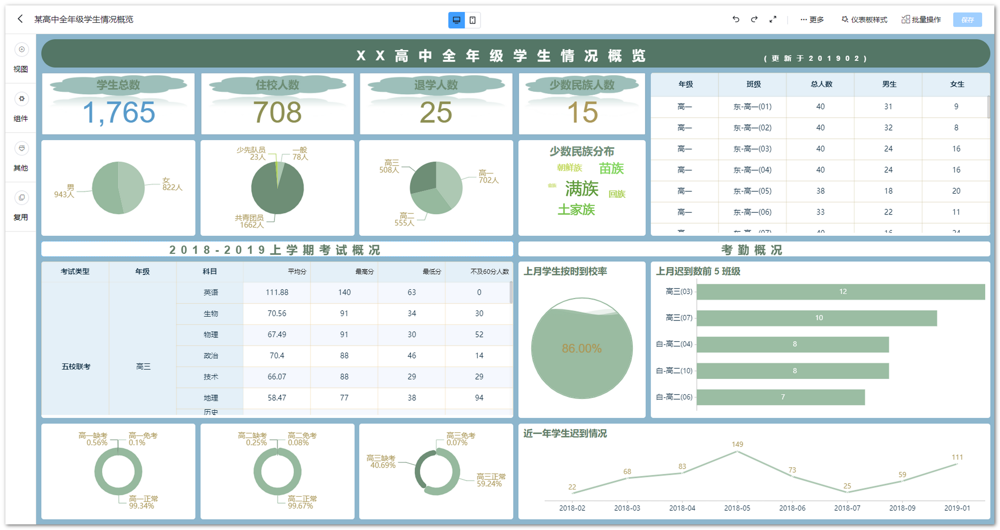{ width="900px" }

!!! Abstract ""
    编辑视图组件，根据情况替换为自己的数据。

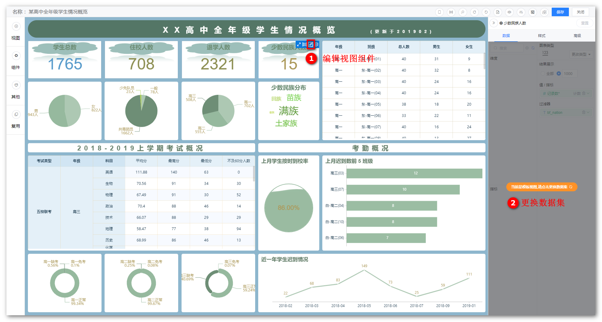{ width="900px" }

!!! Abstract ""
    将视图所关联的数据集替换为自己的实际数据集。

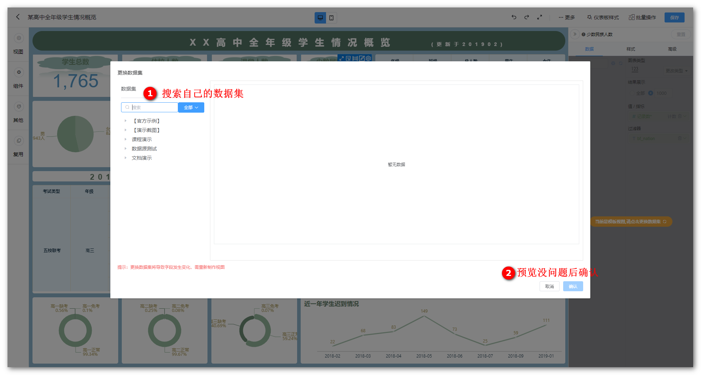{ width="900px" }

## 5 样式调整（可选）

!!! Abstract ""
    如下图所示，模板的各组件、样式、背景已带入到新建的仪表板中，如需修改可在模板的基础上再根据自己的实际情况，自行调整仪表板样式、组件和视图等。

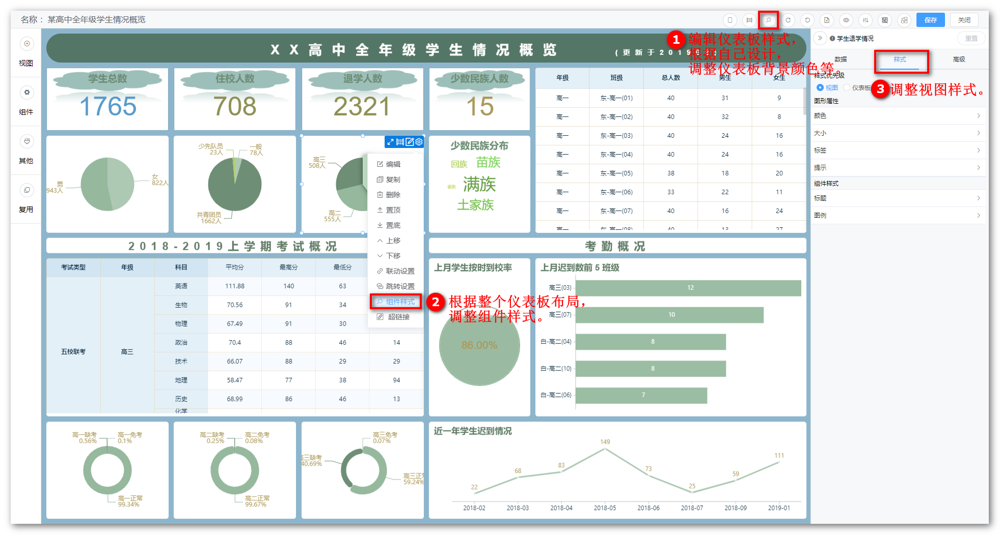{ width="900px" }

## 6 应用示例

!!! Abstract ""
    - [DataEase 仪表板数据概览](https://kb.fit2cloud.com/archives/171)
    - [Jira 业务数据仪表板](https://kb.fit2cloud.com/archives/161)
    - [MeterSphere 测试质量大屏](https://kb.fit2cloud.com/archives/120)  
    - [JumpServer 运维安全审计大屏](https://kb.fit2cloud.com/archives/112)
    - [Redmine 任务分析大屏](https://kb.fit2cloud.com/archives/119)
    - [禅道业务数据分析大屏](https://kb.fit2cloud.com/archives/137)
    - [Confluence 仪表看板大屏](https://kb.fit2cloud.com/archives/145)