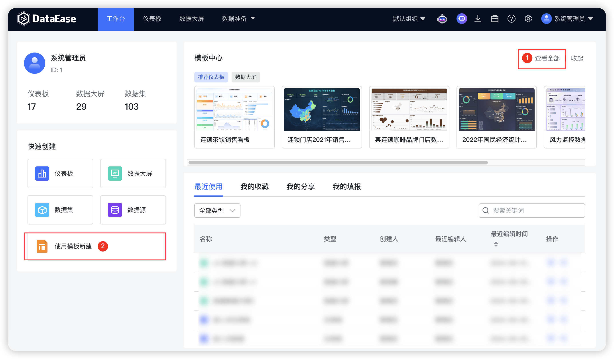
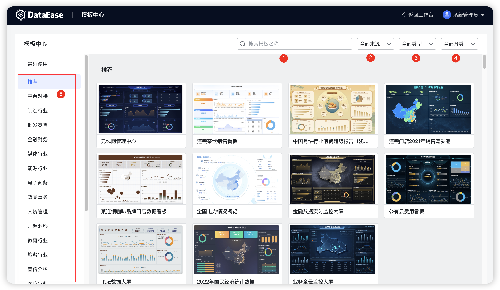
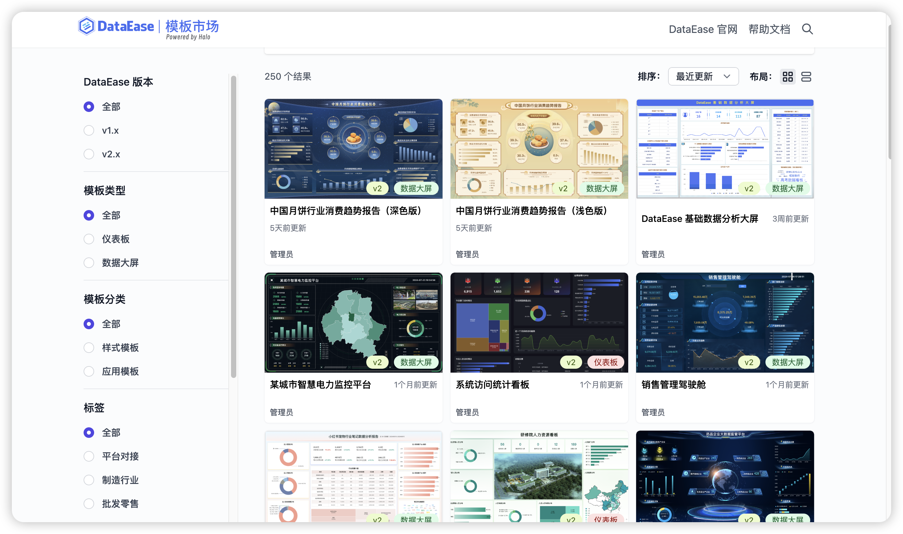
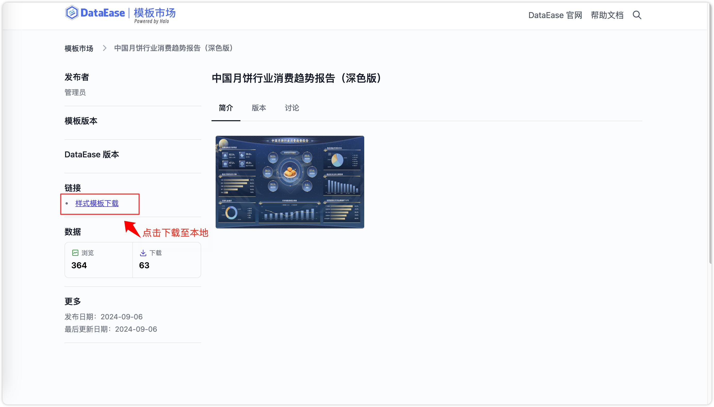

## 1 模板市场概述

!!! Abstract ""
    模板市场旨在为 DataEase 用户提供专业、美观、拿来即用的仪表板模板，方便用户根据自身的业务需求和使用场景选择对应的仪表板模板，并在优质模板的基础上轻松制作自己的仪表板。

## 2 内置模板市场

### 2.1 预览模板

!!! Abstract ""
    支持通过 DataEase 内置的模板市场模块，预览模板。   
    **注意：查看内置的模板市场需要与模板市场（https://templates.dataease.cn/）网络连通。**

{ width="900px" }
!!! Abstract ""
    支持通过搜索名称（序号 1）、来源选择（序号 2）、类型选择（序号 3）、分类选择（序号 4）、行业标签（序号 5）等功能选择模板。  
    **注意：分类中样式模板与应用模板的区别：**

    - **样式模板** ：更注重仪表板本身的样式设计布局等内容，。DataEase 生成仪表板并附带示例数据，需要根据自己的数据情况自行手动创建数据源、数据集并将仪表板中的示例数据替换为自己的真实数据；
    - **应用模板** ：有一定的针对性，适用于应用系统的对接，例如 DataEase 日志应用。DataEase 生成仪表板并同时生成其所对应的数据集，无需再手动替换数据。

    **关于样式模板与应用模板的详细差异可参考** ：https://kb.fit2cloud.com/?p=72aab3f5-2706-4c6c-a0e9-6dcd58aa00a0。

{ width="900px" }

### 2.2 使用模板

!!! Abstract ""
    点击【应用】，根据模板属于仪表板还是数据大屏，会自动跳转到该仪表板或者数据大屏的编辑界面下。

{ width="900px" }

{ width="900px" }

{ width="900px" }

## 3 线上模板市场

### 3.1 下载模板

!!! Abstract ""
    点击[模板市场](https://templates-de.fit2cloud.com/)，如下图所示，打开模板市场主页。

{ width="900px" }

!!! Abstract ""
    如下图所示，可通过切换版本，快速查看 v1 和 v2 下的模板。

{ width="900px"}

!!! Abstract ""
    如下图所示，可通过切换模板类型，快速查看仪表板和数据大屏应用下的模板。

{ width="900px"}

!!! Abstract ""
如下图所示，可通过切换模板分类，快速查看样式模板和应用模板下的模板。

{ width="900px"}

!!! Abstract ""
    如下图所示，可通过快速检索功能，进行关键字搜索或分类切换，目前上架的仪表板模板不仅涉及零售、证券、制造、电商、教育、医疗、物流、能源、旅游、金融等多种行业和场景应用，还涵括 JumpServer、MeterSphere 等专题分析，后续更多优质模板将持续增加。

{ width="900px"}

!!! Abstract ""
    如需预览或下载模板，可点击对应模板进入详情界面，点击”下载“按钮后可将对应模板下载至本地。 模板文件不包含仪表板所用到的数据集与数据源信息，需手动替换数据；

{ width="900px" }

### 3.2 导入模板

!!! Abstract ""
    用户可以在模板管理中进行模板上传，并为模板进行分组分类，可以更方便的对模板进行管理和查找。点击[模板管理](../user_manual/system_management/module.md)，如下图所示，打开模板市场主页。

{ width="900px" }

## 4 替换数据

!!! Abstract ""
    应用模板后如下图所示，该模板的各组件、样式、背景及仪表板数据等均被导入到新建仪表板中。

{ width="900px" }

!!! Abstract ""
    编辑图表，根据情况替换为自己的数据。

{ width="900px" }

!!! Abstract ""
    将视图所关联的数据集替换为自己的实际数据集。

{ width="900px" }

## 5 样式调整（可选）

!!! Abstract ""
    如下图所示，模板的各组件、样式、背景已带入到新建的仪表板或数据大屏中，如需修改可在模板的基础上再根据自己的实际情况，自行调整样式、组件和视图等。

{ width="900px" }