## 首页
### 我的计划
> 页面左侧是我的测试计划列表，展示了负责人或用例执行人是我的测试计划, 列表信息包括了通过率、测试进度等指标，可以直观了解计划的执行情况，点击某行，跳转至对应计划详情页面
### 最近测试
> 页面右侧是最近测试列表，展示了我最近执行的测试用例，点击某行，跳转至该用例的编辑页面

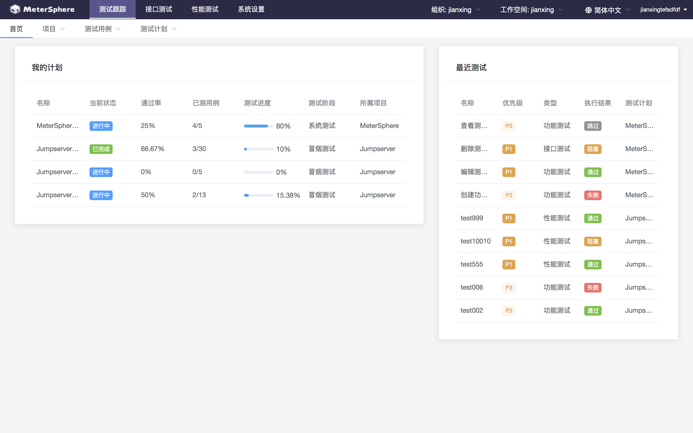

## 项目
> 项目是测试用例和测试计划的管理单位，该页面包括项目的创建、编辑、查看、删除等管理功能；

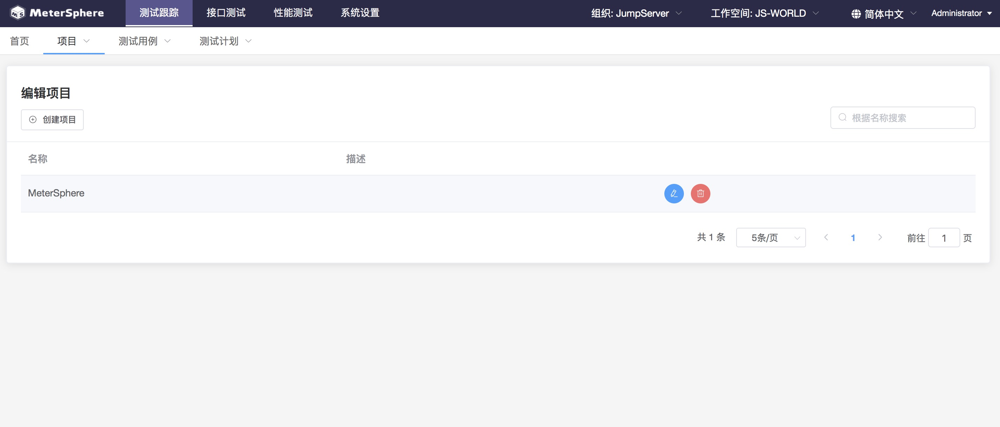

## 测试用例
### 模块管理
> 页面左侧为模块树，模块属于某个项目，测试用例以模块为单位进行统一管理；模块树支持添加、修改、删除以及拖拽操作

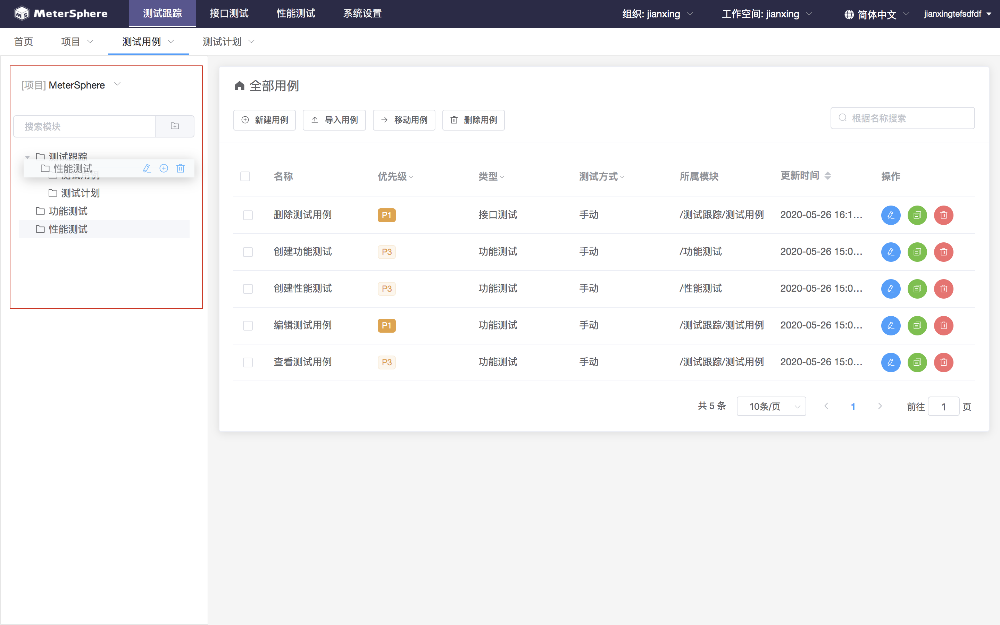

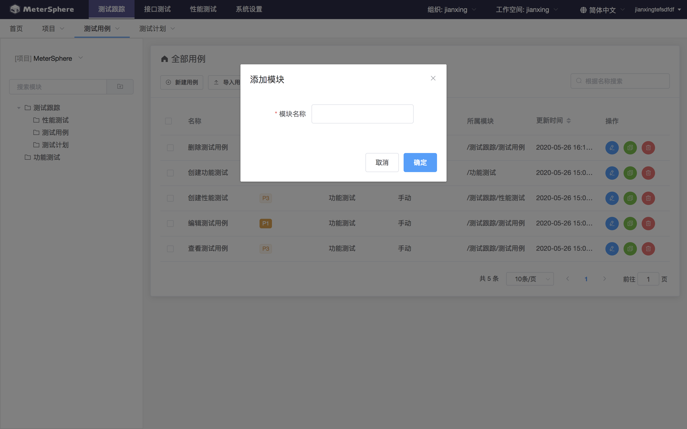

## 用例列表
### 用例列表
> 页面右侧为用例列表，测试用例属于某个项目；该页面支持测试用例的创建、修改、删除、复制以及Excel导入等操作

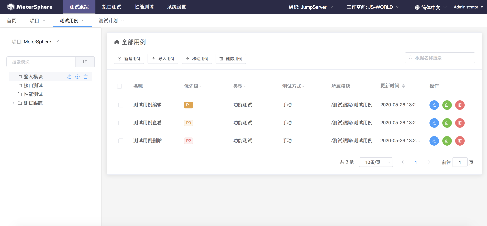

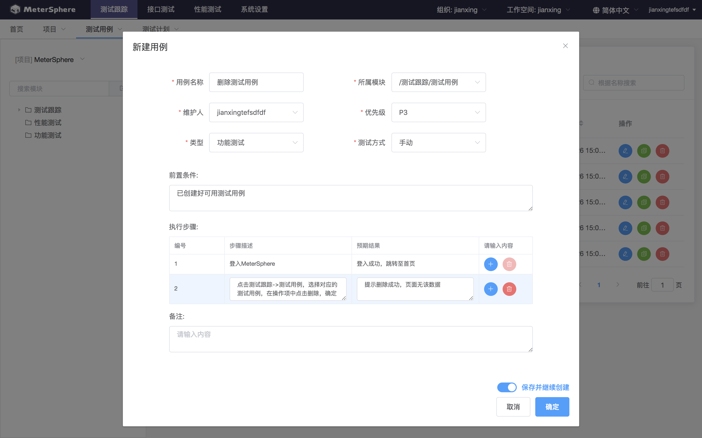

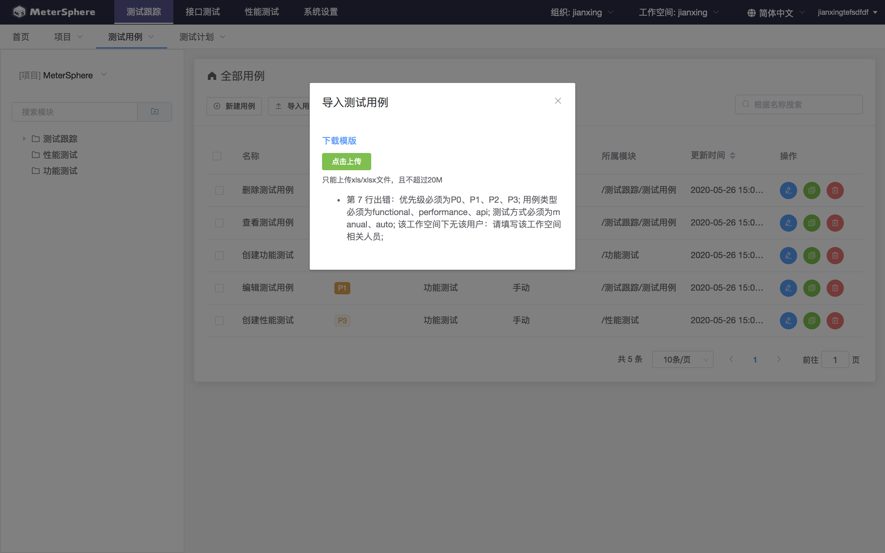

### 用例关联

> 新建测试用例可以和平台已有的接口测试用例、性能测试用例进行关联

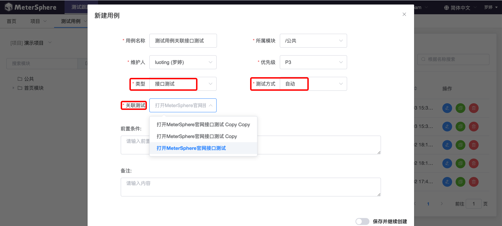

## 测试计划

> 测试计划属于某个项目，并可关联该项目下的测试用例；该页面功能包括测试计划的添加、修改、删除操作；点击某行，跳转至对应计划详情页面

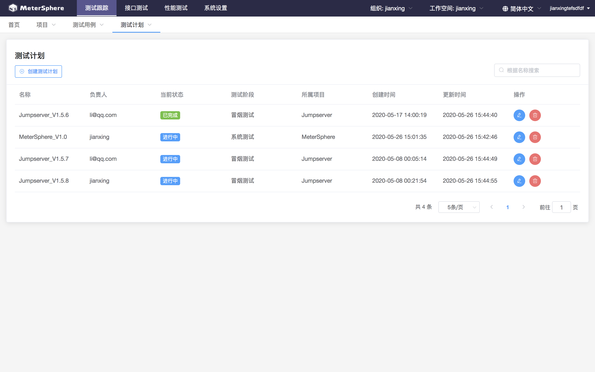

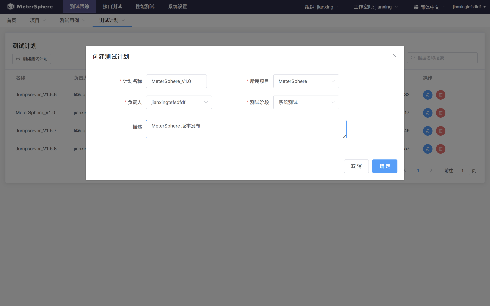

## 测试计划详情
### 用例管理
> 该页面可关联对应项目的下的测试用例，关联后的用例是测试执行的基本单位；该页面管理了测试用例执行的生命周期，支持测试用例的创建、修改、删除、批量执行、批量变更执行人、创建测试报告等操作

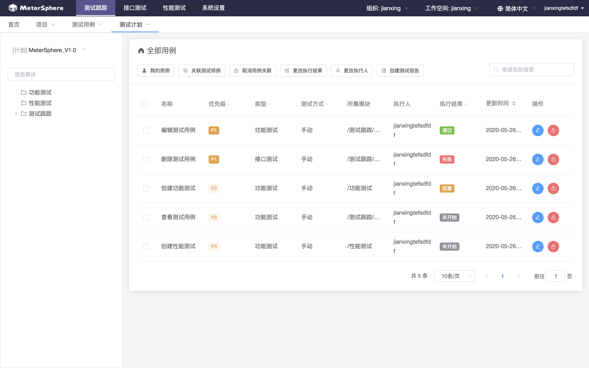

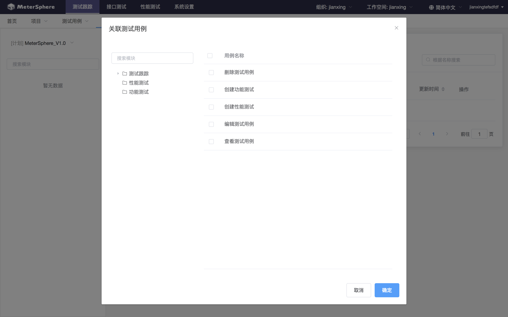

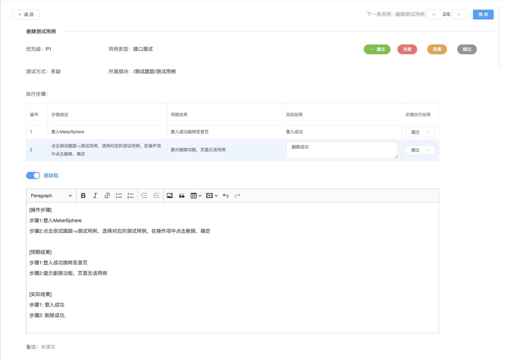

## 测试报告
> 测试详情页面中，可根据模版创建该计划对应的测试报告，模版可在「系统设置」-「工作空间」-「测试报告模版」中由测试管理人员创建；

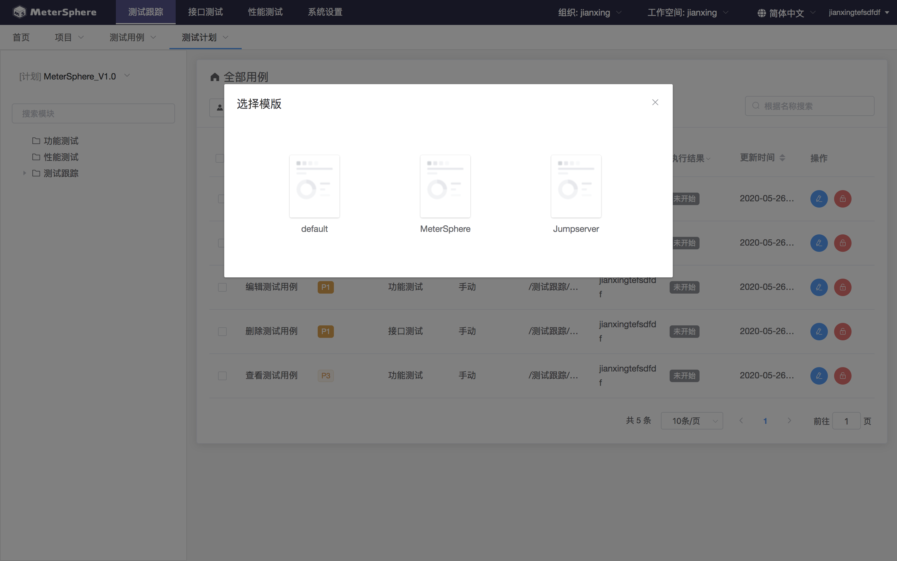

### 测试报告详情
> 根据该测试计划的执行结果生成对应的测试报告详情页面，其中包括基础信息、测试结果列表、测试结果统计等模块

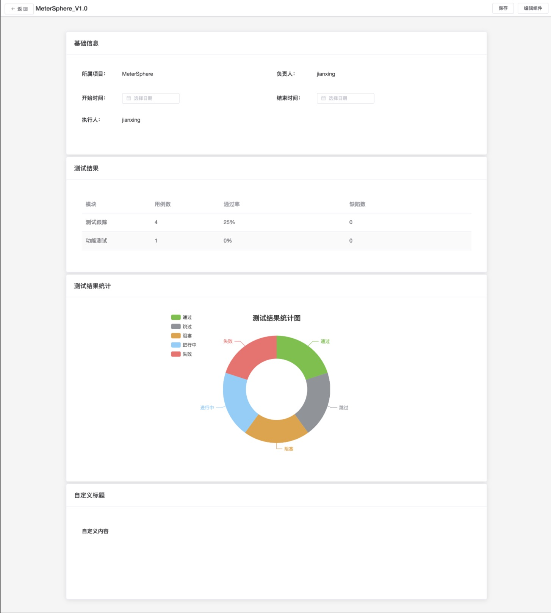

### 编辑测试报告组件
> 可以从组件库拖拽，自定义测试报告内容

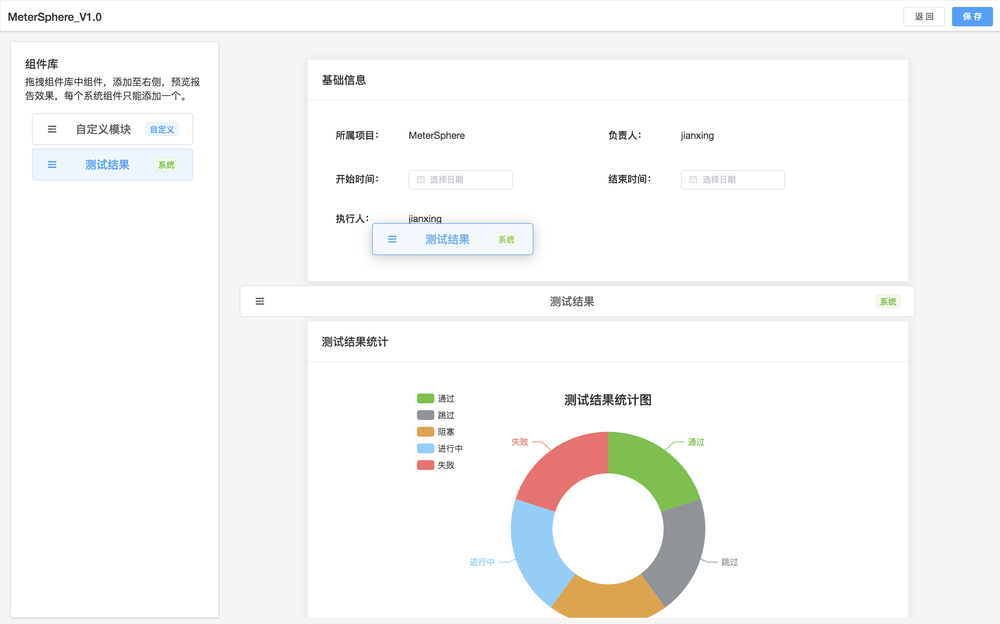