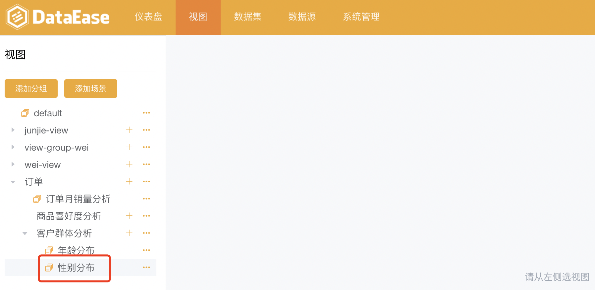
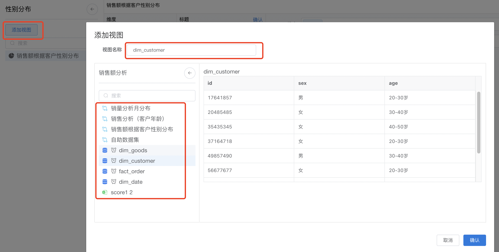
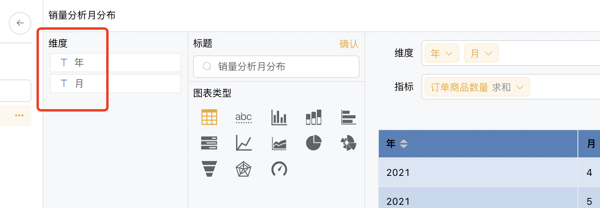
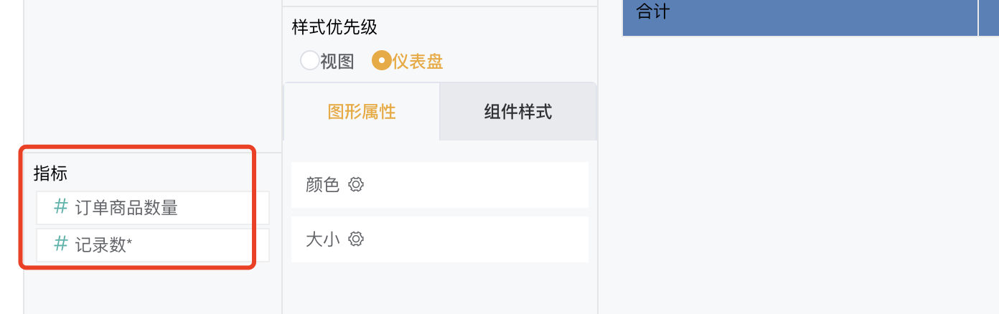
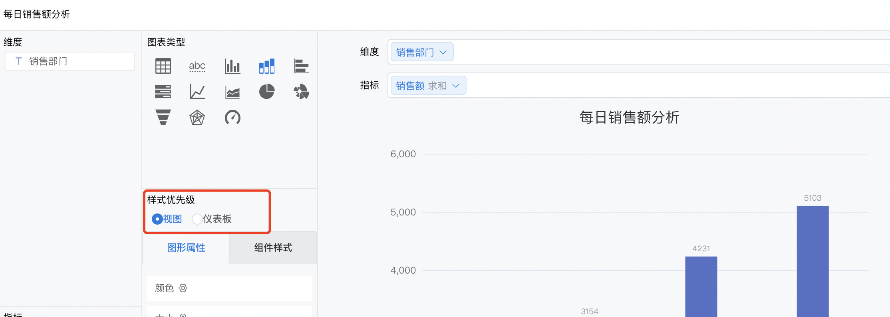
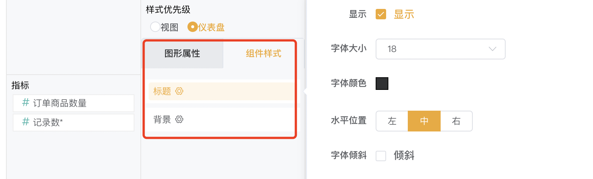
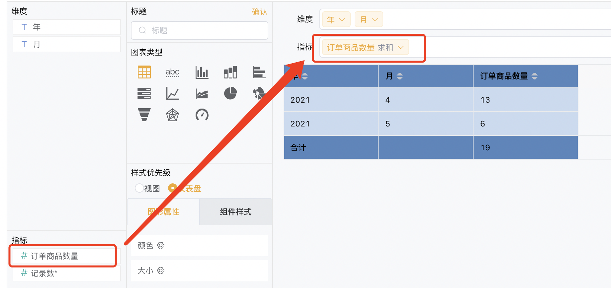

## 功能概述
> 点击菜单栏中"视图"，进入视图设计模块，可通过简单的拖拉拽生成柱形图、折线图、环形图等图表，并设置图表的颜色、大小、标签、图例、标题等属性。
## 1 视图设计开始
> 通过点击左侧的场景，开始设计该场景下的视图

## 2 视图添加
> 如下图所示： 第一步，点击【添加视图】； 第二步，从左侧的目录中选择数据集； 第三部，修改视图名称； 第四步，点击【确认】提交，视图添加成功。

## 3 视图设计
### 3.1 界面功能区
>通过点击左侧的视图，设计该视图，视图设计的7大功能区介绍： 
>序号1：可选维度列表 序号2：可选指标列表 序号3：图表类型 序号4：样式优先级 序号5：图表样式 序号6：结果过滤器 序号7：选择维度 序号8：选择指标 序号9：图表展示

### 3.2 可选维度列表
> 展示所有维度，当选择数据集后，视图的维度与指标由系统自动分配，分配原则：文本型字段默认为维度、数值型字段默认为指标，因此如果需要某个字段作为维度，在数据集中编辑字段，设置字段类型为文本型。

### 3.3 可选指标列表
> 展示所有指标，当选择数据集后，维度与指标由系统自动分配，分配原则：文本型字段默认为维度、数值型字段默认为指标，因此如果需要某个字段作为指标，在数据集中编辑字段，设置字段类型为数值型。

### 3.4 图表类型
> 展示所有图表类型，如柱形图，折线图，漏斗图、雷达图等，可通过点击图标进行图表类型的切换。

### 3.5 样式优先级
> 在视图和仪表板中均可以设置视图样式，通过设置样式优先级，如果优先级设置为【视图】，那么仪表板展示视图样式。

### 3.6 图表样式
> 如下图所示，图形样式包括图形属性、组件样式两部分，在所示的位置，点击标题，那么弹出标题样式设置窗口，包括是否显示标题、标题字体大小、颜色、位置等；以此类似方式，设置背景、图形颜色、大小等

### 3.7 结果过滤器
> 可点击设置过滤条件，对结果进行过滤

> 如下图所示，设置过滤条件，可设置多个

### 3.7 维度选择
#### 3.7.1 维度选择
> 如下图所示，通过拖拉的形式，从"维度可选列表中"拖拉至"维度选择"，图表根据所选择的维度去统计分析数据。

#### 3.7.2 维度设置
> 如下图所示，点击维度上的小箭头，弹出设置窗口，可设置维度排序（升序、降序）、过滤条件、显示名等。

### 3.8 指标选择
#### 3.8.1 指标选择
> 如下图所示，通过拖拉的形式，从"指标可选列表中"拖拉至"指标选择"，图表根据所选择的指标去汇总。

#### 3.8.2 指标设置
> 如下图所示，点击维度上的小箭头，弹出设置窗口，可设置指标汇总方式（求和，平均，最大值）、快速计算、排序（升序、降序、无）、以及过滤等。

### 3.9 图表展示
> 图表展示区，展示视图设计的结果

