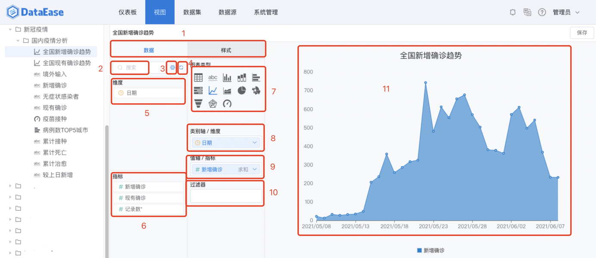

## 功能概述
> 点击菜单栏中"视图"，进入视图设计模块，可以通过简单的拖拉拽生成柱形图、折线图、环形图等

## 视图设计开启
> 通过点击左侧的场景，进入该场景的视图设计窗口

## 视图添加
> 通过点击左侧的场景，进入该场景的视图设计窗口
> 
## 视图设计
### 界面功能区
> 通过点击左侧的场景，进入该场景的视图设计页面，主要有7大功能区：
> 
>序号1：可选维度列表
> 
>序号2：可选指标列表
> 
>序号2：图表选择区

