## 功能概述
!!! Abstract ""
    视图属于仪表板功能中重要的一部分，可通过简单的拖拉拽将数据集中的数据做成各种图表，并设置图表的颜色、大小、标签、图例、标题等属性。 为了满足不同用户对视图的需求，系统不仅支持了 echarts 图库，而且拓展了 antv 图库，不同图库支持的图表类型如下：

=== "echarts"
    !!! Abstract ""
        - 表格（明细表格、汇总表格）
        - 指标卡
        - 柱状图（基础柱状图、堆叠柱状图、横向柱状图、横向堆叠柱状图）
        - 折线图（基础折线图、堆叠折线图）
        - 组合图（柱状折线图等）
        - 散点图
        - 气泡图
        - 雷达图
        - 仪表盘
        - 饼图（基础饼图、环形饼图）
        - 南丁格尔玫瑰
        - 漏斗图
        - 矩形树图
        - 地图（普通地图、气泡地图）

=== "antv"
    !!! Abstract ""
        - 表格（明细表格、汇总表格、透视表）
        - 指标卡
        - 柱状图（基础柱状图、堆叠柱状图、横向柱状图、横向堆叠柱状图）
        - 折线图（基础折线图、堆叠折线图）
        - 散点图
        - 气泡图
        - 雷达图
        - 仪表盘
        - 饼图（基础饼图、环形饼图）
        - 南丁格尔玫瑰
        - 漏斗图
        - 矩形树图
        - 瀑布图
        - 水波图
        - 词云图

## 1 视图添加

!!! Abstract ""
    进入仪表板编辑界面，点击【视图】或【复用】为仪表板引入视图。  
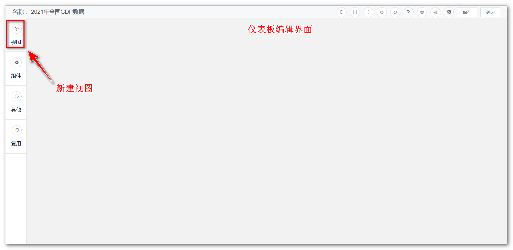

!!! Abstract ""
    添加视图步骤：  

    1. 选择一个数据集（支持搜索）后点击【下一步】； 
    2. 选择一个图表类型后，点击【确认】。
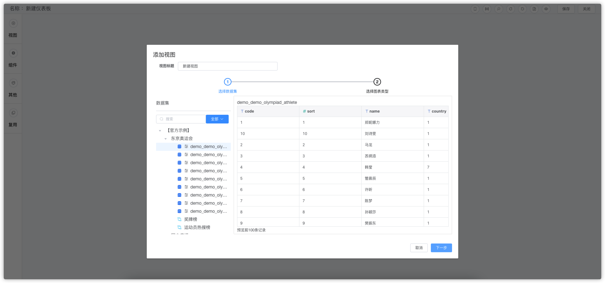
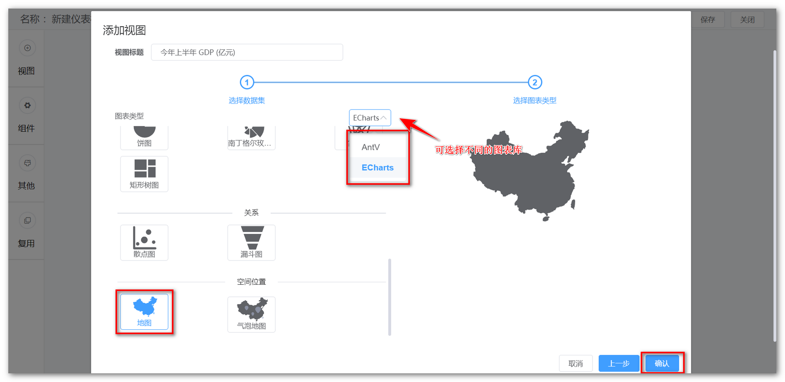

!!! Abstract ""
    **v1.7.0 及以前版本升级至 v1.8.0 时请注意，v1.8.0 版本将视图功能内置于仪表板内，权限跟随仪表板。直接使用 v1.8.0 版本则无需关注此内容。**  

    - 存量视图之前如果被仪表板使用了，则该视图根据引用的仪表板的数量复制多份，每个仪表板具备一份，权限跟随仪表板。另外源视图保留在存量视图中；  
    - 仅 admin 用户可以在复用中看到【存量视图】列表（由于视图权限去掉，系统无法根据权限给用户查看对应视图，本着在原权限基础上缩小而不扩大权限范围的原则，全部回收到 admin 处）；
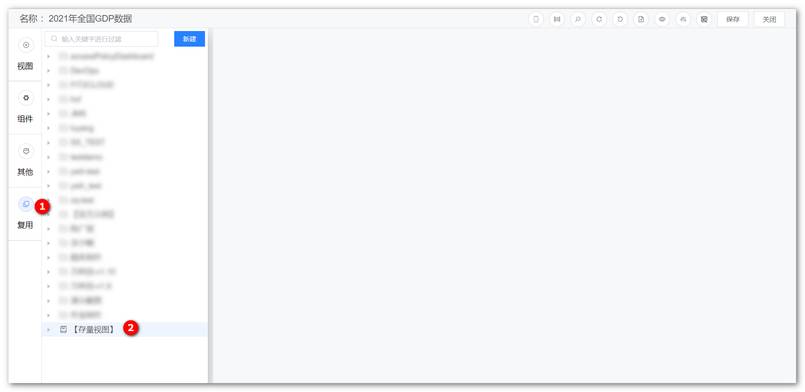

## 2 视图设计
### 2.1 界面功能区

!!! Abstract "视图设计功能区介绍"
    - 【序号1】：数据操作区与样式编辑区切换
    - 【序号2】：搜索
    - 【序号3】：字段编辑
    - 【序号4】：更换数据集
    - 【序号5】：可选维度列表
    - 【序号6】：可选指标列表
    - 【序号7】：图表类型（包括 Echarts、AntV）
    - 【序号8】：维度设置区
    - 【序号9】：指标设置区
    - 【序号10】：结果过滤器
    - 【序号11】：钻取维度设置区
    - 【序号12】：图表展示

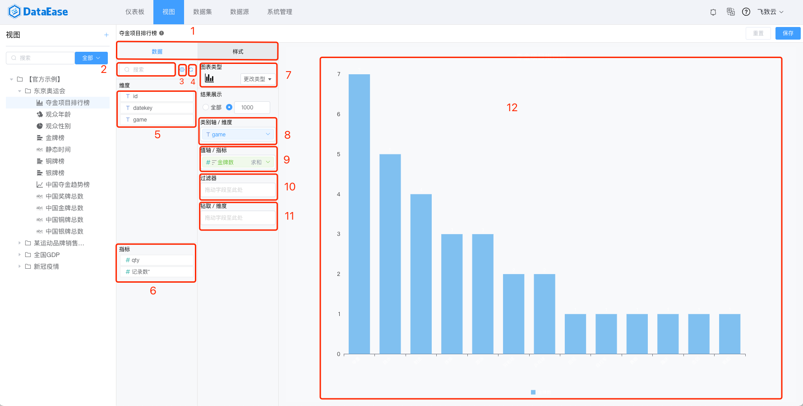
### 2.2 更多图表样式设置

!!! Abstract ""
    点击【样式】，切换至样式设计界面，该界面主要针对【图形属性】和【组件样式】进行调整，**不同的视图类型可支持的样式会有所差异，不同的图表库（Echarts、AntV）在样式上也有一些差异。**
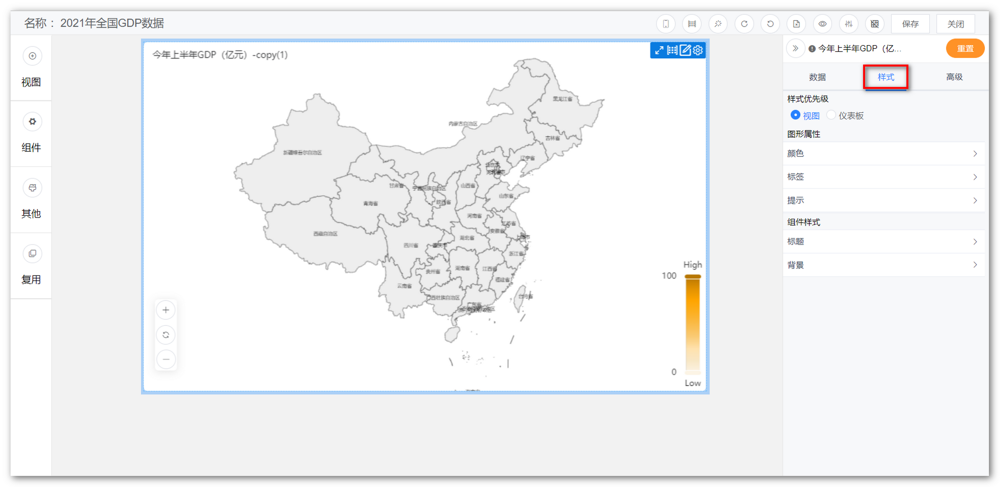

!!! Abstract ""
    **注意：【样式优先级】可以选择为视图或仪表板。视图的颜色与仪表板的背景色等属性不同时，以样式优先级选择项为主来显示。**
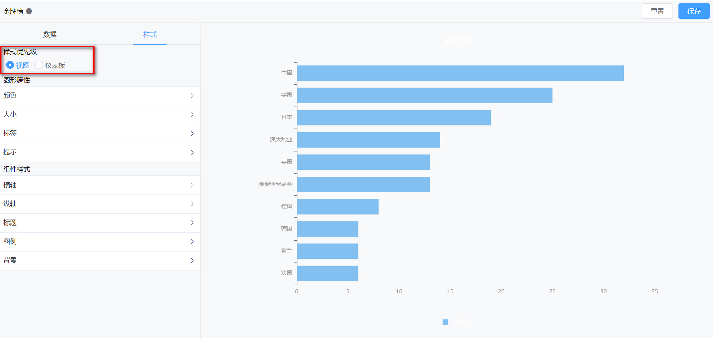

### 2.3 搜索

!!! Abstract ""
    使用方式，请查阅通用功能 [「搜索」](../general/#_6)

### 2.4 字段编辑

!!! Abstract ""
    点击，可编辑对应数据集的字段，如修改字段类型、名称、切换为维度或指标等

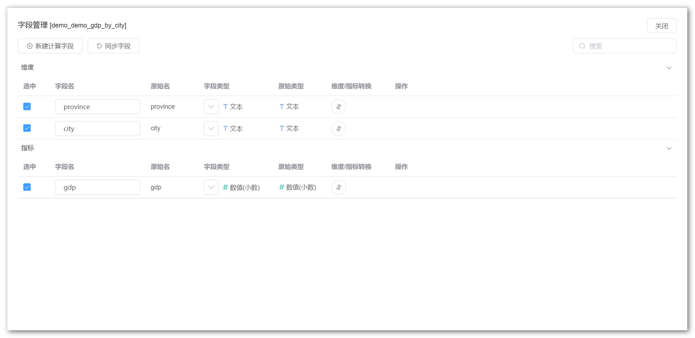
### 2.5 更换数据集

!!! Abstract ""
    点击可为视图更换数据集。

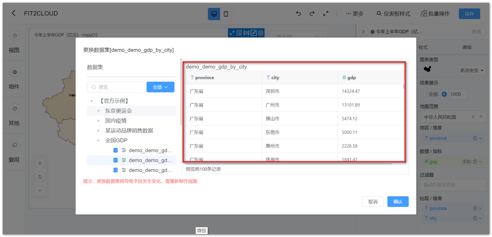
### 2.6 可选维度列表

!!! Abstract ""
    展示所有维度，当选择数据集后，维度与指标由系统自动分配，分配原则：文本型字段默认为维度、数值型字段默认为指标，因此如果需要某个字段作为指标，在数据集中编辑字段，将其设置为维度。

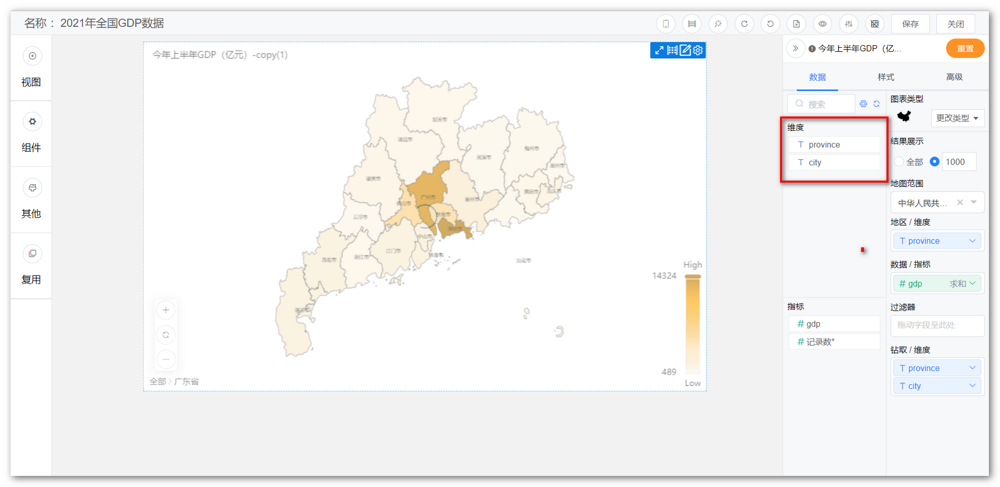
### 2.7 可选指标列表

!!! Abstract ""
    展示所有指标，当选择数据集后，维度与指标由系统自动分配，分配原则：文本型字段默认为维度、数值型字段默认为指标，因此如果需要某个字段作为指标，在数据集中编辑字段，将其设置为指标。

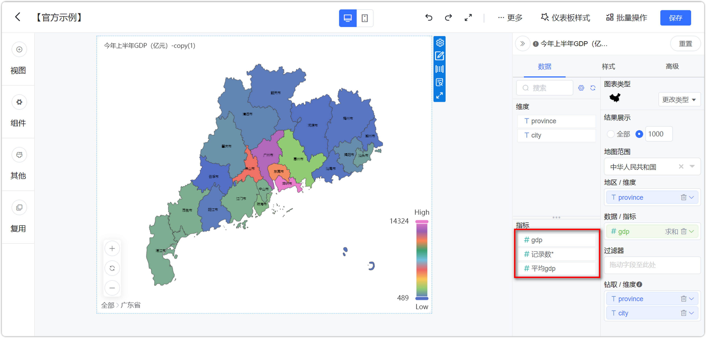
### 2.8 图表类型

!!! Abstract ""
    展示所有图表类型，如柱形图，折线图，组合图、雷达图等，可通过点击图标进行图表类型的切换。

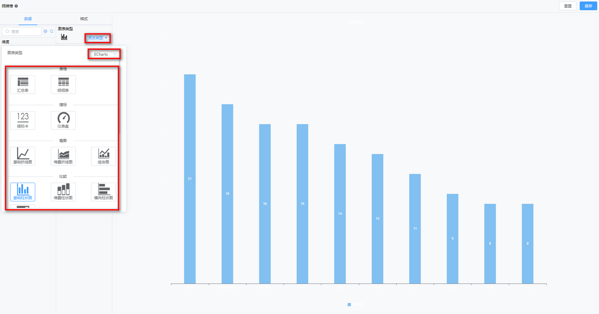
### 2.9 维度选择

!!! Abstract "维度选择"
    如下图所示，通过拖拉的形式，从"维度可选列表中"拖拉至"维度选择"，图表根据所选择的维度去统计分析数据。

!!! Abstract "维度设置"
    如下图所示，点击维度上的小箭头，弹出设置窗口，可设置维度排序（升序、降序）、过滤条件、显示名等。

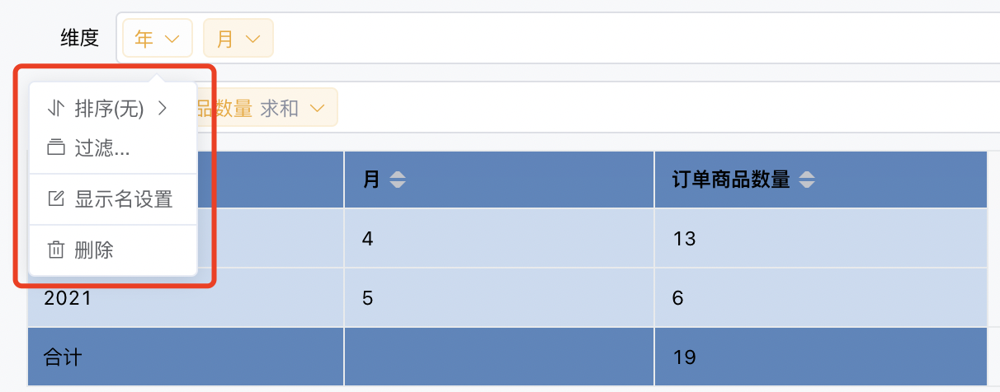
### 2.10 指标选择

!!! Abstract "指标选择"
    如下图所示，通过拖拉的形式，从"指标可选列表中"拖拉至"指标选择"，图表根据所选择的指标去汇总。

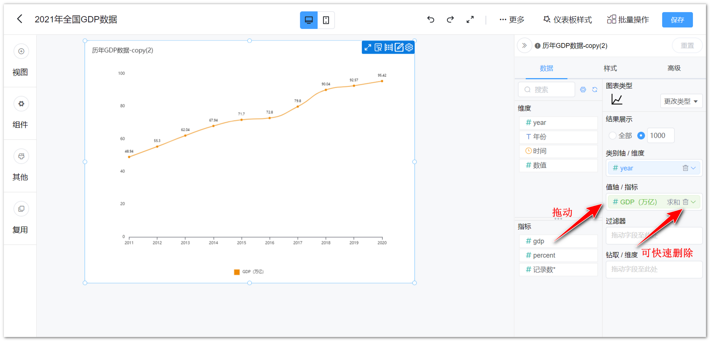

!!! Abstract "指标设置"
    如下图所示，点击指标上的小箭头，弹出设置窗口，可设置指标汇总方式（求和，平均，最大值）、快速计算、排序（升序、降序、无），可选择高级计算如同比、环比，可设置过滤等。

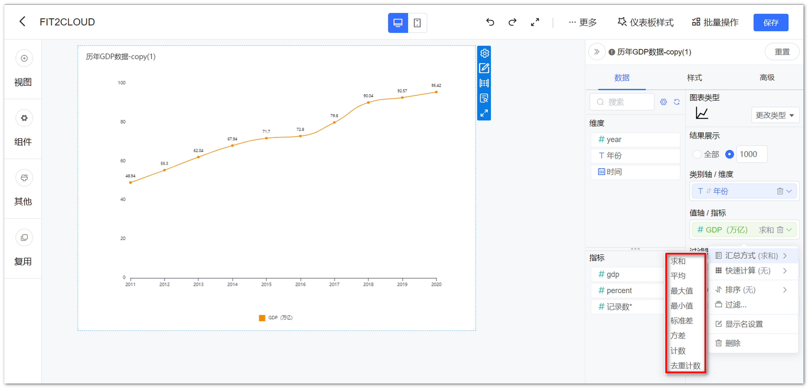

### 2.10 结果过滤器

!!! Abstract ""
    可点击设置过滤条件，对结果进行过滤

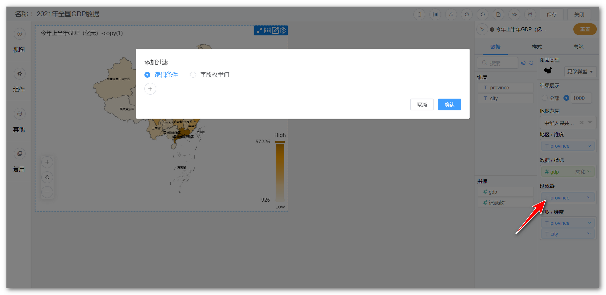

!!! Abstract ""
    如下图所示，设置过滤条件，可设置多个

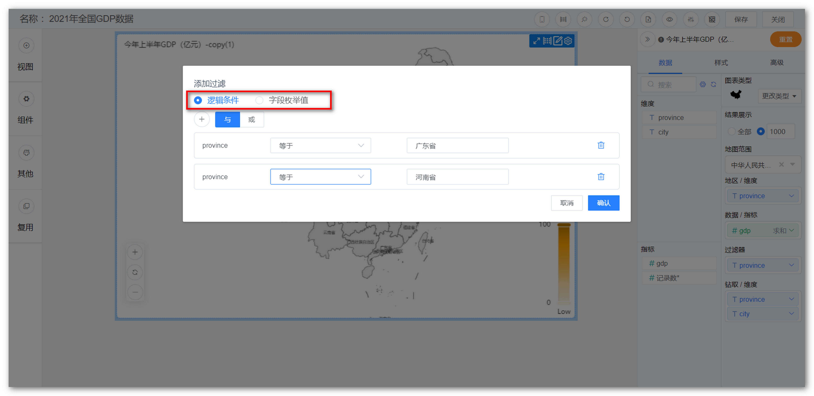

### 2.11 图表展示

!!! Abstract ""
    图表展示区，展示视图设计的结果

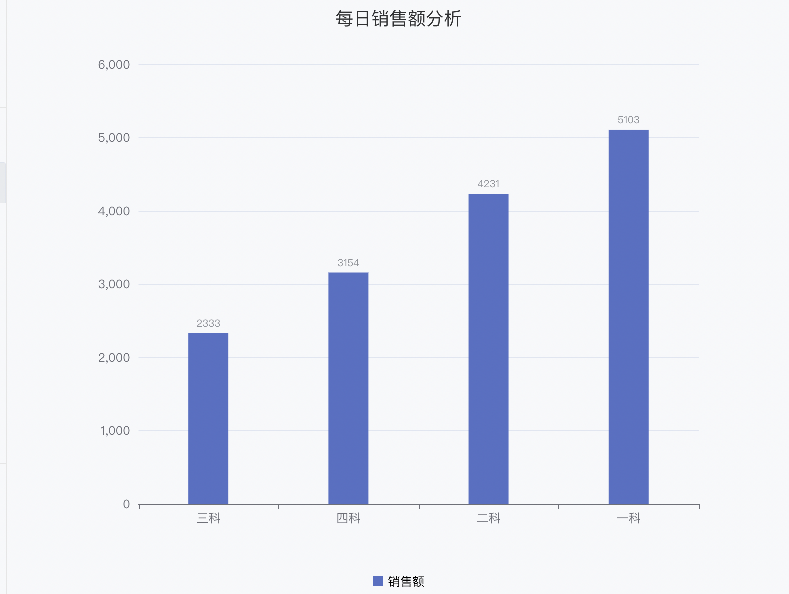

## 3 视图钻取
### 3.1 设置钻取目录

!!! Abstract ""
    生成全国的GDP地图后，拖拽钻取字段至【钻取/维度】。  
    **请注意：下钻目录与拖入的字段顺序有关，如下图所示，自上而下依次下钻。**

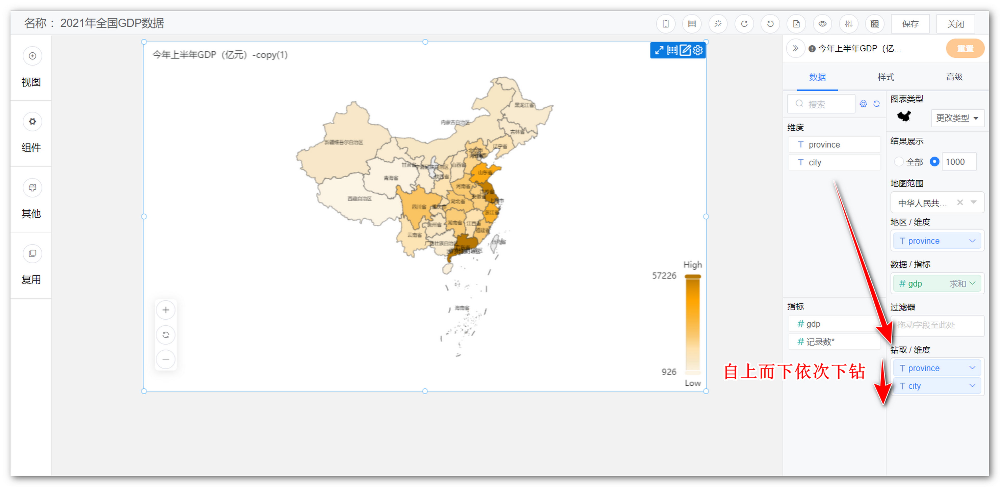
### 3.2 下钻

!!! Abstract "下钻步骤"
    第一步，点击【广东省】。

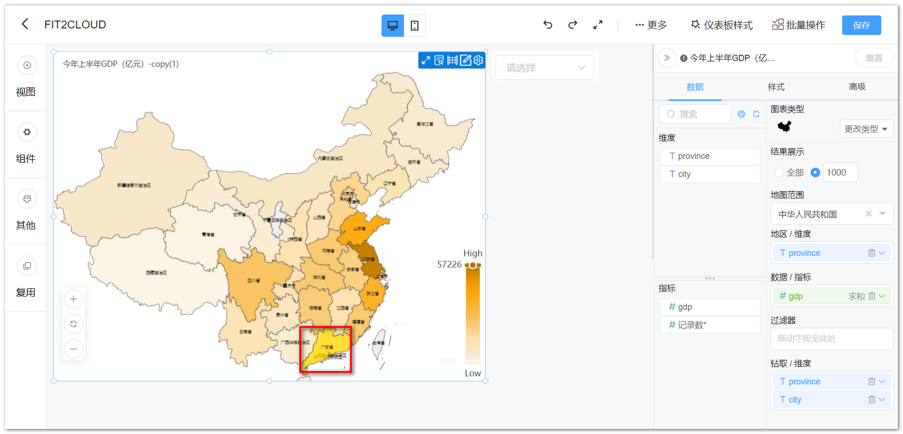

!!! Abstract "下钻步骤"
    第二步，下钻结果展示，如下图，展示广东省地图。如果想返回上一级，点击视图左下角的【全部】，返回全国地图。

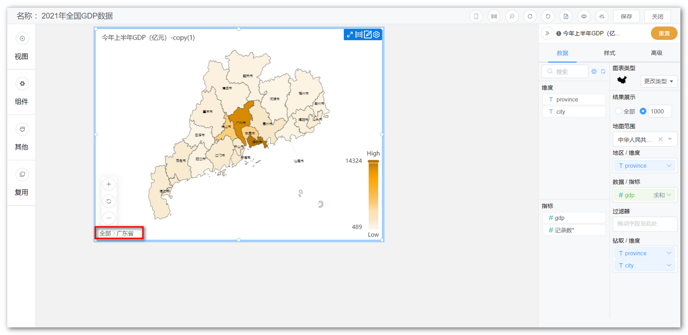

