!!! Abstract ""
    图表编辑区【高级】模块，不同图表存在差异，根据各图表特性具备不同的高级功能。

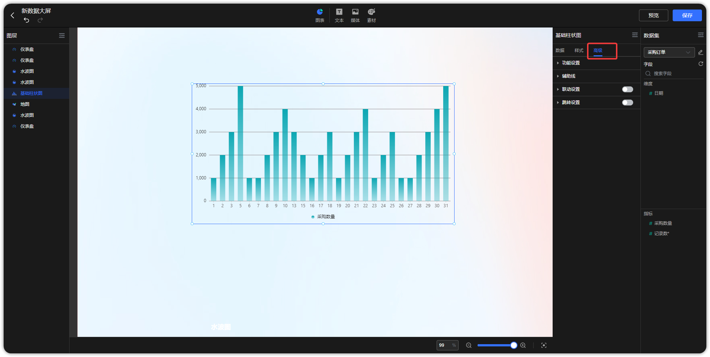{ width="900" }

## 1 缩略轴

!!! Abstract ""
    **柱状图和折线图支持设置缩略轴，可通过调整缩略轴快速调整显示的维度范围；**  
    如下图所示，切换至【高级】，点击功能设置，勾选【显示】缩略轴，调整维度显示范围；  
    缩略轴支持样式配置，支持背景、选中背景、字体颜色三个样式配置项。

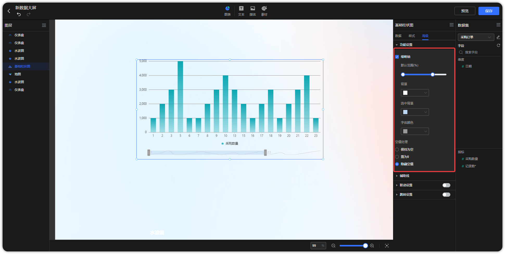{ width="900" }

## 2 空值处理

!!! Abstract ""
    如下图所示，在柱状图、折线图中均加入了空值处理的设置。

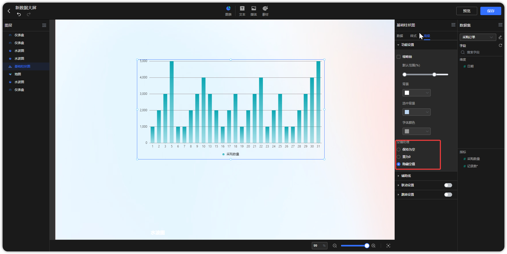{ width="900px" }

!!! Abstract ""
    控制处理支持隐藏无数据的点，支持空值的三种处理方式：

    - 保存为空
    - 置为 0
    - 隐藏空值
    
    空值的三种处理示例如下:

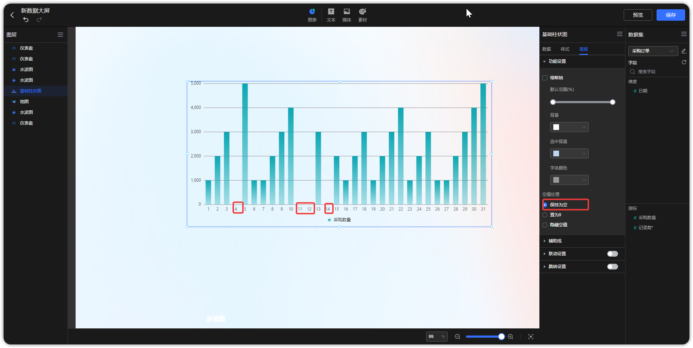{ width="900" }

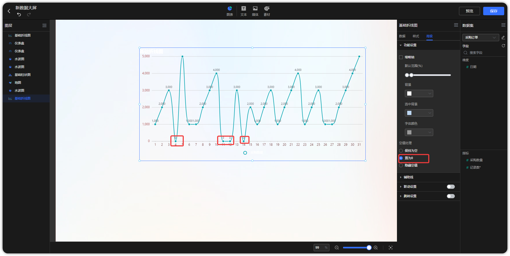{ width="900" }

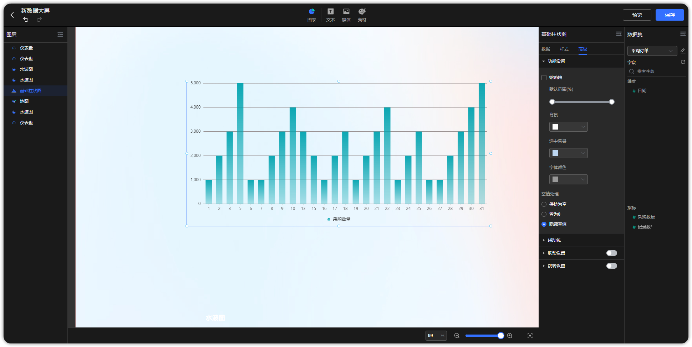{ width="900" }

!!! Abstract ""
    除了柱状图和折线图支持空值处理，在表格、地图中均加入了空值处理的设置。

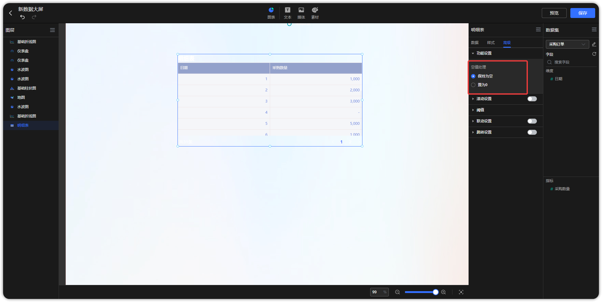{ width="900" }

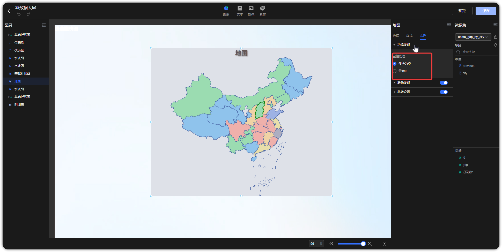{ width="900" }

!!! Abstract ""
    富文本空值默认置为 "-"，也可以自定义为任意内容，比如 0。

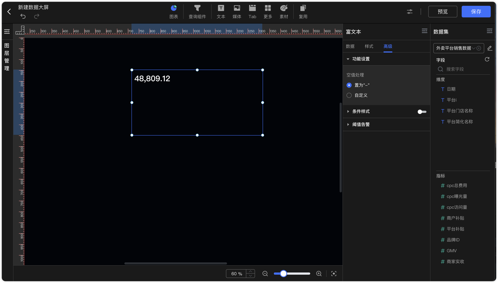{ width="900px" }

## 3 辅助线

!!! Abstract ""
    **对于具备横纵坐标系的图表（柱状图、折线图）支持设置辅助线；**

    - 支持设置名称、数值展示，且名称和数值的展示位置跟随坐标轴，当坐标轴分别放置在左右两侧时，辅助线的内容将跟随变化；  
    - 支持设置短划线类型（实线、线型虚线、点型虚线）、短划线颜色；  
    - 支持设置动态值，包括平均值、最大值、最小值；  
    - 支持同一图表设置多条辅助线；  
    - 支持支持字体大小设置；  

    如下图所示，切换至【高级】，点击【编辑】辅助线，弹出辅助线设置框，填写预警值名称及其他参数，点击【确定】即可。

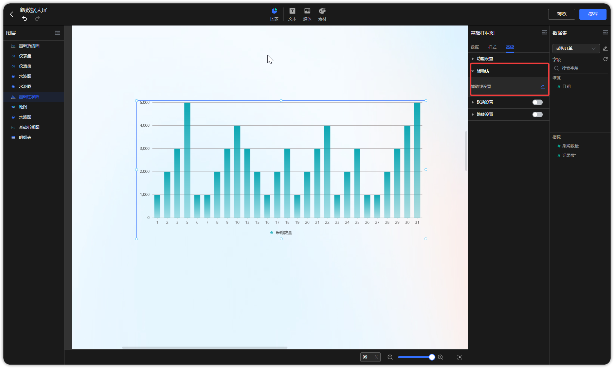{ width="900px" }

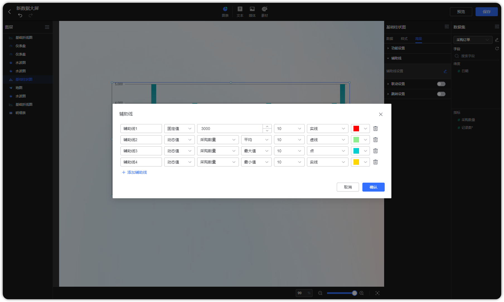{ width="900px" }

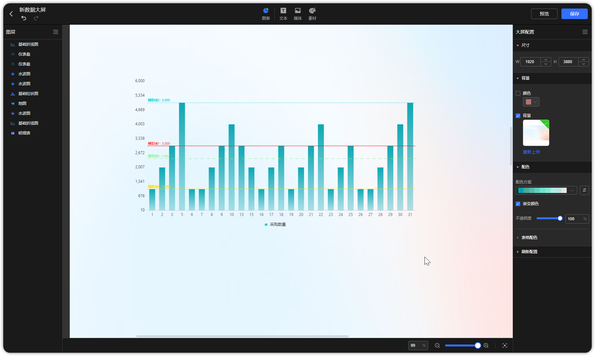{ width="900px" }

!!! Abstract ""
    辅助线数值格式化支持跟随轴设置。

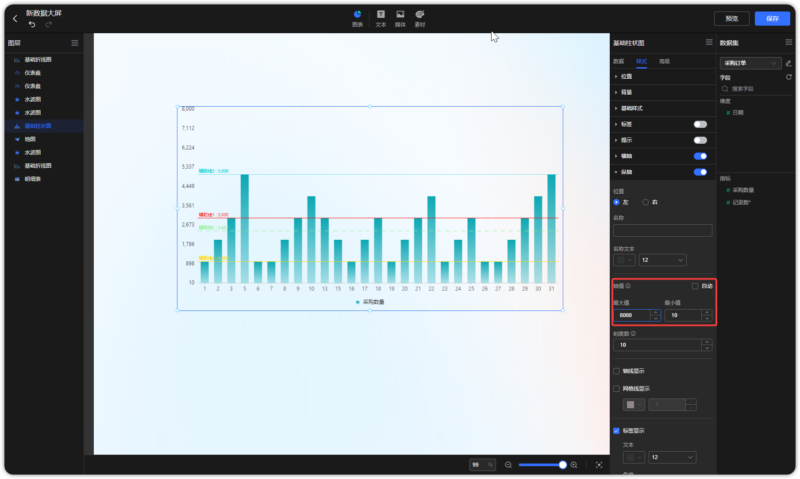{ width="900px" }

## 4 条件样式

!!! Abstract ""
    如下图所示切换至【高级】进入【条件样式】，可设置根据不同的字段类型可选的判断条件样式；  
    以数字类型的判断条件为例：可设置介于、等于、不等于、小于、大于、小于等于、大于等于；  
    目前汇总表、明细表、仪表盘支持阈值设置，支持配置文字颜色和背景颜色，支持默认背景色透明度调整。

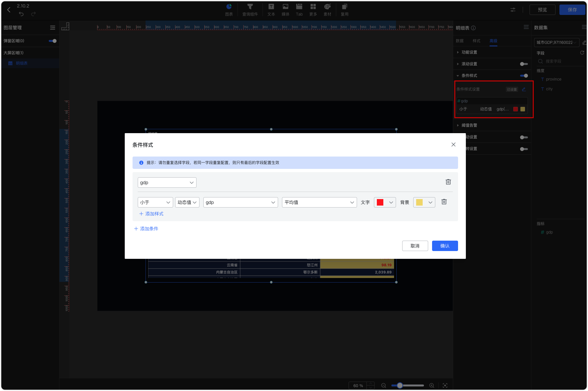{ width="900px" }  
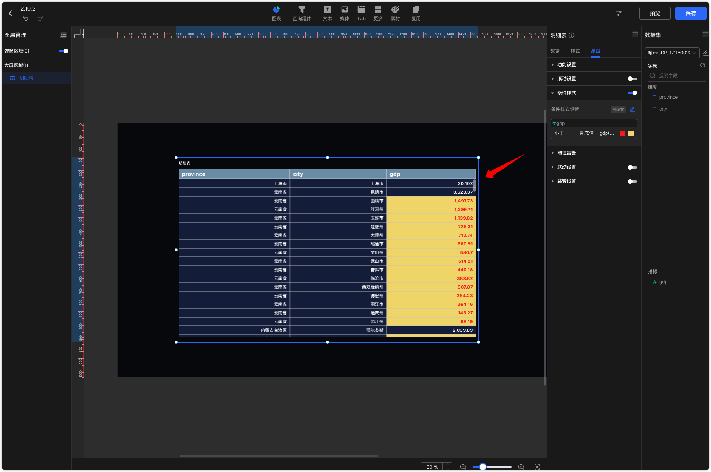{ width="900px" }

!!! Abstract ""
    仪表盘支持范围（0-100），逐级递增，若为空则不开启阈值，示例输入 30，70，表示分 3 段，分别为[0,30]，(30,70]，(70,100]。

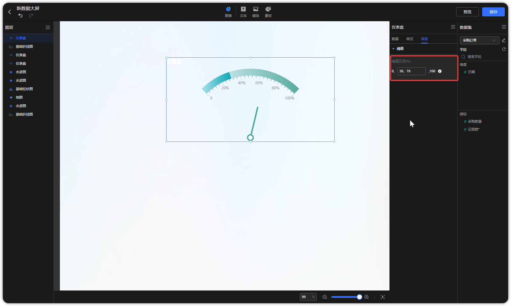{ width="900px" }

## 5 滚动

!!! Abstract ""
    如下图所示，表格支持滚动设置，支持滚动行数和时间间隔设置；  
    开启滚动后，鼠标在表格的滚动事件仍然有效，无法改变当前自动滚动的位置，即：鼠标触发滚动事件后，下次自动滚动，仍然从上一次自动滚动后的位置开始，不会从鼠标滚轮滚动后的位置开始，比如：目前自动滚动到第三行，下次应该滚动第四行，但在这之间，鼠标滚动了一下到第五行，下次自动滚动仍然为第四行。  
    **注意：** 透视表不支持滚动，明细表需设置分页模式为下拉时滚动才能生效。

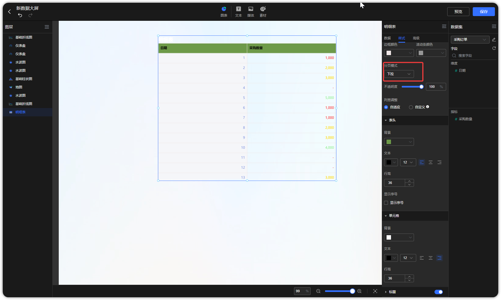{ width="900px" }  
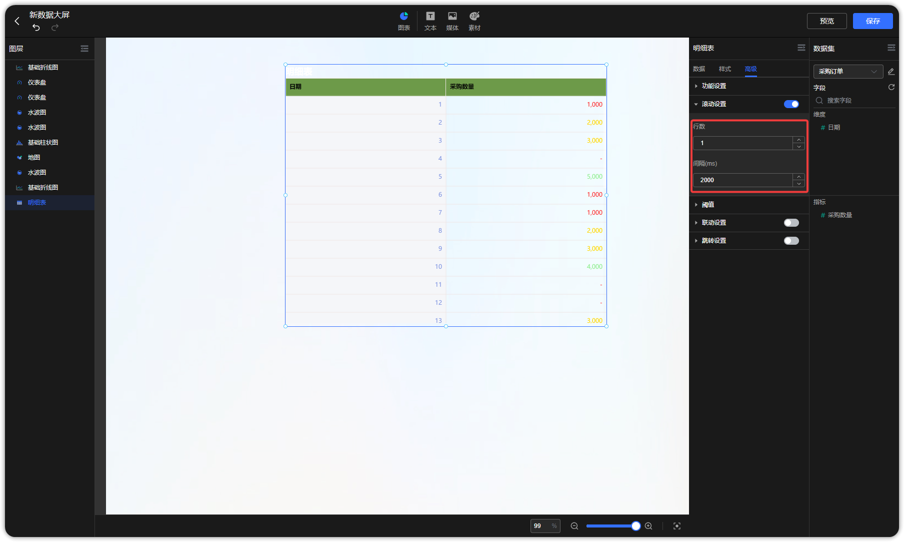{ width="900px" }

## 6 气泡动效

!!! Abstract ""
    流向地图、气泡地图配置数据后，支持配置气泡动效。进入【高级】并打开【气泡动效】开关。  
    **注意：流向地图需先在【样式】中设置标注点气泡大小。此外，流向地图为在线地图需要[配置地图 Key](https://dataease.io/docs/v2/user_manual/system_management/param/#32)。**

{ width="900px" }

