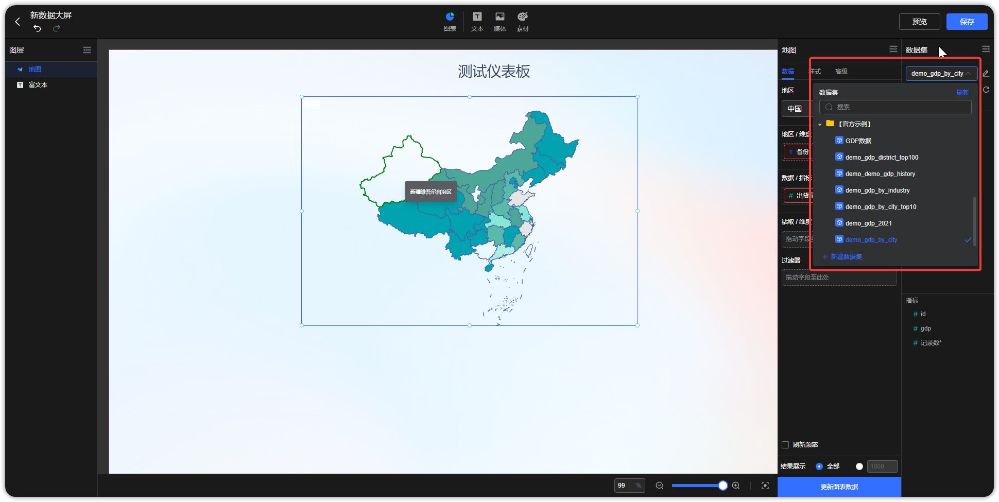
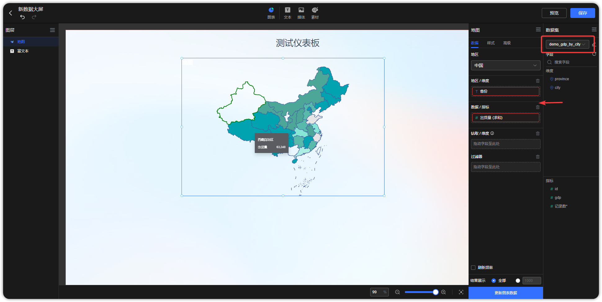
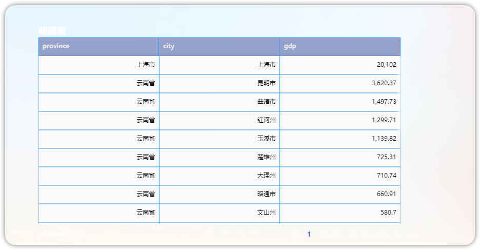
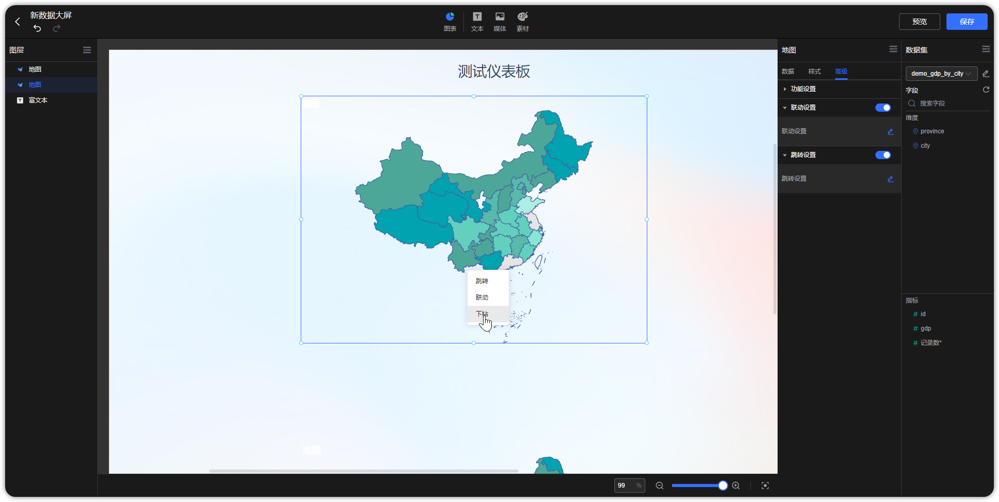
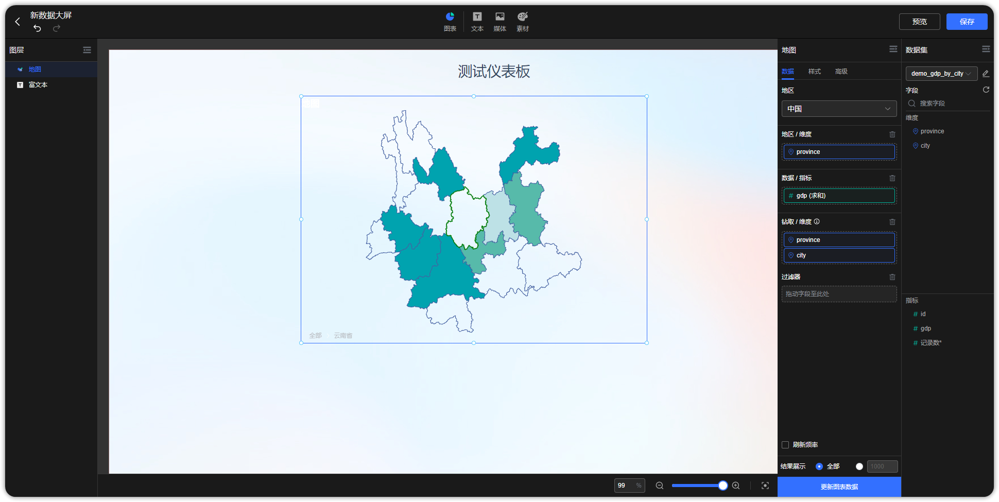

## 1 更换数据集

!!! Abstract ""
    如下图，点击箭头指向的位置，可为图表更换数据集，更换图表数据集时，系统会根据数据集字段名自动匹配（区分大小写），若字段名称、类型等无法匹配，则该字段会标红显示。  
    **提示：若更换后的数据集与原数据集字段发生变化，需重新制作图表，若更换后的数据集与原数据集字段可匹配上，图表数据自动根据更换后的数据集展示，不用再做调整。**

{ width="900px" }

!!! Abstract ""
    更换数据集，下拉数据集目录，点击数据集名称即可更换的数据集。

{ width="900px" }

## 2 图表下钻

!!! Abstract ""
    如下示例，生成全国的 GDP 地图后，拖拽钻取字段（钻取字段的第一个维度需要与地区维度内的字段相同）至【钻取/维度】；  
    字段下钻后将延续第一层排序规则（仅对升降序有效）；  
    **支持下钻区域文字跟随图表背景改变；**  
    **示例数据集如下，维度为地区，同一维度的地区由省、市不同层次（粒度）构成，示例数据集中可通过“省”钻取到“市”。**

{ width="900px" }

!!! Abstract ""
    如下示例，生成全国的 GDP 地图后，拖拽钻取字段（钻取字段的第一个维度需要与地区维度内的字段相同）至【钻取/维度】。

{ width="900px" }

!!! Abstract ""
    第一步，点击【云南省】，点击【下钻】。如果图表同时设置了联动和钻取，那么当点击时由用户选择执行联动或者钻取，当只设置了钻取时，默认执行钻取。

{ width="900px" }

!!! Abstract ""
    第二步，下钻结果展示，如下图，展示云南省地图。如果想返回上一级，点击图表左下角的【全部】，返回全国地图。

{ width="900px" }

