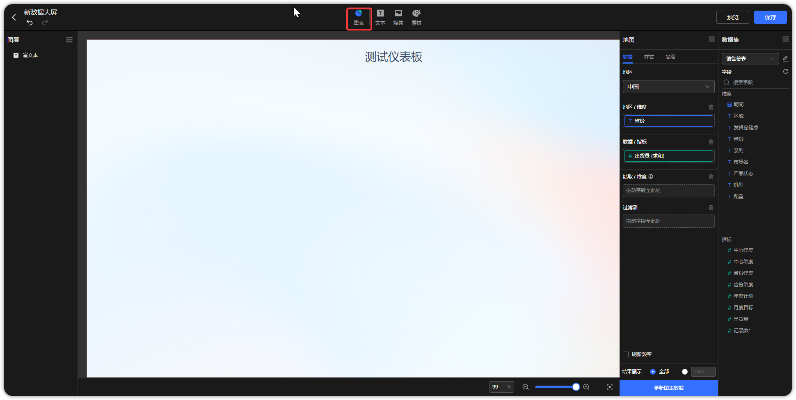
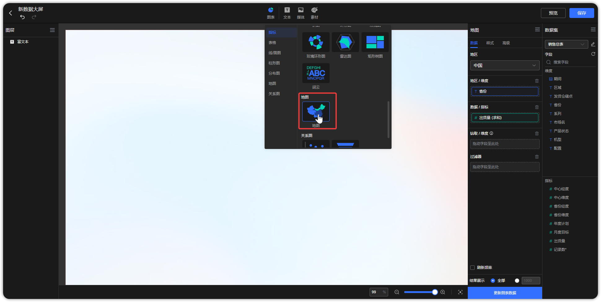
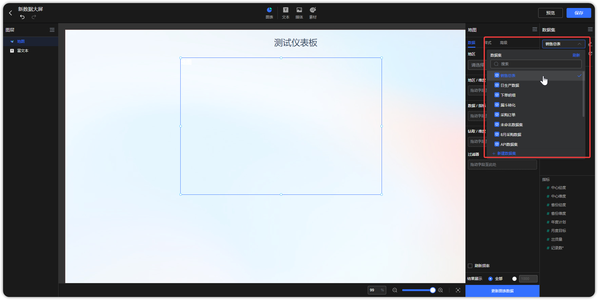
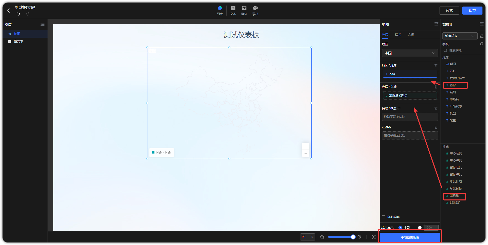
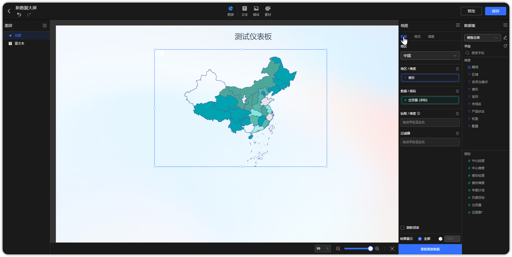

## 1 新建图表

!!! Abstract ""
    进入仪表板编辑界面，页面顶部菜单点击【图表】。

{ width="900px" }

!!! Abstract ""
    选择一个图表类型后，点击进入下一步.

{ width="900px" }

!!! Abstract ""
    选择一个数据集（支持搜索）。
{ width="900px" }

!!! Abstract ""
    将字段拖到维度框与指标框，点击【更新图表数据】，新建图表完成。

{ width="900px" }

{ width="900px" }