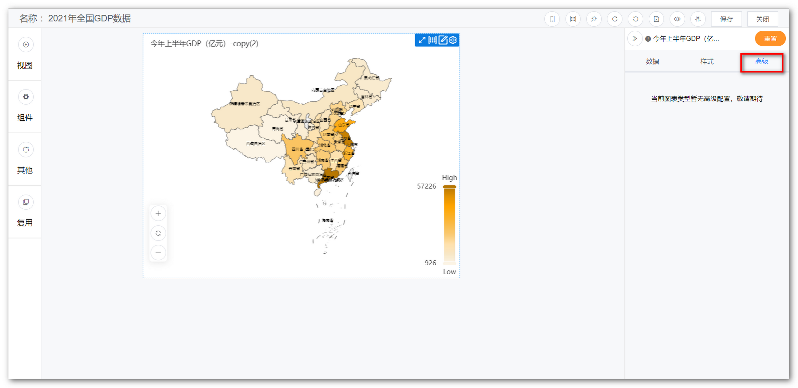
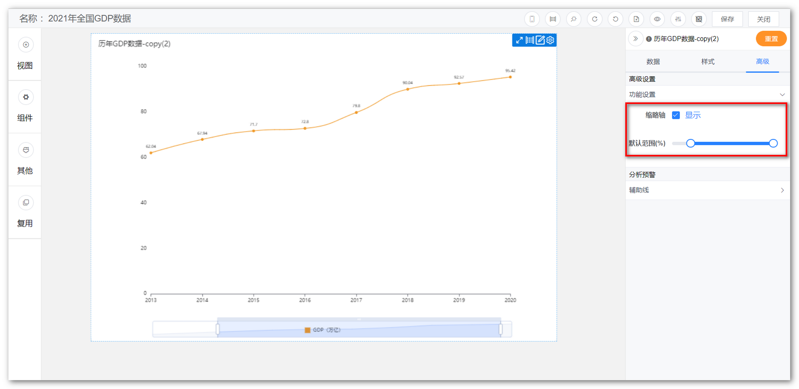
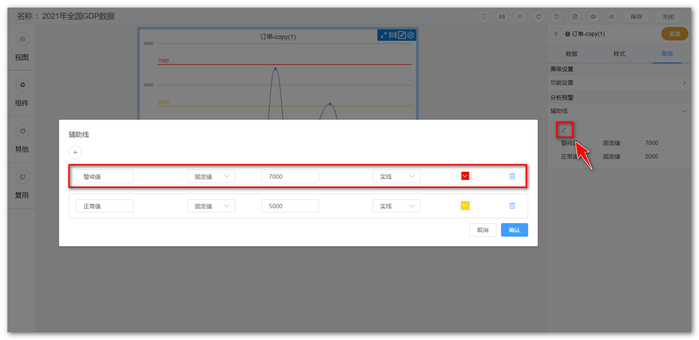
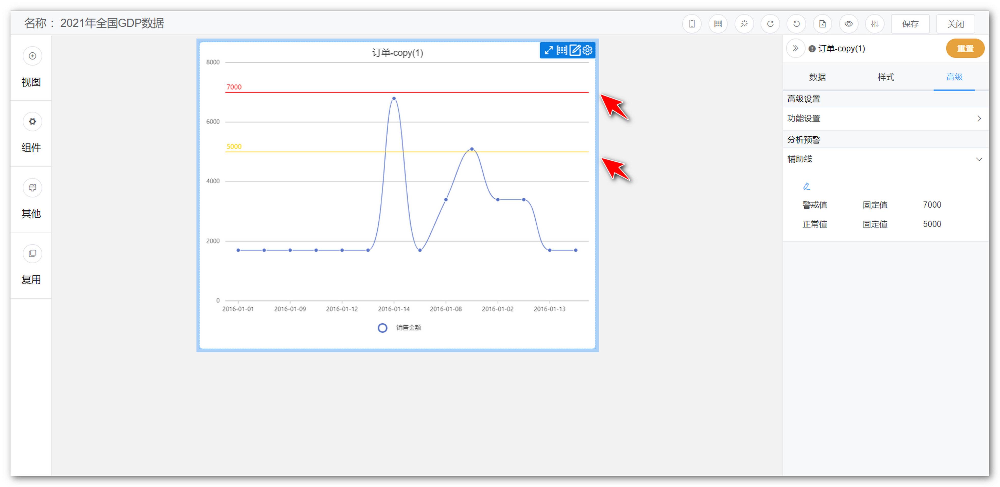
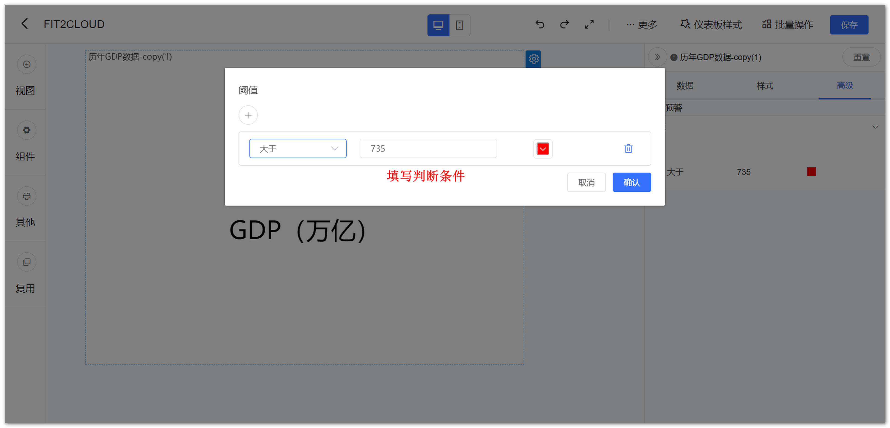
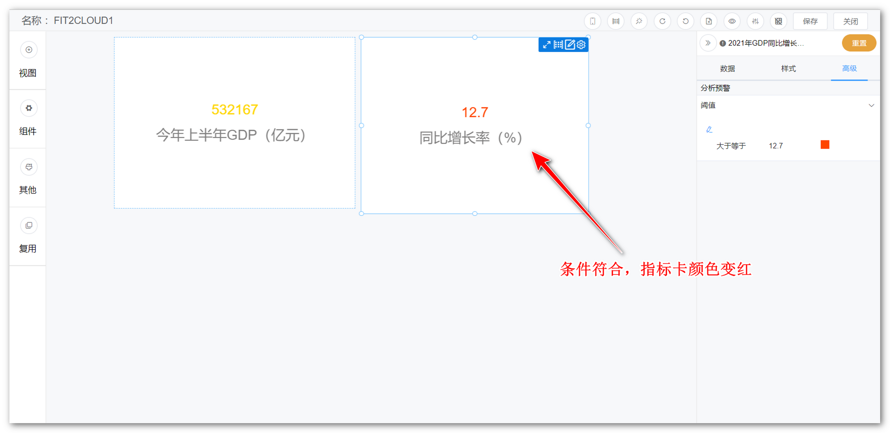
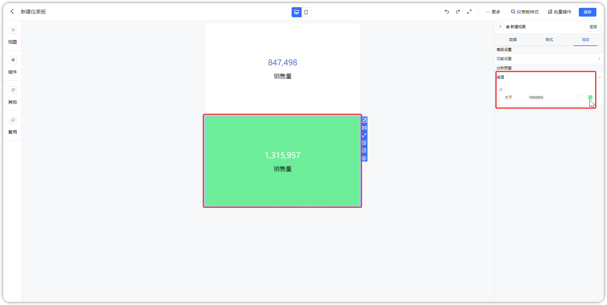
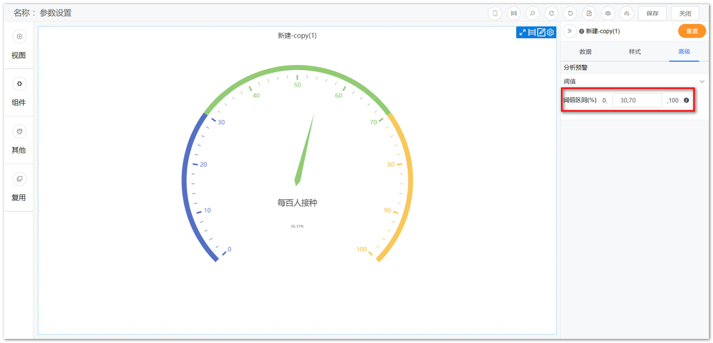
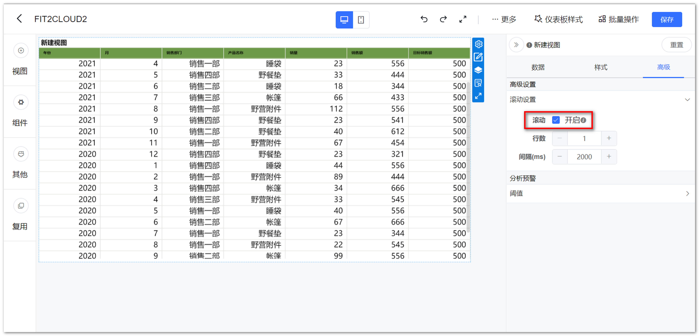
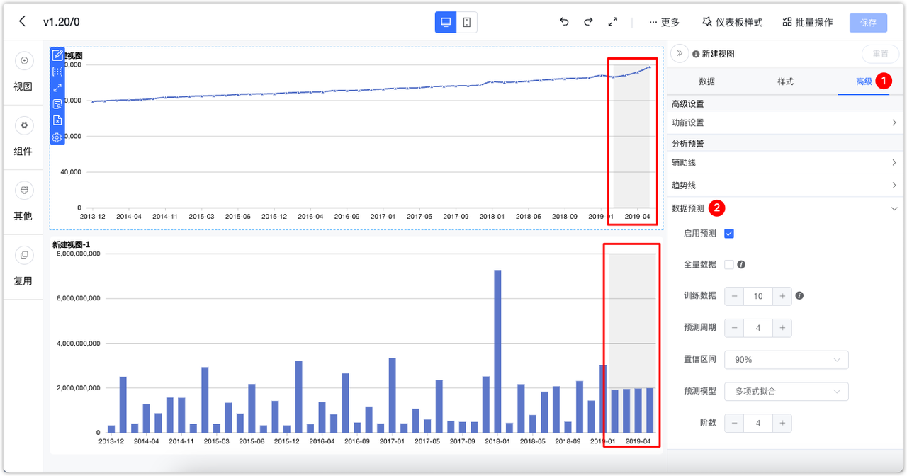

!!! Abstract ""
    视图编辑区【高级】模块，不同视图存在差异，根据各视图特性具备不同的高级功能。

{ width="900" }

## 1 缩略轴

!!! Abstract ""
    **柱状图和折线图支持设置缩略轴，可通过调整缩略轴快速调整显示的维度范围；**  
    如下图所示，切换至【高级】，点击功能设置，勾选【显示】缩略轴，调整维度显示范围；  
    缩略轴支持样式配置，支持背景、选中背景、字体颜色三个样式配置项。

{ width="900" }

!!! Abstract ""
    折线图支持隐藏无数据的点，支持空值的三种处理方式：

    - 线条断开
    - 置为 0，线条不断开
    - 跳过空值，不展示（线仍然是连贯的，为空的日期自动不展示出来）
    
    空值的三种处理示例如下:

{ width="900" }

{ width="900" }

{ width="900" }

## 2 辅助线

!!! Abstract ""
    **对于具备横纵坐标系的视图（柱状图、折线图）支持设置辅助线；**

    - 支持设置名称、数值展示，且名称和数值的展示位置跟随坐标轴，当坐标轴分别放置在左右两侧时，辅助线的内容将跟随变化；  
    - 支持设置短划线类型（实线、线型虚线、点型虚线）、短划线颜色；  
    - 支持设置动态值，包括平均值、最大值、最小值；  
    - 支持同一图表设置多条辅助线；  
    - 支持支持字体大小设置；  

    如下图所示，切换至【高级】，点击【编辑】辅助线，弹出辅助线设置框，填写预警值名称及其他参数，点击【确定】即可。

{ width="900px" }

{ width="900px" }

!!! Abstract ""
    辅助线数值格式化支持跟随轴设置。

{ width="900px" }

## 3 阈值

!!! Abstract ""
    如下图所示，切换至【高级】，点击【编辑】设置阈值，根据不同的字段类型可选的判断条件不同；  
    以数字类型的判断条件为例：可设置介于、等于、不等于、小于、大于、小于等于、大于等于；  
    目前支持的视图有指标卡，仪表盘。此外 AntV 图库的汇总表、明细表、透视表均支持阈值设置，支持配置文字颜色和背景颜色，支持默认背景色调整。指标卡支持通过设置阈值使背景变色。

{ width="900px" }  
{ width="900px" }
{ width="900px" }

!!! Abstract ""
    仪表盘阈值设置如下图所示，切换至【高级】，进入【阈值区间】设置，支持范围（0-100），逐级递增，若为空则不开启阈值，示例输入 30，70，表示分 3 段，分别为[0,30]，(30,70]，(70,100]。

{ width="900px" }

## 4 滚动

!!! Abstract ""
    如下图所示，表格支持滚动设置，支持滚动行数和时间间隔设置；  
    开启滚动后，鼠标在表格的滚动事件仍然有效，无法改变当前自动滚动的位置，即：鼠标触发滚动事件后，下次自动滚动，仍然从上一次自动滚动后的位置开始，不会从鼠标滚轮滚动后的位置开始，比如：目前自动滚动到第三行，下次应该滚动第四行，但在这之间，鼠标滚动了一下到第五行，下次自动滚动仍然为第四行。  
    **注意：** 明细表需设置分页模式为下拉时滚动才能生效。

{ width="900px" }  
{ width="900px" }

## 5 空值处理

!!! Abstract ""
    目前支持的视图有AntV 明细表、透视表、ECharts 地图、AntV 指标卡支持空值策略。如下图所示，在柱状图、折线图中均加入了空值处理的设置。

{ width="900px" }

## 6  趋势线
!!! Abstract ""
    目前仅 AntV 折线图支持趋势线设置，支持的算法有：多项式、线性、指数、对数、二次项、幂函数、局部加权。
{ width="900px" }
{ width="900px" }
{ width="900px" }

## 7  数据预测
!!! Abstract ""
    支持对 AntV 的基础柱状图和基础折线图做数据预测，使用规则如下：

    - 维度限制为单个时间类型，格式包括年、年季度、年月、年周、年月日；
    - 仅支持计算首个指标，暂不支持多序列；
    - 目前支持的预测模型：多项式拟合、线性回归。

{ width="900px" }