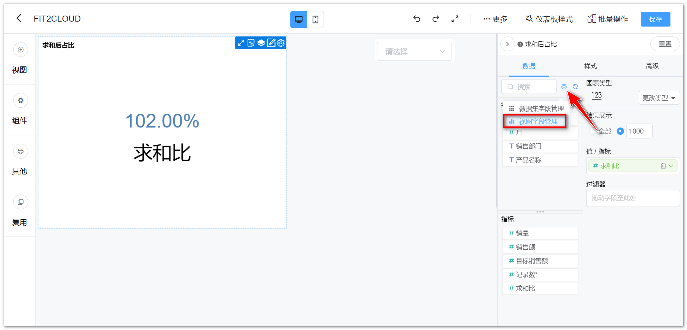
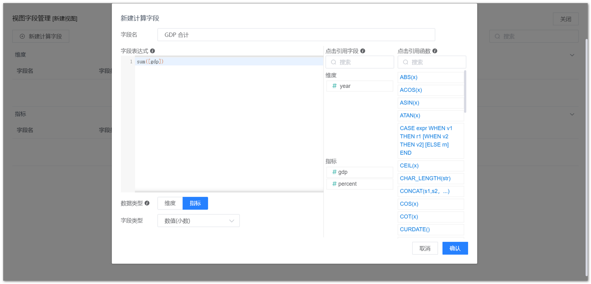
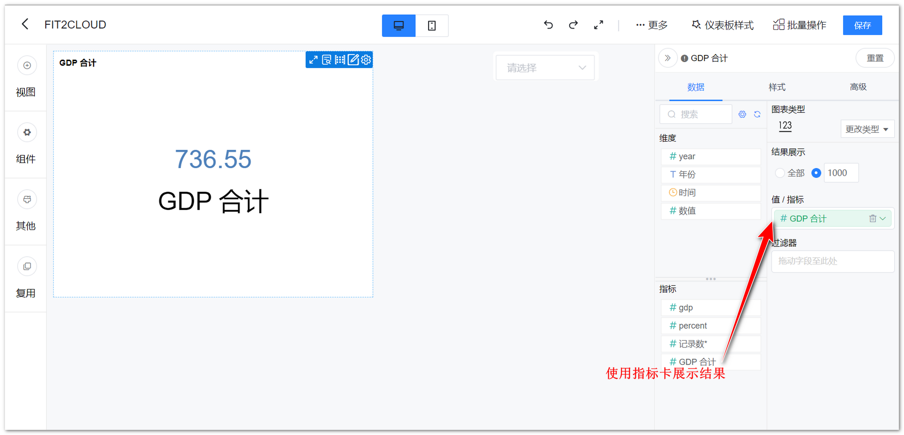
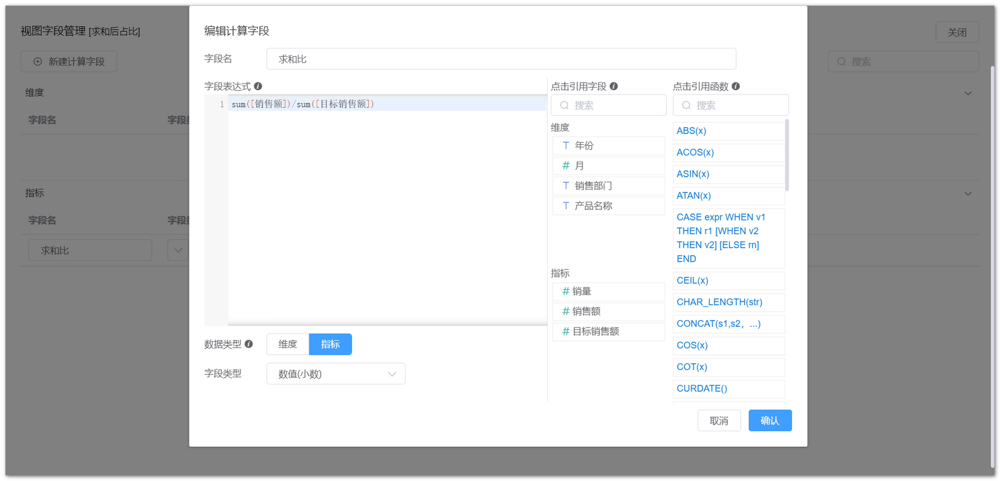
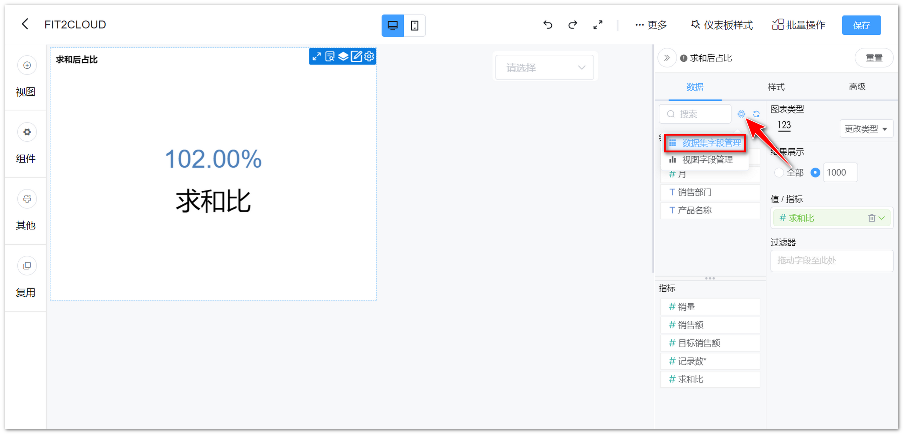
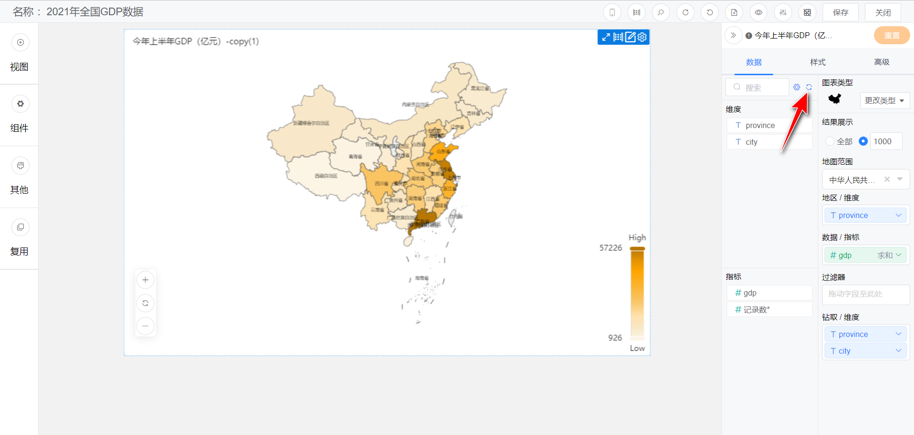
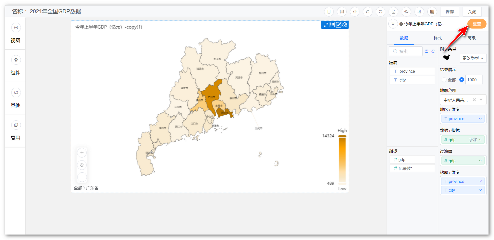

## 1 视图字段管理

!!! Abstract ""
    视图级别计算字段随视图，不影响数据集的计算字段。

    - 支持 Avg、Sum、Count、Min、Max 聚合函数；  
    - 新建的视图级别指标类字段，如果涉及到聚合函数，则不能单独出现该字段，必须是聚合函数和聚合函数的组合，比如可以 sum(salary)/count(user)，不能 salary/sum(salary)；  
    - 创建的字段若使用了聚合函数，则只能是指标，不能转维度。
    
    如下图所示，点击箭头指向的【齿轮】，选择【视图字段管理】，进入视图字段管理界面。

{ width="900px" }

{ width="900px" }

!!! Abstract ""
    如下示例计算求和。

{ width="900px" }

{ width="900px" }

!!! Abstract ""
    如下示例计算求和后的占比。

{ width="900px"}

{ width="900px" }

{ width="900px" }

## 2 数据集字段管理

!!! Abstract ""
    如下图所示，点击箭头指向的【齿轮】，选择【数据集字段管理】，可编辑对应数据集的字段，如修改字段类型、名称、切换为维度或指标等。

{ width="900px" }

## 3 更换数据集

!!! Abstract ""
    如下图，点击箭头指向的位置，可为视图更换数据集，更换视图数据集时，系统会根据数据集字段名自动匹配（区分大小写），若字段名称、类型等无法匹配，则该字段会标红显示。  
    **提示：若更换后的数据集与原数据集字段发生变化，需重新制作视图，若更换后的数据集与原数据集字段可匹配上，视图数据自动根据更换后的数据集展示，不用再做调整。**

{ width="900px" }

!!! Abstract ""
    更换数据集，右侧显示出原数据集的内容，选定更换的数据集，点击【确定】即可。

{ width="900px" }

## 4 更改图表类型

!!! Abstract ""
    展示所有图表类型，如柱形图，折线图，组合图、雷达图等，可通过点击图标进行图表类型的切换。

{ width="900px" }

## 5 视图下钻

!!! Abstract ""
    如下示例，生成全国的 GDP 地图后，拖拽钻取字段（钻取字段的第一个维度需要与地区维度内的字段相同）至【钻取/维度】；  
    字段下钻后将延续第一层排序规则（仅对升降序有效）；  
    **支持下钻区域文字跟随视图背景改变；**  
    **示例数据集如下，维度为地区，同一维度的地区由省、市、区/县三个不同层次（粒度）构成，示例数据集中可通过“省”钻取到“市”，从“市”下钻到“区/县”。**

| province | city | district | gdp     |
|----------|------|--------|---------|
| 广东省      | 深圳市  | 罗湖区    | 1149.53 |
| 广东省      | 深圳市  | 南山区    | 3042.29 |
| 广东省      | 深圳市  | 福田区    | 2225.76 |
| 广东省      | 广州市  | 天河区    | 6012.20 |
| 广东省      | 广州市  | 黄埔区    | 4158.37 |
| 广东省      | 广州市  | 越秀区    | 3629.48 |
| 浙江省      | 杭州市  | 余杭区    | 1195.4  |
| 浙江省      | 杭州市  | 上城区    | 1183.2  |
| 浙江省      | 杭州市  | 拱墅区    | 986.6   |
| 浙江省      | 宁波市  | 鄞州区    | 1018.2  |
| 浙江省      | 宁波市  | 北仑区    | 898.4   |
| 浙江省      | 宁波市  | 慈溪市    | 872.2   |

!!! Abstract ""
    如下示例，生成全国的 GDP 地图后，拖拽钻取字段（钻取字段的第一个维度需要与地区维度内的字段相同）至【钻取/维度】。

{ width="900px" }

!!! Abstract ""
    第一步，点击【广东省】。

{ width="900px" }

!!! Abstract ""
    第二步，下钻结果展示，如下图，展示广东省地图。如果想返回上一级，点击视图左下角的【全部】，返回全国地图。

{ width="900px" }

## 6 重置

!!! Abstract ""
    如下图所示，点击【重置】，可将本次对于该视图的编辑全部还原。

{ width="900px" }

{ width="900px" }
