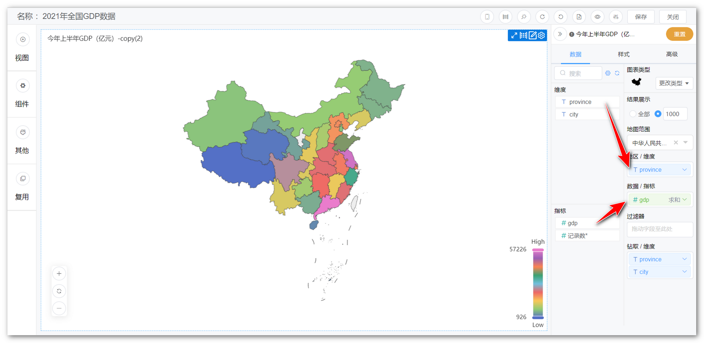
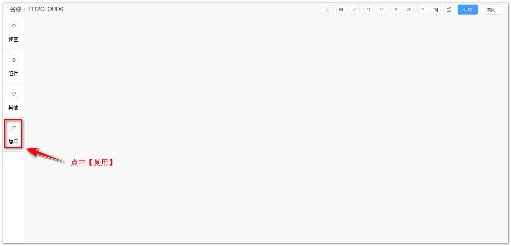
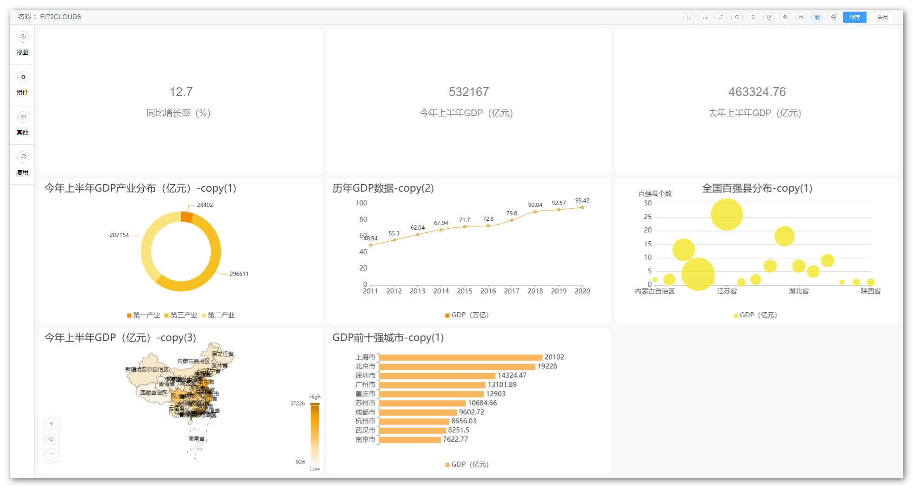

## 1 新建视图

!!! Abstract ""
    进入仪表板编辑界面，页面左侧点击【视图】。

{ width="900px" }

!!! Abstract ""
    新建视图步骤：

    1. 填写视图标题名称，选择一个数据集（支持搜索）后点击【下一步】； 
    2. 选择一个图表类型后，点击【确认】，进入下一步；
    3. 将字段拖到维度框与指标框，点击【保存】，新建视图完成。

{ width="900px" }  
{ width="900px" }  
{ width="900px" }

## 2 复用视图
    
!!! Abstract ""
    复用视图即从其他已建好的视图，拷贝一份到当前仪表板下，如下图所示，点击仪表板左侧的【复用】，弹出复用视图界面，点击选择某个仪表板，右侧弹出仪表板的内容，选择仪表板中的视图或者其他组件，选择完成后，点击【确认】按钮，复用成功。

{ width="900px" }

{ width="900px" }

!!! Abstract ""
    复用时可多选，引用进的视图按一行三个视图的排列水平平铺，如下图所示。

{ width="900px" }

!!! Abstract ""
    **v1.7.0 及以前版本升级至 v1.8.0 时请注意，v1.8.0 版本将视图功能内置于仪表板内，权限跟随仪表板。直接使用 v1.8.0 版本则无需关注此内容。**

    - 存量视图之前如果被仪表板使用了，则该视图根据引用的仪表板的数量复制多份，每个仪表板具备一份，权限跟随仪表板。另外源视图保留在存量视图中；  
    - 仅 admin 用户可以在复用中看到【存量视图】列表（由于视图权限去掉，系统无法根据权限给用户查看对应视图，本着在原权限基础上缩小而不扩大权限范围的原则，全部回收到 admin 处）；
    - v1.11.0 版本存量视图按照单个视图预览，点击视图后右上角的复选框自动被勾选上，如下图所示。

{ width="900px" }

