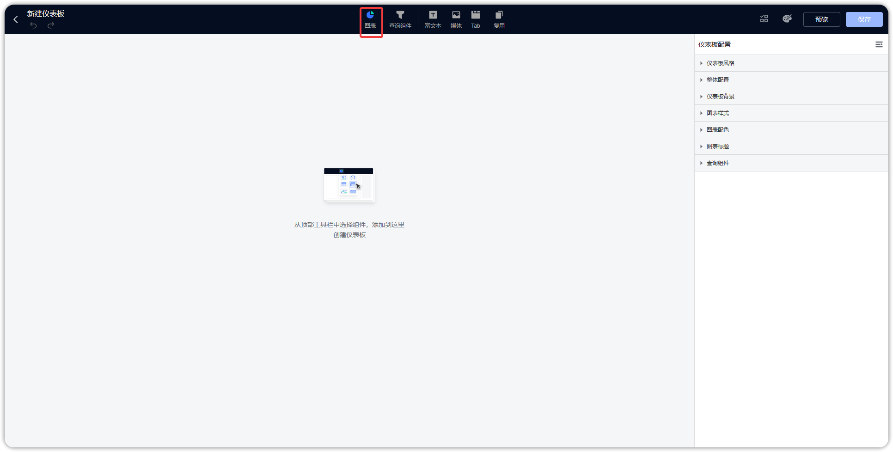
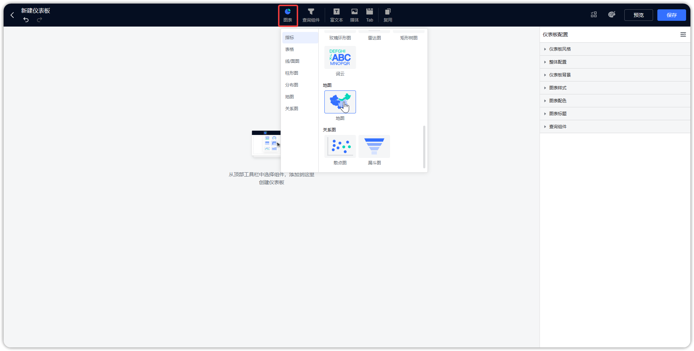
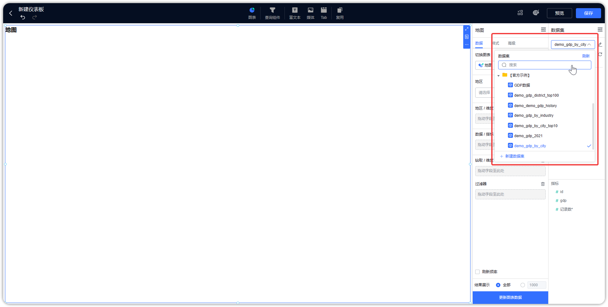
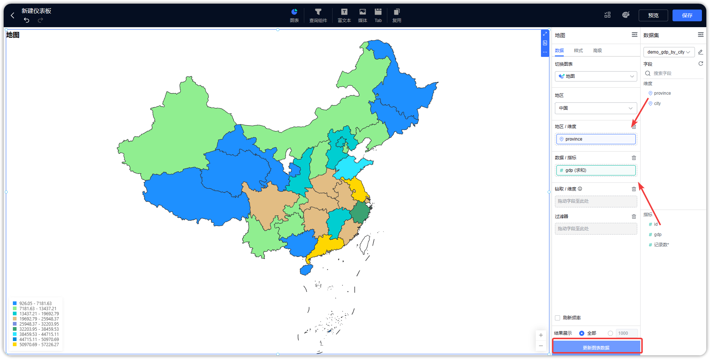
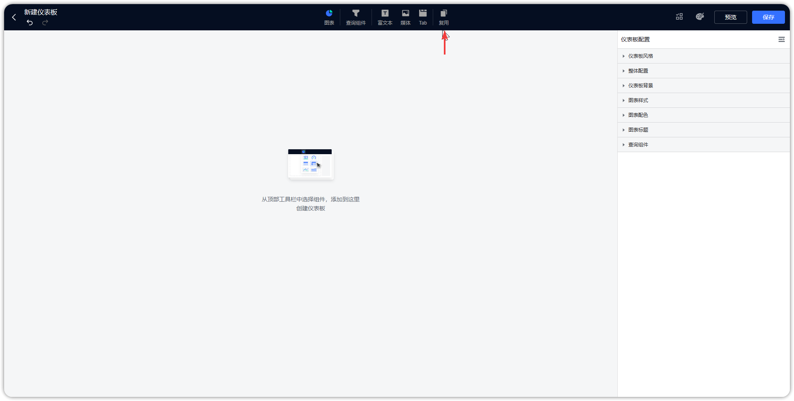
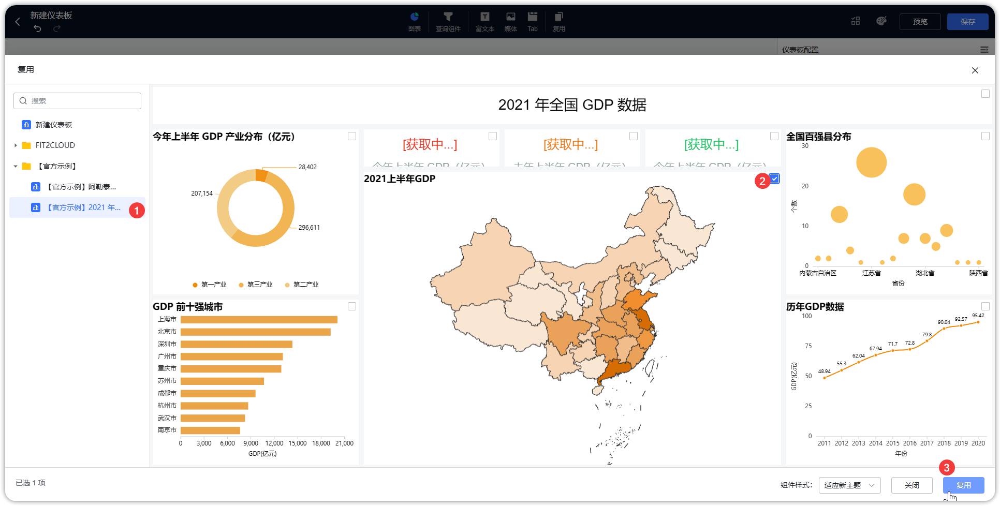
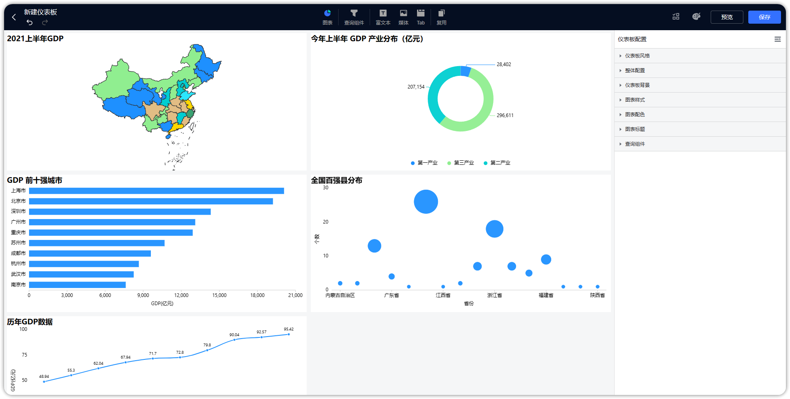

## 1 新建图表

!!! Abstract ""
    进入仪表板编辑界面，页面顶部菜单点击【图表】。

{ width="900px" }

!!! Abstract ""
    新建图表步骤：

    1. 选择一个图表类型后，点击【确认】，进入下一步；
    2. 选择一个数据集（支持搜索）； 
    3. 将字段拖到维度框与指标框，点击【更新图表数据】，新建图表完成。

{ width="900px" }
{ width="900px" }  
{ width="900px" }

## 2 更改图表类型

!!! Abstract ""
    点击切换图表，展示所有图表类型，如柱形图，折线图，组合图、雷达图等，可通过点击图表图标进行图表类型的切换。

{ width="900px" }

{ width="900px" }

## 3 复用图表

!!! Abstract ""
    复用图表即从其他已建好的图表，拷贝一份到当前仪表板下，如下图所示，点击仪表板顶部的【复用】，弹出复用图表界面，点击选择某个仪表板，右侧弹出仪表板的内容，选择仪表板中的图表或者其他组件，选择完成后，点击【复用】按钮，复用成功。

{ width="900px" }

{ width="900px" }

!!! Abstract ""
    复用时可多选，引用进的图表按一行两个图表的排列水平平铺，如下图所示。

{ width="900px" }
