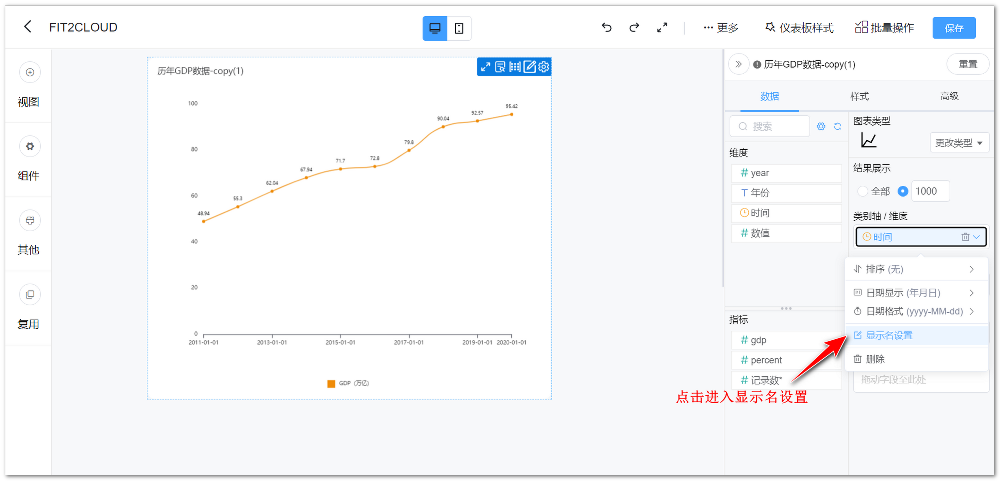
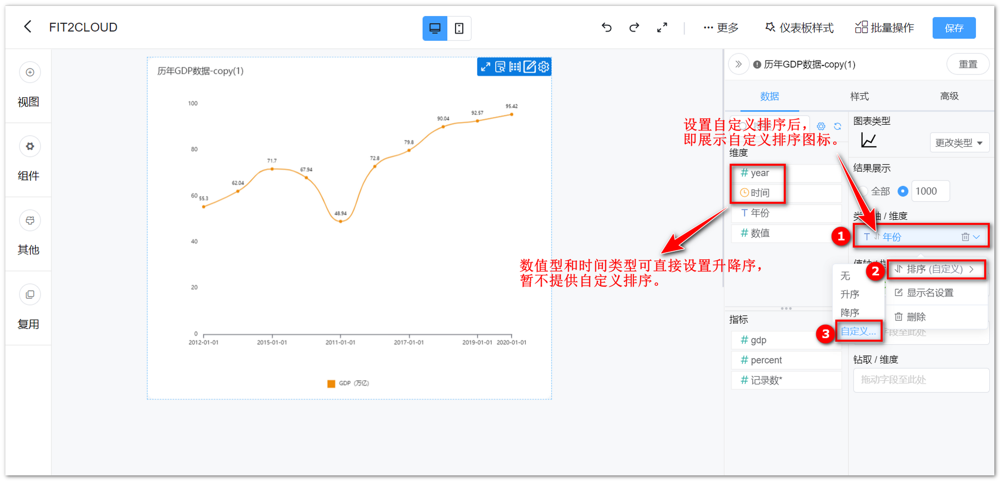
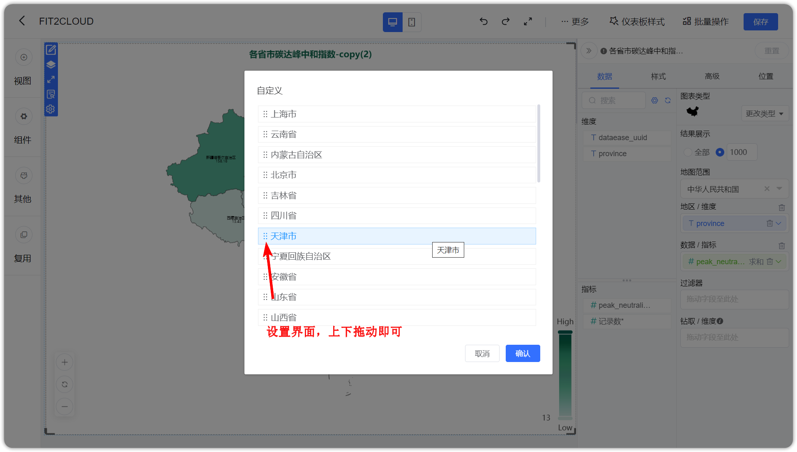
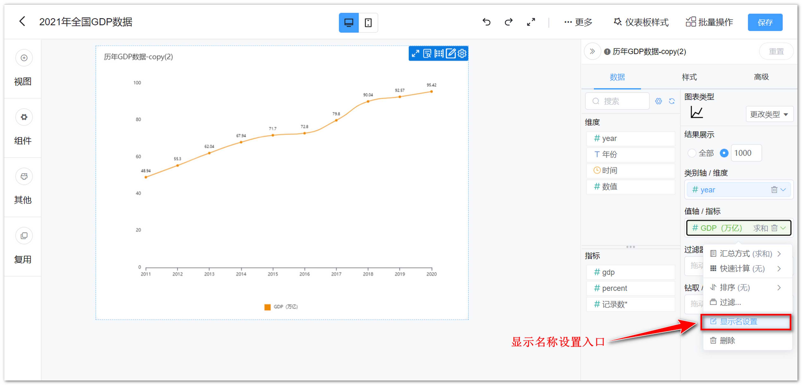
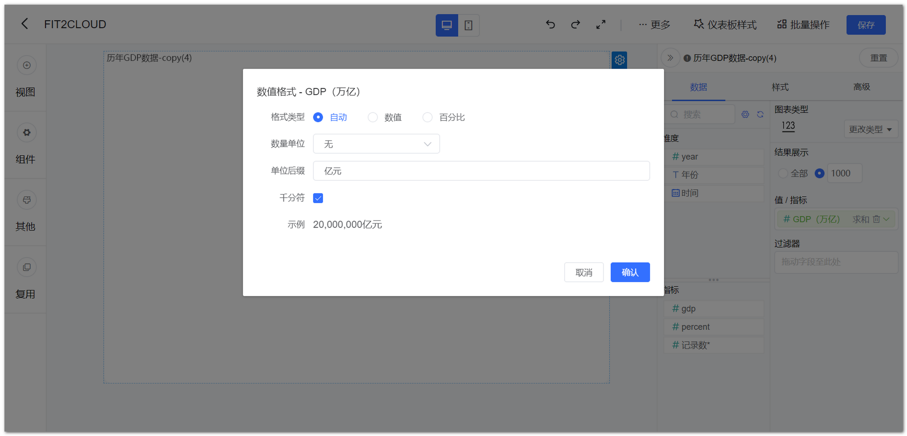

## 1 可选维度列表

!!! Abstract ""
    展示所有可选维度，当选择数据集后，维度与指标由系统自动分配，分配原则：文本型字段默认为维度、数值型字段默认为指标，因此如果需要某个字段作为指标，在数据集中编辑字段，将其设置为维度。

{ width="900px" }

## 2 可选指标列表

!!! Abstract ""
    展示所有可选指标，当选择数据集后，维度与指标由系统自动分配，分配原则：文本型字段默认为维度、数值型字段默认为指标，因此如果需要某个字段作为指标，在数据集中编辑字段，将其设置为指标。

{ width="900px" }

## 3 维度选择

!!! Abstract ""
    **如下图所示，通过拖拉的形式，从"维度可选列表中"拖拉至"维度选择"，图表根据所选择的维度去统计分析数据。**

{ width="900px" }

!!! Abstract ""
    **如下图所示，点击维度上的小箭头，弹出设置窗口，可设置维度排序方式、显示名，日期类型字段还可设置日期显示和日期格式；**  
    **提示：** 仅时间类型支持设置日期显示和日期格式。

{ width="900px" }

!!! Abstract ""
    **支持更改维度显示名称，同时保留该字段原始的字段名称，如下图所示。**

{ width="900px" }

!!! Abstract ""
    **支持维度自定义排序，具体操作步骤如下图所示。**  
    **注意：**

    - 数值型的不提供自定义排序；
    - 时间类型不支持自定义排序；
    - 透视表只支持数据列维度；
    - 堆叠类图表只支持类别轴维度。

    Tips：可以根据前面的图标快速判断当前设置的排序方式。

{ width="900px" }

{ width="900px" }

## 4 指标选择

!!! Abstract ""
    **如下图所示，通过拖拉的形式，从"指标可选列表中"拖拉至"指标选择"，图表根据所选择的指标进一步分析展示数据。**

{ width="900px" }

!!! Abstract ""
    ECharts 地图支持切换指标，允许拖入多个指标，可在地图组件的数据设计区做多个指标的切换。

{ width="900px" }

!!! Abstract ""
    **如下图所示，点击指标上的小箭头，弹出设置窗口，可设置指标汇总方式；**  
    不同字段类型对应的汇总方式不同，具体如下。

    - 数值型支持求和、平均、最大值、最小值、标准差、方差、计数、去重统计；
    - 文本类型支持计数、去重统计；
    - 时间类型支持计数、去重统计。

{ width="900px" }

!!! Abstract ""
    **支持更改指标显示名称，同时保留该字段原始的字段名称，如下图所示。**
    
{ width="900px" }

!!! Abstract ""
    **支持快速计算（同比环比、占比计算）、支持排序，可设置过滤等；**  
    **注意：使用同比环比功能，需字段为日期类型，若【同比环比】不可点击，请检查维度字段是否为日期类型。**

{ width="900px" }

!!! Abstract ""
    **支持设置数值格式化，AntV 图库图表支持数值格式化（注意除文本卡和符号地图外）。**

    - 支持数量单位：千、万、百万、亿；
    - 支持设置小数位数；
    - 支持设置为百分比格式；
    - 支持设置单位后缀；
    - 支持打开千分位，即每三位数，以逗号隔开的方式，20,000,000。

    下图以 AntV 图库指标卡为例。

{ width="900px" }

{ width="900px" }

## 5 结果过滤器

!!! Abstract ""
    可点击设置过滤条件，对结果进行过滤。

{ width="900px" }

!!! Abstract ""
    如下图所示，可设置多个过滤条件，并且支持逻辑条件过滤（或、与），可选择等于、不等于、包含、不包含、为空、不为空，支持字段枚举值过滤。

{ width="900px" }
