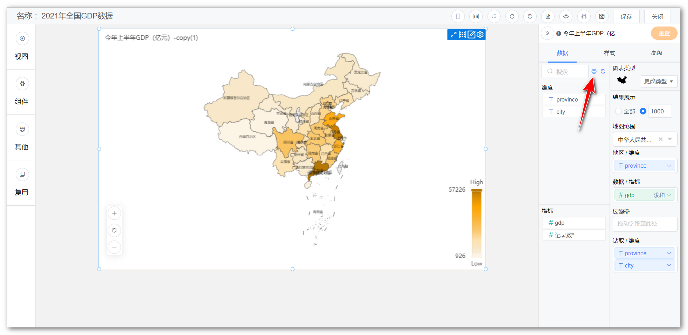

## 1 基础功能

### 1.1 编辑数据集

!!! Abstract ""
    如下图，点击箭头指向的【齿轮】，跳转到字段管理页面，可编辑对应数据集的字段，如修改字段类型、名称、切换为维度或指标等。

{ width="900px" }  
{ width="900px" }

### 1.2 更换数据集

!!! Abstract ""
    如下图，点击箭头指向的位置，可为视图更换数据集；  
    **提示：** 更换数据集将导致字段发生变化，需重新制作视图。

{ width="900px" }  
{ width="900px" }

### 1.3 更改图表类型

!!! Abstract ""
    展示所有图表类型，如柱形图，折线图，组合图、雷达图等，可通过点击图标进行图表类型的切换。

{ width="900px" }

### 1.4 视图下钻

!!! Abstract ""
    如下示例，生成全国的 GDP 地图后，拖拽钻取字段至【钻取/维度】。  
    **请注意：下钻目录与拖入的字段顺序有关，如下图所示，自上而下依次下钻。**

{ width="900px" }

!!! Abstract ""
    第一步，点击【广东省】。

{ width="900px" }

!!! Abstract ""
    第二步，下钻结果展示，如下图，展示广东省地图。如果想返回上一级，点击视图左下角的【全部】，返回全国地图。

{ width="900px" }

### 1.5 重置

!!! Abstract ""
    如下图所示，点击【重置】，可将本次对于该视图的编辑全部还原。

{ width="900px" }

## 2 数据设置

### 2.1 可选维度列表

!!! Abstract ""
    展示所有可选维度，当选择数据集后，维度与指标由系统自动分配，分配原则：文本型字段默认为维度、数值型字段默认为指标，因此如果需要某个字段作为指标，在数据集中编辑字段，将其设置为维度。

{ width="900px" }

### 2.2 可选指标列表

!!! Abstract ""
    展示所有可选指标，当选择数据集后，维度与指标由系统自动分配，分配原则：文本型字段默认为维度、数值型字段默认为指标，因此如果需要某个字段作为指标，在数据集中编辑字段，将其设置为指标。

{ width="900px" }

### 2.3 维度选择

!!! Abstract ""
    如下图所示，通过拖拉的形式，从"维度可选列表中"拖拉至"维度选择"，图表根据所选择的维度去统计分析数据。

{ width="900px" }

!!! Abstract ""
    如下图所示，点击维度上的小箭头，弹出设置窗口，可设置维度排序（升序、降序）、显示名，时间类型的维度还可设置日期显示和日期格式。

{ width="900px" }

### 2.4 指标选择

!!! Abstract ""
    如下图所示，通过拖拉的形式，从"指标可选列表中"拖拉至"指标选择"，图表根据所选择的指标进一步分析展示数据。

{ width="900px" }

!!! Abstract ""
    如下图所示，点击指标上的小箭头，弹出设置窗口，可设置指标汇总方式（求和，平均，最大值）、快速计算、排序（升序、降序、无），可选择高级计算如同比、环比，可设置过滤等。  
    **注意：使用同比环比功能，需字段为日期类型，若【同比环比】不可点击，请检查维度字段是否为日期类型。**

{ width="900px" }

### 2.5 结果过滤器

!!! Abstract ""
    可点击设置过滤条件，对结果进行过滤。

{ width="900px" }

!!! Abstract ""
    如下图所示，可设置多个过滤条件，并且支持逻辑条件过滤（或、与），可选择等于、不等于、包含、不包含、为空、不为空，支持字段枚举值过滤。

{ width="900px" }

## 3 样式设置

!!! Abstract ""
    点击【样式】，切换至样式设计界面，该界面主要针对【图形属性】和【组件样式】进行调整，**不同的视图类型可支持的样式会有所差异，不同的图表库（Echarts、AntV）在样式上也有一些差异。**

{ width="900px" }

### 3.1 样式优先级

!!! Abstract ""
    **注意：【样式优先级】可以选择为视图或仪表板。视图的颜色与仪表板的背景色等属性不同时，以样式优先级选择项为主来显示。**

{ width="900px" }

### 3.2 图形属性

!!! Abstract ""
    如下图，支持修改图形的颜色，大小，标签等。

{ width="900px" }

!!! Abstract ""
    支持配置系统方案（默认、复古、淡雅、未来、渐变、简洁、商务、柔和、科技、明亮、经典、清新、活力、火红、轻快、灵动）；  
    如下图，点击，也可以自定义配色。

{ width="900px" }

### 3.3 组件样式

!!! Abstract ""
    支持修改组件的标题（标题名称、字体大小、字体颜色、水平位置、垂直位置、字体样式），图例（图标、方向、字体大小、字体颜色、水平位置、垂直位置）等。

{ width="900px" }

## 4 高级设置

!!! Abstract ""
    DataEase 1.9.0 版本，视图编辑区新增【高级】模块，不同视图存在差异，根据各视图特性具备不同的高级功能。

{ width="900" }

### 4.1 缩略轴

!!! Abstract ""
    **柱状图和折线图支持设置缩略轴，可通过调整缩略轴快速调整显示的维度范围：**  
    如下图所示，切换至【高级】，点击功能设置，勾选【显示】缩略轴，调整维度显示范围。

{ width="900" }

### 4.2 辅助线

!!! Abstract ""
    **对于具备横纵坐标系的视图（柱状图、折线图）支持设置辅助线：**  
    辅助线支持设置名称、数值、短划线类型（实线、线型虚线、点型虚线）、短划线颜色，支持同一图表设置多条辅助线；  
    如下图所示，切换至【高级】，点击【编辑】辅助线，弹出辅助线设置框，填写预警值和其他参数，点击【确定】即可。

{ width="900px" }  
{ width="900px" }

