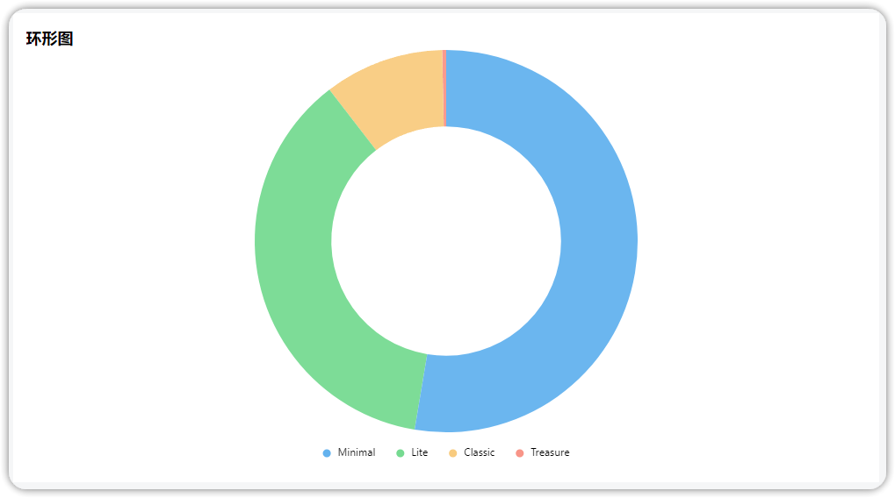

!!! Abstract ""
    使用数据可视化分析工具时，图表样式是展现数据的关键因素之一。在 DataEase 开源数据可视化分析平台上，提供了多种图表样式，包括折线图、柱状图、饼图、雷达图、散点图等。不同的图表样式适用于不同的数据类型和数据分析需求，因此在使用 DataEase 时选择合适的图表样式非常重要。

## 1 指标
!!! Abstract ""
    通过文字、数字和符号的合理排版，对数据进行一目了然的展示。

### 1.1 仪表盘

!!! Abstract ""
    仪表盘像一个钟表或者可读盘，有刻度和指针，其中刻度表示度量，指针表示维度，指针角度表示数值，指针指向当前数值。

    { width="900px" }

### 1.2 水波图

!!! Abstract ""
    水波图的水波高度表示指标值，当水填满或溢出时，代表指标值已经到达目标值。

    { width="900px" }

### 1.3 指标卡
!!! Abstract ""
    指标卡由看板标签和看板指标组成，标签由数据的维度决定，指标由数据的度量决定。

    { width="900px" }

## 2 表格
!!! Abstract ""
    表格是数据的详情罗列，能看到明细信息，表格包含汇总表和明细表。
### 2.1 汇总表

!!! Abstract ""
    汇总表

    { width="900px" }
### 2.2 明细表
!!! Abstract ""
    明细表

    { width="900px" }

### 2.3 透视表
!!! Abstract ""
    透视表

    { width="900px" }

### 2.4 热力图
!!! Abstract ""
    热力图
{ width="900px" }

## 3 线/面图

!!! Abstract ""
    折线图是用折线将各个数据点标志连接起来的图表，可用于直角坐标系和极坐标系上。

### 3.1 基础折线图
!!! Abstract ""
    基础折线图

    { width="900px" }

    { width="900px" }

### 3.2 堆叠折线图
!!! Abstract ""
    堆叠折线图在折线图的基础上形成，折线与自变量坐标轴之间的区域使用颜色填充，堆叠折线图每一个数据的起点都是基于前一个数据，最终代表的是所有数据的和，即累计值。

    { width="900px" }

### 3.3 面积图
!!! Abstract ""
    面积图是通过将折线图下方的区域填充来强调数据的累积变化。

    { width="900px" }

## 4 柱状图

!!! Abstract ""
    柱状图又称条形图，是一种通过柱形的高度（横向的情况下则是宽度）来表现数据大小的一种常用图表类型，柱状图包括基础柱状图、堆叠柱状图、横向柱状图和横向堆叠柱状图。  
    **注意：** 柱状图当前同一维度只能显示一种颜色。
### 4.1 基础柱状图

!!! Abstract ""
    基础柱状图

    { width="900px" }

### 4.2 堆叠柱状图

!!! Abstract "" 
    堆叠柱状图是柱状图的变形，堆叠柱状图将每个柱子进行颜色分割，用于显示同系列下各个数据的大小情况，它不仅可以比较不同维度间总数的差别，还可以显示同类型下子类别的构成以及各数据的大小情况。

    { width="900px" }

### 4.3 横向柱状图
!!! Abstract ""
    横向柱状图，用于比较不同类别的数量或数值，而且柱状条是水平排列的。

    { width="900px" }

### 4.4 横向堆叠柱状图
!!! Abstract ""
    横向堆叠柱状图如同字面意思，是堆叠柱状图的横向展示。

    { width="900px" }

### 4.5 分组柱状图
!!! Abstract ""
    分组柱状图,是一种用于比较多个组内不同类别的数量关系的图表。每个组有多个并排的柱状条，每个柱状条表示一个类别。

    { width="900px" }

### 4.6 分组堆叠柱状图
!!! Abstract ""
    分组堆叠柱状图,可以同时展示多个组内的不同类别的数量关系，并且在每个组内，各类别的值可以堆叠在一起。

    { width="900px" }

### 4.7 百分比柱状图
!!! Abstract ""
    百分比柱状图，每个柱状条的总高度表示 100%，而不同颜色段表示不同类别的百分比贡献

    { width="900px" }

### 4.8 横向百分比柱状图
!!! Abstract ""
    横向百分比柱状图

    { width="900px" }

### 4.9 瀑布图
!!! Abstract ""
    瀑布图是一种用于显示累计数值变化的图表，能够清晰展示各个数据点的增减对总值的影响。

    { width="900px" }

### 4.10 区间条形图
!!! Abstract ""
    区间条形图用于显示数据集中每个区间内数据分布的图表，通常通过条形的长度表示各个区间的频率或数量。

    { width="900px" }

### 4.11 对称条形图
!!! Abstract ""
    对称条形图用于比较两个数据集在相同类别下的数值，通过在中轴两侧对称排列的条形来显示数据的差异和分布情况。

    { width="900px" }

### 4.12 进度条
!!! Abstract ""
    进度条是可直观地表示任务或过程的完成进度，通常通过填充条的长度或百分比来显示进度状态。

    { width="900px" }

### 4.13 K 线图
!!! Abstract ""
    K 线图是一种金融图表，用于显示特定时间段内证券价格的开盘价、收盘价、最高价和最低价。

    { width="900px" }

## 5 分布图

### 5.1 饼图

!!! Abstract ""
    饼图以饼状图形显示一个数据系列中各项的大小与各项总和的比例，也称作扇形统计图。

    { width="900px" }

### 5.2 环形饼图

!!! Abstract ""
    环形图（环形饼图）

    { width="900px" }

### 5.3 南丁格尔玫瑰图

!!! Abstract ""
    南丁格尔玫瑰图又称鸡冠花图、极坐标区域图，是由弗罗伦斯·南丁格尔所发明，其实是一种圆形的直方图，以圆弧的半径长短表示数据的大小。

    { width="900px" }

### 5.4 玫瑰环形图

!!! Abstract ""

    { width="900px" }

### 5.5 矩形树图

!!! Abstract ""
    矩形树图是一种常见的表达『层级数据』『树状数据』的可视化形式。它主要用面积的方式，便于突出展现出『树』的各层级中重要的节点。

    { width="900px" }

### 5.6 雷达图

!!! Abstract ""
    雷达图又称蜘蛛网图，将多个维度的数据量映射到起始于同一个圆心的坐标轴上，结束于圆周边缘，然后将同一组的点使用线连接起来。

    { width="900px" }

### 5.7 词云图

!!! Abstract ""
    词云图又称文字云，是文本数据的视觉表示，由词汇组成类似云的彩色图形，用于展示大量文本数据。每个词的重要性以字体大小或颜色显示。

    { width="900px" }

## 6 地图
### 6.1 区域地图
!!! Abstract ""
    普通地图：用颜色的深浅来展示区域范围的数值大小。

    { width="900px" }

!!! Abstract ""
    支持展示世界地图，【地图设置】中选择【世界村】。

    { width="900px" }

### 6.2 气泡地图
!!! Abstract ""
    气泡地图：用气泡大小展示区域范围的数值大小。

    { width="900px" }

### 6.3 流向地图
!!! Abstract ""
    流向地图根据起始地点的经纬点绘制动线，在地图上显示信息或物体从一个位置到另一个位置的移动，可以通过流向地图揭示出运动中的一些规律或现象。  
    流向地图基于高德地图(火星坐标系)，使用流向地图的数据集字段类型需为 “地理位置”，即数据集数据需在标准的经度数值范围与纬度数值范围。示例如：出发经度值为 116.403963，出发纬度值为 39.915119；目的经度值为 114.064552，目的纬度值为 22.550058。   
    **注意：流向地图、符号地图等组件使用的是高德在线地图，需能够连接外网高德服务器，如遇组件白屏，可自行申请在线地图 Key 并配置，参考[在线地图 Key 申请](https://dataease.io/docs/v2/user_manual/system_management/param/#31)。**

    { width="900px" }

### 6.4 热力地图
!!! Abstract ""
    热力地图通过颜色渐变来表示地理区域或数据分布密度的地图，通常用于显示数据的浓度和变化趋势。

    { width="900px" }

### 6.5 符号地图
!!! Abstract ""
    符号地图使用不同大小或形状的符号在地图上表示数据值的地图，用于显示地理位置上的数据分布和相对大小。

    { width="900px" }

## 7 关系图

### 7.1 散点图

!!! Abstract ""
    散点图是一种用于展示二维数据的图表类型，其中维度和一个额外的指标（通常表示大小）组成。

    { width="900px" }

### 7.2 象限图
!!! Abstract ""
    象限图是分为四个象限的数据的直观表示。 它用于在二维网格上绘制数据点，其中一个变量表示在x 轴上，另一个变量表示在y 轴上。

    { width="900px" }

### 7.3 漏斗图

!!! Abstract ""
    漏斗图由多个梯形从上而下叠加而成，从上到下的项有逻辑上的顺序关系，梯形面积表示某个业务量与上一个环节之间的差异。

    { width="900px" }

### 7.4 桑基图

!!! Abstract ""
    桑基图是通过宽度不同的箭头或流动带表示不同类别之间的流量或比例关系，适用于显示复杂的系统中流动和分配情况。

    { width="900px" }

## 8 双轴图

### 8.1 柱线组合图

!!! Abstract ""
    柱形图和折线图是比较常见的图表，组合后既可以用柱形图比较数据大小，又可以通过折线图查看数据变化趋势。

    { width="900px" }

### 8.2 分组柱线组合图

!!! Abstract ""
    分组柱线组合图在同一个图表中并排显示多个柱形图组，每组柱形图代表不同类别的数据，便于比较不同类别之间的数据差异。

    { width="900px" }

### 8.3 堆叠柱线组合图

!!! Abstract ""
    堆叠柱线组合图在同一个柱形图中叠加显示多个数据系列，每个数据系列的数值累加在前一个数据系列之上，便于展示总量和各部分的贡献。

    { width="900px" }

### 8.4 双线组合图

!!! Abstract ""
    双线组合图同时展示两组数据随时间变化的趋势，使用双 Y 轴以表示数据单位不同的两组数据。例如，可左侧 Y 轴可以显示销售额，右侧 Y 轴显示销售量。

    { width="900px" }

