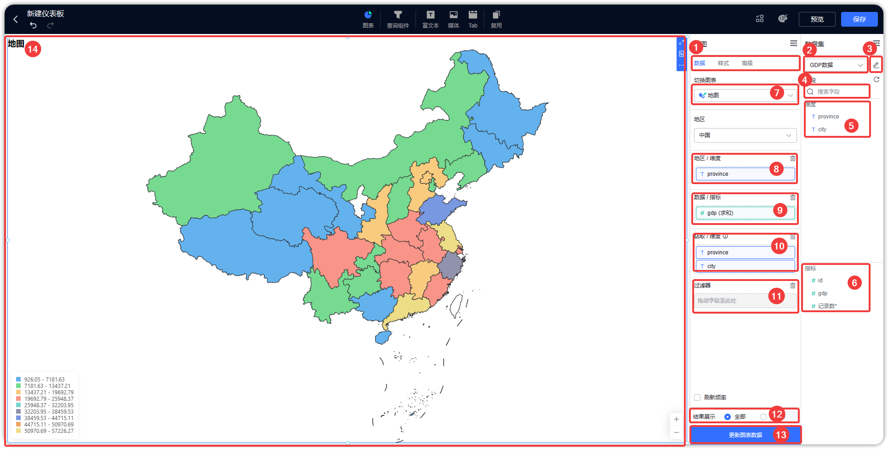

## 1 功能概述

!!! Abstract ""
    图表属于仪表板功能中重要的一部分，可通过简单的拖拉拽将数据集中的数据做成各种图表，并设置图表的颜色、大小、标签、图例、标题等属性。

## 2 图表类型
!!! Abstract ""

    - 指标（仪表盘、水波图、指标卡）
    - 表格（明细表格、汇总表格、透视表格）
    - 线/面图（基础折线图、面积图、堆叠折线图）
    - 柱状图（基础柱状图、堆叠柱状图、百分比柱状图、分组柱状图、分组堆叠柱状图、瀑布图、横向柱状图、横向堆叠柱状图、横向百分比柱状图）
    - 分布图（饼图、环形图、玫瑰图、玫瑰环形图、雷达图、矩形树图、词云图）
    - 地图（区域地图、气泡地图）
    - 关系图（散点图、象限图、漏斗图）
    - 双轴图（柱线组合图）

## 3 功能区介绍

!!! Abstract ""
    图表设计功能区介绍

    - 【序号 1】： 数据操作区、样式编辑区和高级功能区切换
    - 【序号 2】： 选择、更换数据集
    - 【序号 3】： 数据集设计入口
    - 【序号 4】： 搜索字段
    - 【序号 5】： 可选维度列表
    - 【序号 6】： 可选指标列表
    - 【序号 7】： 切换图表
    - 【序号 8】： 维度设置区
    - 【序号 9】： 指标设置区
    - 【序号 10】： 钻取维度设置区
    - 【序号 11】：结果过滤器
    - 【序号 12】：结果展示
    - 【序号 13】：数据刷新按钮
    - 【序号 14】：图表展示

{ width="900px" }
