!!! Abstract ""
    点击【样式】，切换至样式设计界面，该界面主要针对【背景】、【基础样式】、【标签】、【提示】、【标题】等进行调整，**不同的图表类型可支持的样式会有所差异。**

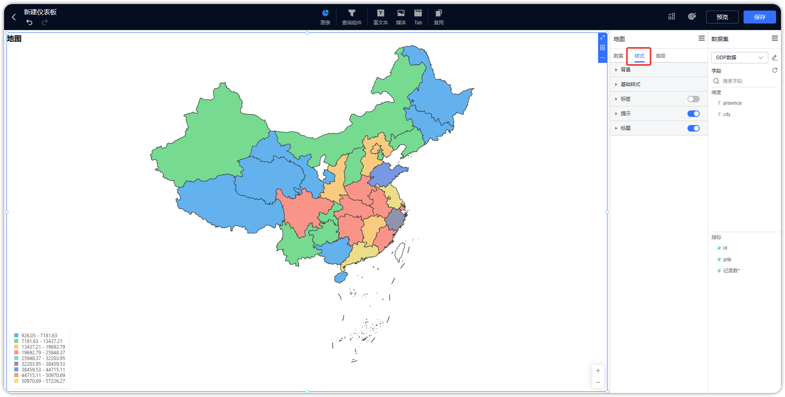{ width="900px" }

## 1 背景
!!! Abstract ""

    - 支持进行图表的内边距、圆角设置；
    - 图表背景颜色设置；
    - 背景图片和边框设置。
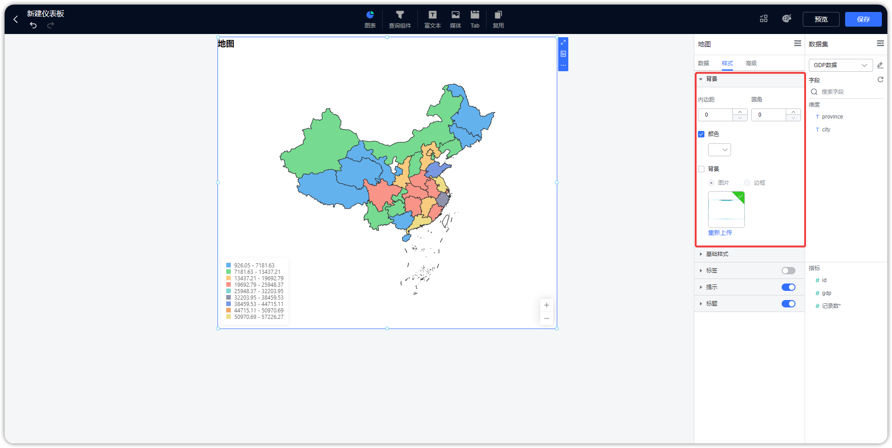{ width="900px" }

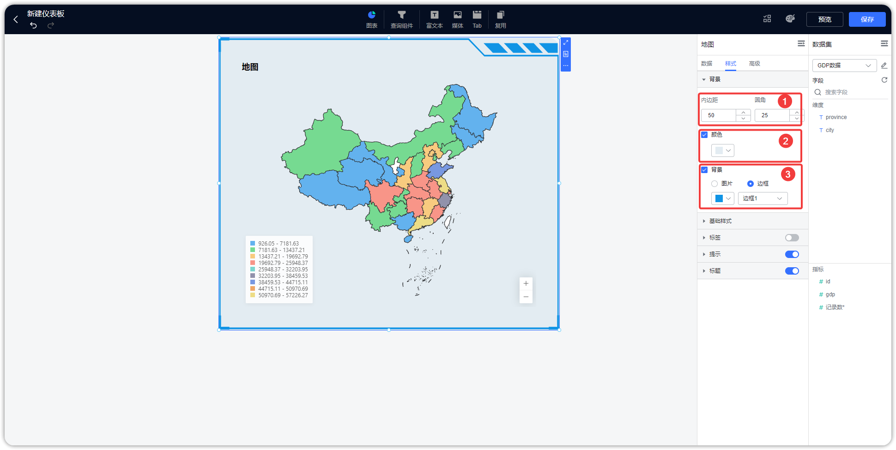{ width="900px" }

## 2 基础样式

!!! Abstract ""
    支持修改图形的颜色，支持配置系统方案（默认、复古、淡雅、未来、渐变、简洁、商务、柔和、科技、明亮、经典、清新、活力、火红、轻快、灵动）；  
    如下图所示，点击，也可以自定义配色。

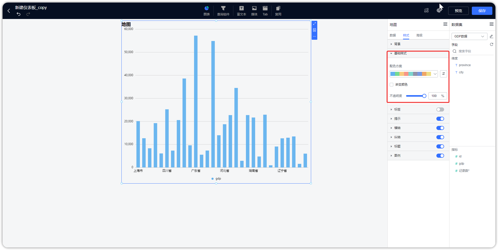{ width="900px" }

!!! Abstract ""
    应用配色方案后，仍然可以进一步调整颜色，如下图所示，整个图表应用到的颜色都会在下方列出来，修改时不需要再在配色方案中选中，自行修改颜色后，配色方案中所展示的颜色将不会跟着改变。如下图所示。

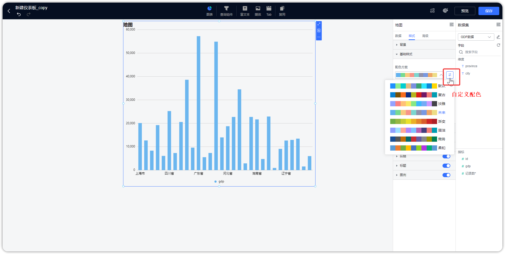{ width="900px" }

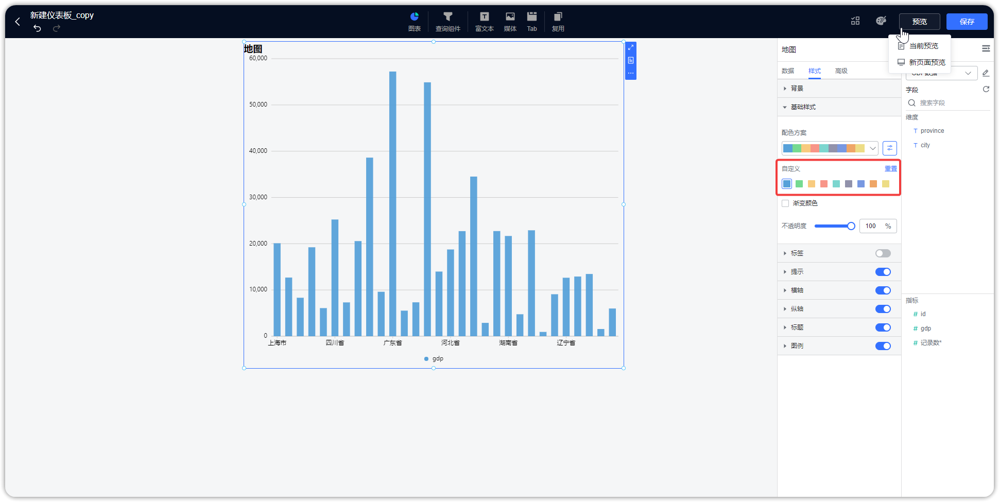{ width="900px" }

!!! Abstract ""
    如下图所示，支持开启渐变色和透明度调整 。

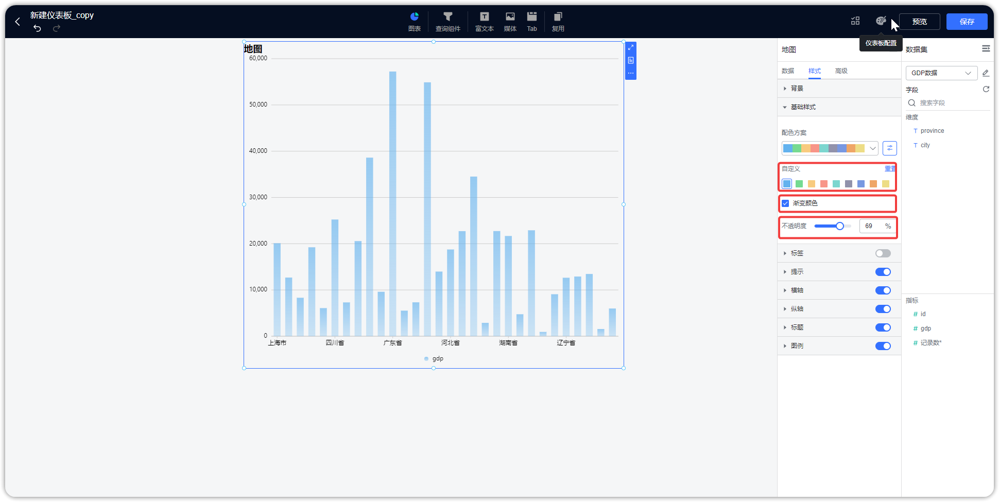{ width="900px" }

## 3 大小

!!! Abstract ""
    如下图所示，以配置"水波图"的图形属性大小为例。
    水波图支持设置目标值和动态值，应用示例如下：    
    指标放置了 ”记录数“ 并且计算方式为 “求和”，目标值使用了设定值，则水波图自动计算出了统计总数占目标值的多少，即占比比例。。

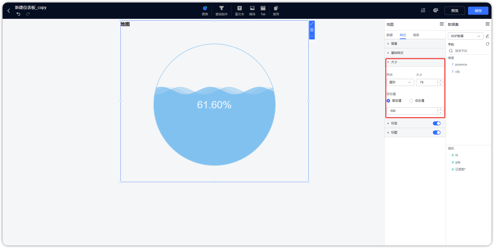{ width="900px" }

!!! Abstract ""
    仪表盘支持在组件样式设置最小值、最大值、支持用图表指标来动态设置最大值和最小值，支持起始角度和结束角度设置。

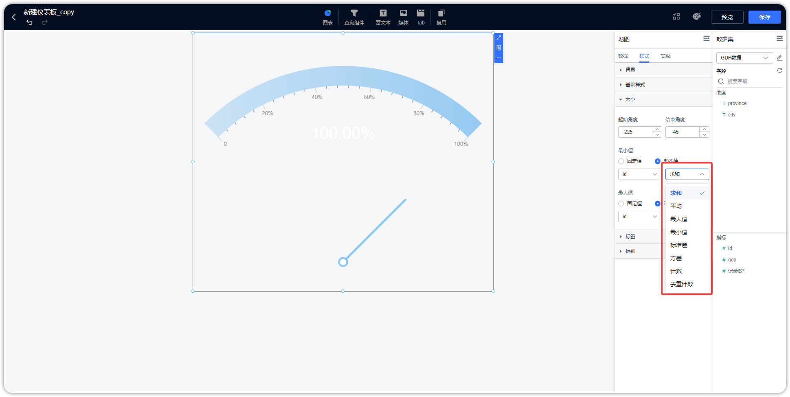{ width="900px" }

## 4 标签

!!! Abstract ""
    支持修改标签的颜色、大小，根据不同的图表所支持的配置项有所不同，以地图为例，支持通过勾选的方式选择展示的维度、指标，同时支持指标的格式类型和单位设置。

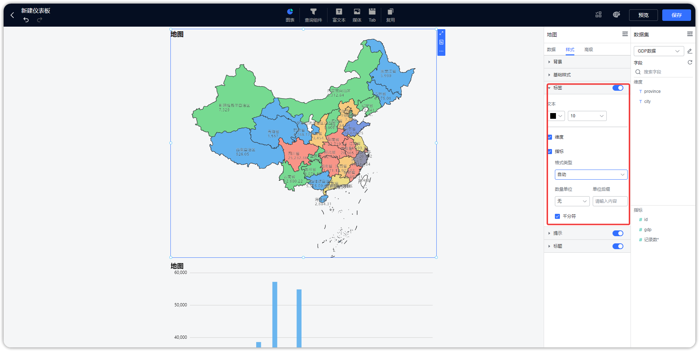{ width="900px" }

## 5 提示

!!! Abstract ""
    支持调整图表的”提示“字体大小、字体颜色，显示格式设置。

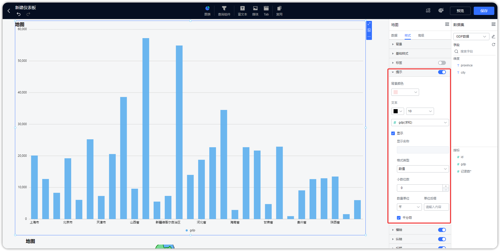{ width="900px" }、

## 6 标题

!!! Abstract ""
    支持修改组件的标题（标题名称、字体大小、字体颜色、字体间隔、字体样式、对齐方式）。

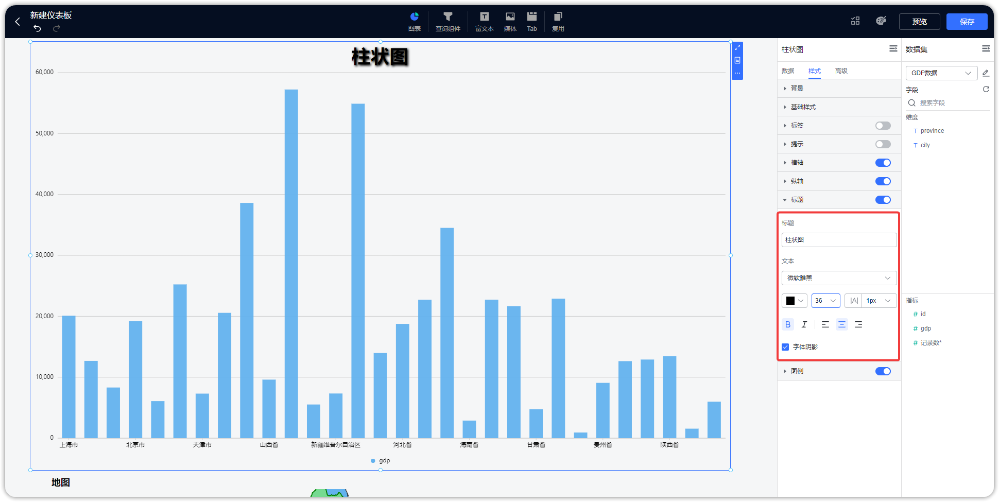{ width="900px" }

## 7 图例

!!! Abstract ""
    支持修改组件的图例，包括图例的图标、方向、字体大小、字体颜色、水平位置、垂直位置等。

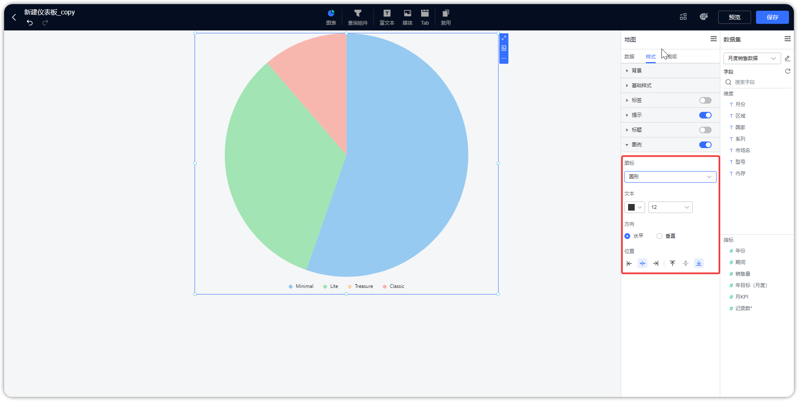{ width="900px" }

## 8 坐标轴

!!! Abstract ""
    有坐标轴的图表（柱状图、折线图等），轴值支持数值格式化设置，如下图所示，在样式的横轴设置中，可以设置横轴位置、轴名、轴线、标签。

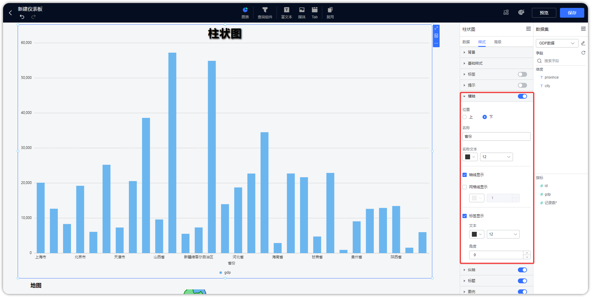{ width="900px" }

!!! Abstract ""
    在纵轴设置中，除了坐标轴横轴的设置内容，还可对纵轴指标的显示进行格式和单位设置。

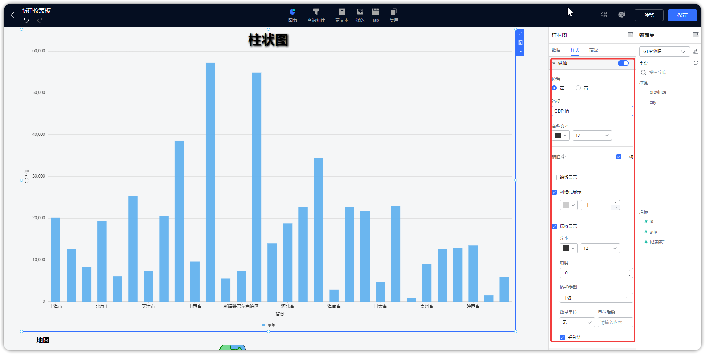{ width="900px" }

## 9 更改图表类型

!!! Abstract ""
    点击切换图表，展示所有图表类型，如柱形图，折线图，组合图、雷达图等，可通过点击图表图标进行图表类型的切换。

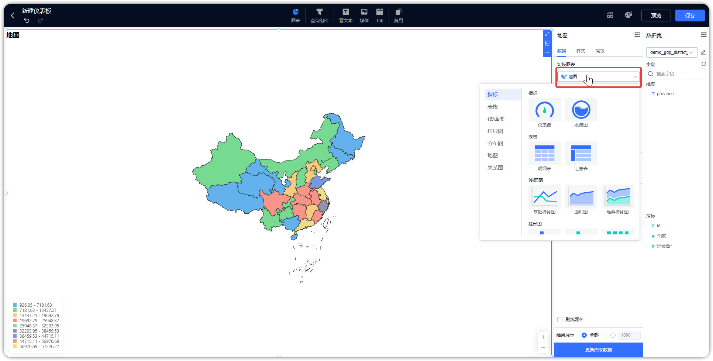{ width="900px" }

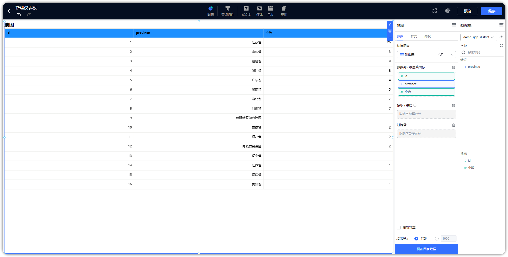{ width="900px" }