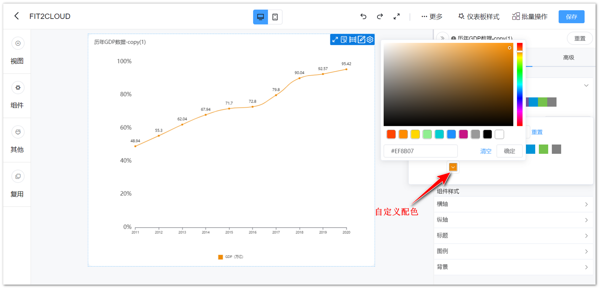
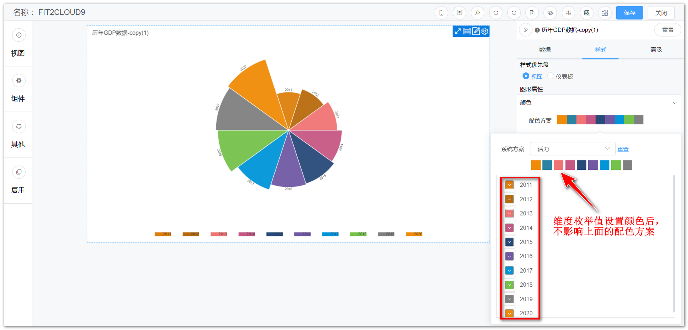
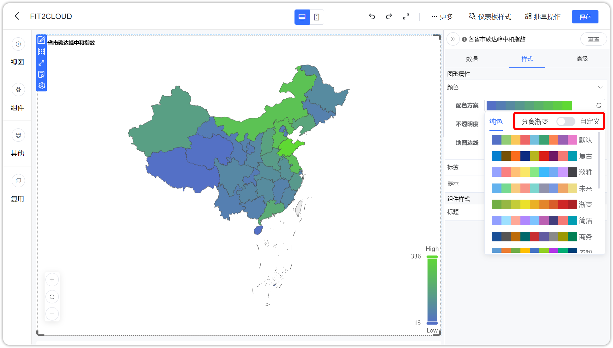
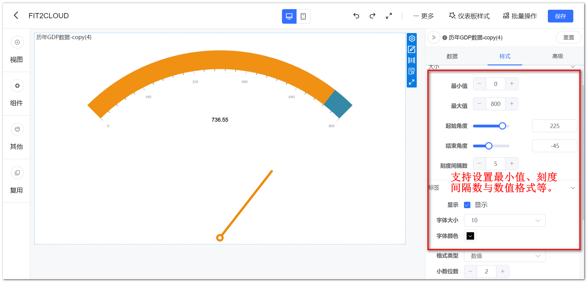
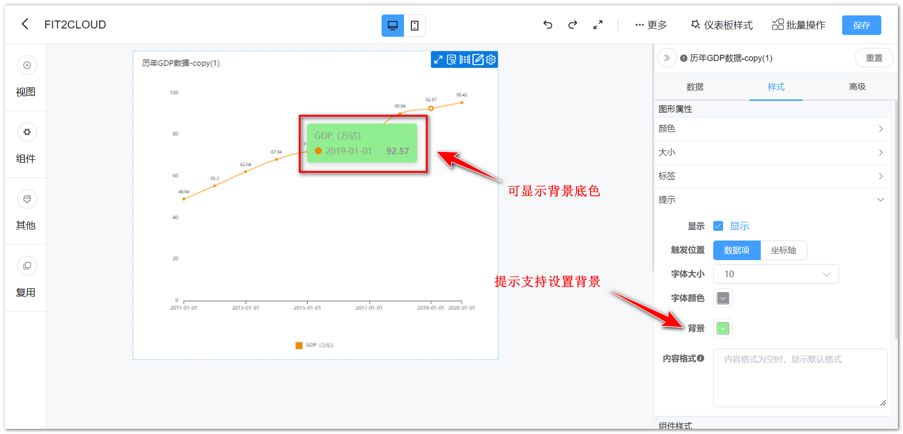
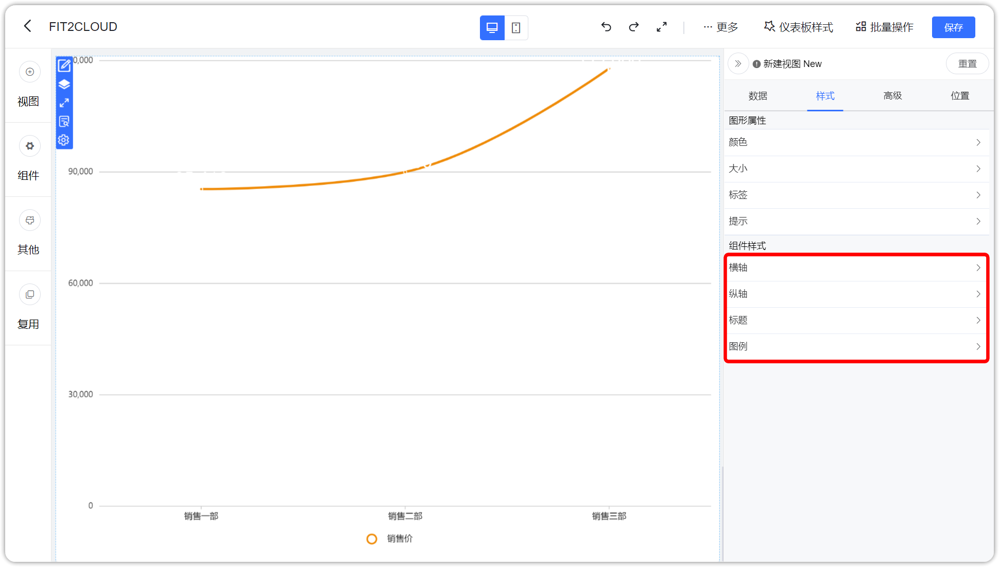
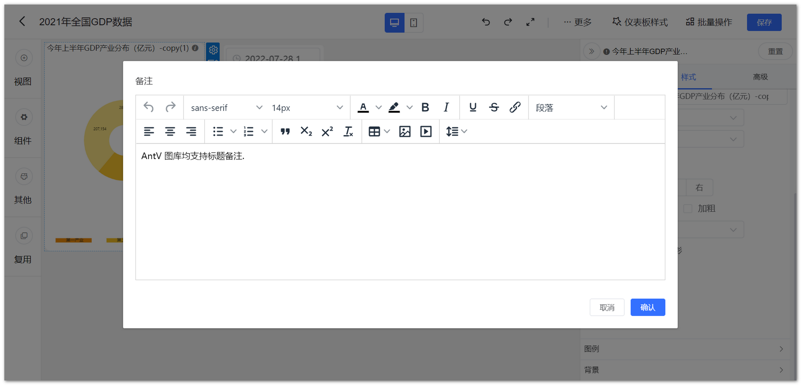
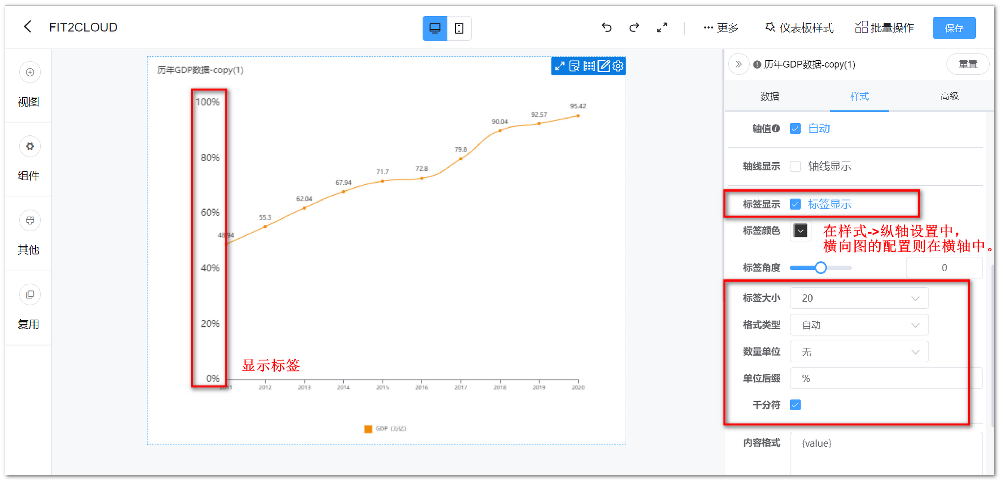
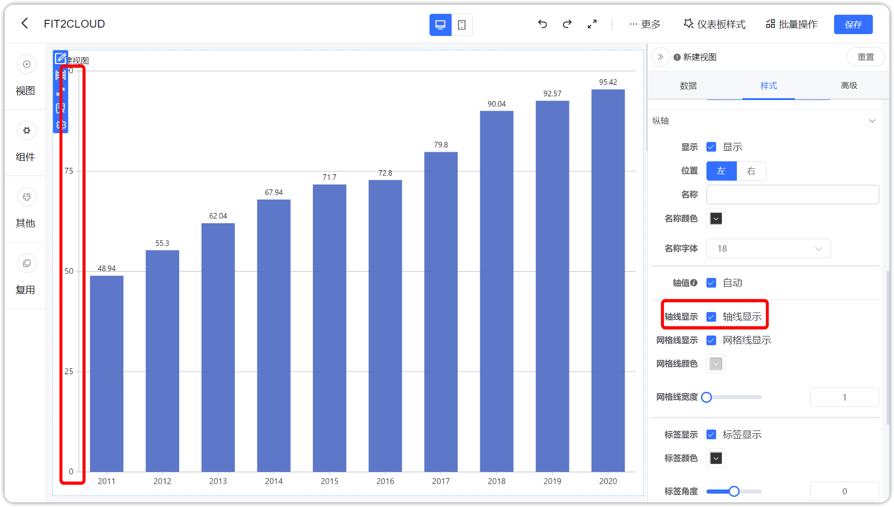

!!! Abstract ""
    点击【样式】，切换至样式设计界面，该界面主要针对【图形属性】和【组件样式】进行调整，**不同的视图类型可支持的样式会有所差异，不同的图表库（Echarts、AntV）在样式上也有一些差异。**

{ width="900px" }

## 1 图形属性

### 1.1 颜色

!!! Abstract ""
    支持修改图形的颜色，支持配置系统方案（默认、复古、淡雅、未来、渐变、简洁、商务、柔和、科技、明亮、经典、清新、活力、火红、轻快、灵动）；  
    如下图所示，点击，也可以自定义配色。

{ width="900px" }

!!! Abstract ""
    应用配色方案后，仍然可以进一步调整颜色，如下图所示，整个视图应用到的颜色都会在下方列出来，修改时不需要再在配色方案中选中，自行修改颜色后，配色方案中所展示的颜色将不会跟着改变。  
    其中柱状图、折线图、散点图、支持系列设置颜色，AntV 图库支持维度枚举值设置颜色，如下图所示。

{ width="900px" }

!!! Abstract ""
    AntV 图库的所有柱状图、面积图、饼图、环形图、仪表盘支持渐变色，如下图所示，支持开启渐变色，渐变色的起始颜色和结束颜色按给定颜色 100 渐变到 30 。

{ width="900px" }

!!! Abstract ""
    ECharts 图库地图的样式配色方案中支持渐变色选项，支持悬浮组件显隐设置，即地图左侧的缩放和右侧的图例可根据需要设置成隐藏。

    - 【分离渐变】：系统内置的渐变色方案；
    - 【自定义】：可自定义开始和结束的颜色，系统会自动生成渐变色方案。

{ width="900px" }

### 1.2 大小

!!! Abstract ""
    如下图所示，以配置"指标卡"的图形属性大小为例。

{ width="900px" }

    水波图目标值支持设置动态值设置，应用示例如下：    
    指标放置了 ”销售价“ 并且计算方式为 “求和”。

{ width="900px" }

!!! Abstract ""
    目标值使用了原始价的求和，则水波图自动计算出了销售价的总数占原始价总数的多少，即整体的折扣率。

{ width="900px" }

!!! Abstract ""
    AntV 图库仪表盘视图支持在组件样式设置最小值、最大值、支持用视图指标来动态设置最大值和最小值，支持刻度间隔数，支持标签设置数值格式。

{ width="900px" }

### 1.3 标签

!!! Abstract ""
    支持修改标签的颜色、大小、位置等，根据不同的图库视图所支持的配置项有所不同，以 AntV 视图图库为例，AntV 图库玫瑰图，饼图，环形图，玫瑰环形图支持标签内容显示，支持通过勾选的方式选择展示的维度、指标、占比。

{ width="900px" }

### 1.4 提示

!!! Abstract ""
    支持调整视图的”提示“字体大小、字体颜色，视图提示支持背景选项。

{ width="900px" }、

## 2 组件样式

### 2.1 标题

!!! Abstract ""
    支持修改组件的标题（标题名称、字体大小、字体颜色、水平位置、垂直位置、字体样式）。

{ width="900px" }  

{ width="900px" }

!!! Abstract ""
    AntV 图库标题支持双击修改。

{ width="900px" }

!!! Abstract ""
    AntV 图库图表标题支持备注，同时支持字体、阴影和间距设置；  
    AntV 指标卡、AntV 文本卡，除了标题以外，在样式->大小选项中，对值和名称也支持字体、阴影、间距、粗细设置。

{ width="900px" }

{ width="900px" }

### 2.2 图例

!!! Abstract ""
    支持修改组件的图例，包括图例的图标、方向、字体大小、字体颜色、水平位置、垂直位置等。

### 2.3 坐标轴

!!! Abstract ""
    有坐标轴的视图（柱状图、折线图等），轴值支持数值格式化设置，如下图所示，在样式的纵轴(横向图则为横轴)设置中。

{ width="900px" }
!!! Abstract ""
    带坐标系的视图类型支持坐标轴轴线显示控制的选项。

{ width="900px" }

### 2.4 外边距与序号

!!! Abstract ""
    支持 ECharts 视图外边距设置。

    - 自动：系统的默认值，自动适配；
    - 绝对：配置实际距离；
    - 相对：配置相对的百分比。

{ width="900px" }

{ width="900px" }

{ width="900px" }

!!! Abstract ""
    **序号设置：** AntV 明细表和汇总表支持序号设置，同时支持给序号列命名。

{ width="900px" }